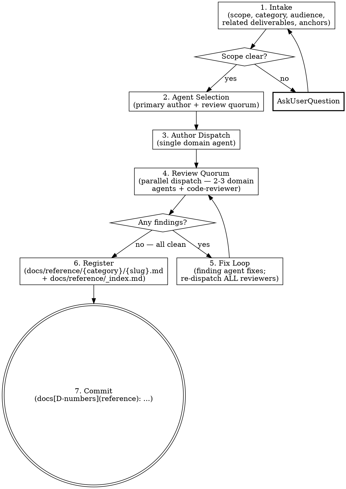

# Reference Doc Creation

Create an internal developer-facing reference doc following cc-sdlc conventions. The doc describes how a system works — event schemas, API surfaces, pipeline stage inventories, config matrices, domain gotchas — in a format optimized for coding agents investigating, debugging, or extending that system. Humans read it too; agents are the primary audience.

**Argument:** `$ARGUMENTS` (subject of the doc — system, feature, or concern to document)

## Process



## Collaboration Model

Read `[sdlc-root]/process/collaboration_model.md` for the CD/CC role definitions, communication patterns (AskUserQuestion rule), and decision authority. All questions to the user during Intake MUST use `AskUserQuestion` — never inline conversational prompts. The anti-patterns in that doc apply for the full skill run.

## Manager Rule

Read and follow `[sdlc-root]/process/manager-rule.md`. The skill does not hand-write reference docs. Domain agents draft; domain agents review. You orchestrate, dispatch, and keep the loop moving.

## Agent Dispatch Protocol

Dispatch prompts describe WHAT the doc must contain and WHY. HOW to structure sentences, which analogies to pick, which examples to include — those are the author-agent's domain. Pass full scope context (subject, audience, template path, related code anchors) into every dispatch.

---

## Steps

### 1. Intake

Clarify with the user (use `AskUserQuestion` when any of these is ambiguous):

- **Subject** — what system, feature, or concern does this doc describe? (e.g. "auth middleware", "background job registration pattern", "feature flag config matrix")
- **Category** — pick the primary domain. Categories are project-specific; common ones include `api`, `frontend`, `database`, `observability`, `security`, `deploy`, `sdlc`, `cross-cutting`. Use what your project's `docs/reference/` already establishes; if it's a new project, propose a category and confirm with the user.
- **Audience** — is this agent-only or also on-call? Default: `coding-agent` + `developer`. Add `on-call` only if the doc directly supports incident response.
- **Related deliverables** — which D-numbers produced or modified the code being documented? (Used for change log + traceability.)
- **Existing code anchors** — at least one `path:line` the author must read as the source of truth. Never let the author rely on memory.

Confirm the output location: `docs/reference/{category}/{slug}.md`, where `{slug}` is `lowercase-with-hyphens`.

### 2. Agent Selection

Pick the **primary author** based on category. One author writes — consistent voice, coherent narrative. Quorum writing produces checklist-y drafts.

**Use `[sdlc-root]/process/agent-selection.yaml` as the source of truth for which agent owns which domain.** Match the doc's category to the agents whose `dispatch_when` triggers cover that domain. The primary author is the most direct match; the review quorum is 2–3 adjacent-domain agents plus `code-reviewer`.

Quick mapping guidance:

| Doc category | Primary author candidates | Review quorum candidates |
|--------------|---------------------------|--------------------------|
| api | backend-developer | data-architect, security-engineer, code-reviewer |
| frontend | frontend-developer | ui-ux-designer, accessibility-auditor, code-reviewer |
| database | data-architect | backend-developer, performance-engineer, code-reviewer |
| observability | devops-engineer | backend-developer, performance-engineer, code-reviewer |
| security | security-engineer | security-auditor, backend-developer, code-reviewer |
| deploy | devops-engineer | build-engineer, security-engineer, code-reviewer |
| sdlc | (ask user — could be any) | sdlc-reviewer, code-reviewer |
| cross-cutting | (ask user) | all relevant domain agents + code-reviewer |

**Substitute project-specific agents** where the project has them — e.g. a project with a dedicated `search-engineer` should author search-related reference docs with that agent rather than `backend-developer`.

**`code-reviewer` is on every quorum.** Its job on reference docs is template compliance, `path:line` anchor accuracy, broken-link detection, and presence of all mandatory sections.

### 3. Author Dispatch

The dispatch prompt must include:

1. **Scope statement** — subject, audience, category, output path.
2. **Template path** — `[sdlc-root]/templates/reference_doc_template.md`. The author MUST read the template and follow the section order and frontmatter exactly. No freestyle section headings.
3. **Source-of-truth anchors** — `path:line` ranges the author must read before drafting. Tell the author: "Do not draft from memory. Read every listed file and base the reference on current code."
4. **Audience framing** — "Agents are the primary reader. Favor structure (tables, frontmatter, fixed section order, `path:line` anchors) over prose. A coding agent reading this doc should be able to answer 'how does X work' and 'where do I go in the codebase to change Y' without grepping."
5. **Related deliverables** — D-numbers + result doc paths to read for context.
6. **Plain-language rule for domain terms** — every domain-specific term used in the doc must be defined on first use with a plain-language explanation and a concrete example or analogy. Reference docs are teaching artifacts as much as reference artifacts.

Author output: a complete Markdown file at `docs/reference/{category}/{slug}.md` that (a) validates against the template's frontmatter schema, (b) has every mandatory section filled, (c) contains at least one `path:line` anchor in **Related Code**, and (d) records at least one entry in **Change Log**.

### 4. Review Quorum

Dispatch every agent in the quorum **in parallel** (single message, multiple Agent tool calls). Each agent reviews under its own lens — see `[sdlc-root]/process/review-lenses.md` for the canonical per-agent review lens definitions. Pass the lens reference into every reviewer's dispatch prompt so reviewers know which checks are theirs vs. adjacent domains'.

- **Primary-domain reviewers** (not the author) — technical accuracy, completeness of coverage, correctness of examples, currency of gotchas.
- **code-reviewer** — template compliance (frontmatter schema, section presence, section order), `path:line` anchor accuracy (the line ranges must actually contain what the doc claims), broken internal links, markdown validity.

Each reviewer reports findings in the shared format:

```
CRITICAL: [...]
HIGH: [...]
MEDIUM: [...]
LOW: [...]
CLEAN: [...]
```

### 5. Fix Loop

Follow the review-fix loop pattern at `[sdlc-root]/process/review-fix-loop.md`:

1. Collect all findings across reviewers.
2. Triage: who owns each fix? Usually the primary author; template/anchor fixes can go to code-reviewer if the finding is mechanical.
3. Dispatch the fixing agent(s) with the specific findings list.
4. Re-dispatch ALL reviewers (not just the one who raised the finding). Repeat until every reviewer reports clean.

Exit condition: every reviewer returns no CRITICAL, HIGH, or MEDIUM findings. LOW findings can be deferred to the doc's next revision if explicitly acknowledged in the commit.

### 6. Register

Once review is clean:

1. Confirm the file is at `docs/reference/{category}/{slug}.md`.
2. Update `docs/reference/_index.md` — add a row to the index table. If the index file does not exist, create it with a header + initial table schema (columns: `Title`, `Category`, `Owner`, `Audience`, `Last Verified`, `Link`).
3. If `docs/reference/` or `docs/reference/{category}/` does not exist yet, create the directory.

### 7. Commit

Stage the reference doc + index update + any template-anchor corrections. Commit message format:

```
docs[{D-numbers}](reference): add {slug} reference doc

{1-2 sentences — what system is now documented and why}

Co-Authored-By: {model-name-and-version} <noreply@anthropic.com>
```

(The `{model-name-and-version}` placeholder follows the repo's current commit convention at author time — do not hardcode a specific model version in this skill; model strings drift.)

If the doc was produced as a follow-up to a specific deliverable, include the D-number in the commit scope so the traceability survives git log.

---

## Principles

### Structure over prose

Reference docs are read by agents scanning for specific information. Tables beat paragraphs for enumerable content (event fields, stage lists, endpoint surfaces, config options). Fixed section order means an agent can predict where to find "gotchas" or "examples" without parsing the full doc.

### File:line anchors are mandatory

Every "Related Code" entry must include `path:line` or `path:line-line`. A reference doc that names a function but not its line is a doc that makes the agent grep — which defeats the point. When code moves, update the anchors (the Change Log captures the update).

### Source of truth is code, not memory

The author reads the referenced files before drafting. Reference docs describing stage lists, schemas, or signatures from memory drift within a week. Every round of review-fix reads the current code.

### One author, many reviewers

Quorum writing produces fragmented drafts — each agent optimizes for its lens without a narrative owner. Quorum review catches cross-domain issues in a coherent draft. This mirrors the SDLC-Lite pattern.

### Agents first, humans welcome

Write for an agent that has never seen this code before. If a human reads it too, the structure helps them. If a human finds a section hard to read, an agent will find it harder.

---

## Red Flags

| Thought | Reality |
|---------|---------|
| "I'll write this doc myself — it's just a reference" | Manager Rule. Dispatch the domain author. |
| "One domain agent can author AND review" | The author cannot be in the review quorum. Review catches blind spots the author has. |
| "Skip the review loop — the doc looks clean" | The loop is where `path:line` anchors get verified against current code and cross-domain accuracy surfaces. Run it. |
| "Freeform sections are fine for this doc" | No. The template is the contract — section order is how agents find information. Deviations break agent parseability. |
| "File names without line numbers are good enough" | They aren't. DO NOT write `service.py — contains search logic`. Instead write `service.py:1334-1728 — search() instrumented body`. Line numbers are the whole point of the anchor. |
| "The author can draft from memory — they know this domain" | No. The dispatch prompt must require reading the current files. Memory-sourced docs drift within days. |
| "This is a runbook" | Runbooks are procedural responses to specific alerts. Reference docs describe how the system works. If the doc is "when X fires, do Y", it is NOT this skill's output. |
| "This is customer-facing documentation" | This skill writes internal agent-and-developer reference docs. Customer docs live in your project's docs site. |
| "The gotchas list from the D-number result doc is good enough — copy it in" | Copy-paste without re-verification is staleness waiting to happen. The review quorum re-checks gotchas against current code. |
| "I'll register in the index later" | Register in the same commit. Docs that aren't in the catalog go unnoticed by future agents — which defeats the agent-audience goal. |
| "The change log is optional" | It is not. The log records who verified the doc against which commit — the only way to detect drift later. |
| "I'll hardcode the agent matrix in this skill" | No — the matrix lives in `agent-selection.yaml` so it stays consistent with planning and review. If a project adds a domain agent, reference docs in that domain pick them up automatically. |

---

## Additional Resources

- `[sdlc-root]/templates/reference_doc_template.md` — the canonical template. Authors read it before drafting; reviewers check drafts against it.
- `[sdlc-root]/process/agent-selection.yaml` — domain-to-agent mapping used during agent selection. Single source of truth shared with planning and review skills.
- `[sdlc-root]/process/manager-rule.md` — agent-dispatch discipline.
- `[sdlc-root]/process/review-fix-loop.md` — review iteration cadence.
- `[sdlc-root]/process/review-lenses.md` — per-agent review lens definitions.

---

## Integration

- **Depends on:** at least one code artifact to reference (the skill documents existing systems, not proposed ones — proposed systems use `sdlc-plan` / `sdlc-lite-plan`).
- **Feeds into:** `docs/reference/_index.md` catalog; future coding-agent investigations into the documented system.
- **Uses:** domain agents (as author and reviewers), `code-reviewer` (template + anchor verification), `[sdlc-root]/templates/reference_doc_template.md`, `[sdlc-root]/process/agent-selection.yaml`.
- **Complements:** `sdlc-create-agent` (agent definitions), `sdlc-develop-skill` (skill definitions), `sdlc-lite-plan` / `sdlc-plan` (produces result docs that reference docs often cite).
- **Does NOT replace:** SDLC result docs (deliverable-bound, archived with the deliverable), customer-facing product docs (project-specific docs site), runbooks (alert-triggered procedural).
- **DRY notes:** a reference doc often cites an SDLC result doc (e.g. "the schema was introduced in D122 — see `docs/current_work/sdlc-lite/completed/d122_.._result.md`"). The reference doc is the long-lived source of truth; the result doc is the deliverable-bound narrative. If content has to live in exactly one place, pick the reference doc.
