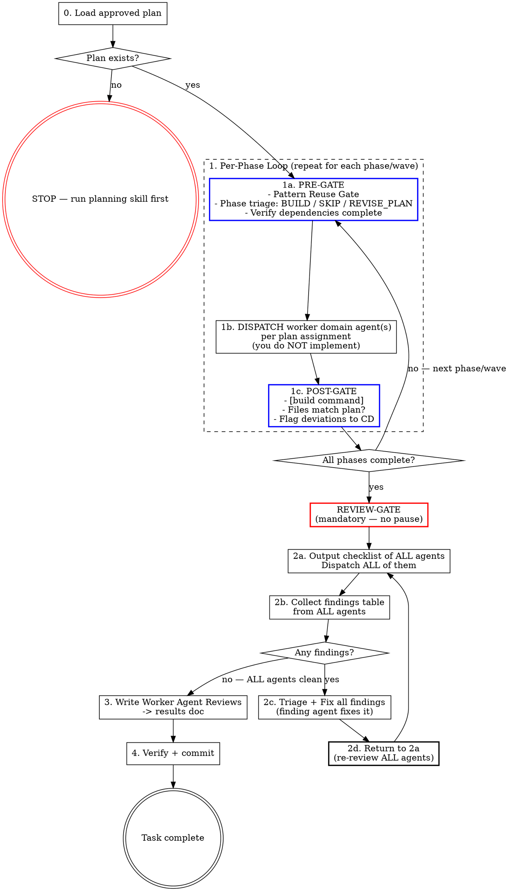

# SDLC Execution

## Overview

This skill executes an approved plan that was produced by `sdlc-plan`. Worker domain agents implement the phases, review the result, and fix findings. You are the manager — you dispatch worker agents, track phase completion, and ensure reviews pass before the task is done.

**Precondition:** A reviewed and approved plan must exist before this skill runs. If no plan exists, stop and use `sdlc-plan` first.

## Mode Selection

| User Intent | Mode | Entry Point |
|-------------|------|-------------|
| "Execute the plan", "implement the plan" | **APPLIER** | Step 0 (full execution workflow) |
| "Audit implementation", "review against plan", "check completed work" | **CHECKER** | Audit Workflow below |
| Unclear | Ask: "Are you executing new work, or auditing completed work?" | — |

### CHECKER Mode: Audit Completed Work Against Plan

When auditing already-implemented work (not executing new work):

1. Load the plan from `docs/current_work/planning/dNN_name_plan.md`
2. Scan changed files (git diff or file list from result doc)
3. Dispatch ALL relevant worker domain agents to audit:
   - Completeness: did all plan phases get implemented?
   - Correctness: does the implementation match the plan's intent?
   - Deviation: are there changes NOT in the plan? Are they justified?
4. Present structured findings to CD
5. If fixes needed: dispatch agents to fix, re-audit

**CHECKER mode ends after step 5. APPLIER mode below governs all execution work.**

## Step 0: Load the Plan

Load the plan from `docs/current_work/planning/dNN_name_plan.md` — this plan has been reviewed and approved.

**Read the plan file only.** Do not pre-read implementation files, existing components, or codebase patterns before dispatch. The plan file is sufficient context for the manager. Worker domain agents read the files relevant to their own phases when they execute. Pre-reading implementation files and accumulating context is not management — it is the first step toward self-implementation.

Extract:
1. **Phases and their dependencies** — what runs in parallel vs. what sequences
2. **Agent assignments** — which worker domain agent owns each phase/task
3. **Relevant worker domain agents** — the full list for post-execution review

If the plan file doesn't exist or can't be found, **stop immediately** and tell the user:

> No approved plan found. Run `sdlc-plan` first to create and review the plan.

Do NOT write a plan yourself. Do NOT proceed without one.

## The Process



## Collaboration Model

Read `[sdlc-root]/process/collaboration_model.md` for the CD/CC role definitions, communication patterns (AskUserQuestion rule), decision authority table, and anti-patterns. All questions to the user must use `AskUserQuestion`. All anti-patterns in that doc apply during execution.

## Deliverable Lifecycle

Follow the state machine in `[sdlc-root]/process/deliverable_lifecycle.md`. Update the `**Status:**` marker in the spec file as the deliverable transitions through states: In Progress (at phase start), Validated (after review loop passes), Deployed (after deployment verification, if applicable), Complete (after final commit). Use the defined status markers — do not invent custom states.

## Manager Rule

Read and follow `[sdlc-root]/process/manager-rule.md` — the canonical definition of this rule. It applies unconditionally for the entire session.

**No pre-dispatch narration.** Status comes from the gates (PRE-GATE, POST-GATE, REVIEW-GATE) — not from sentences around them. Do not type filler describing what you are about to do: "Plan loaded.", "Let me check the catalog.", "Proceeding to Phase N.", "Now updating the catalog and committing.", "Staged set looks correct. Committing." The gates ARE the protocol; commentary around them is noise the user has to scroll past. The two acceptable exceptions are: (1) a one-line note conveying genuinely new information — a deviation observed, a phase-bleeding decision, a serialization choice forced by mid-stream discovery, a triage rationale; (2) the explicit announcements other rules require ("Review loop complete — all agents clean.", REVIEW-GATE block, etc.). When in doubt, prefer the gate over a sentence.

## Phase Details

### 1. Execute Phases

Follow the plan's phase structure.

**Phase plan (emit once, before any dispatch):**

Reprint the plan's phase structure as a single table. This is the reference every subsequent PRE-GATE points back to — file-conflict and dependency information live here, not in each per-phase block.

```
**Phase plan**

| # | Agent       | Files                                 | Depends | Parallel with |
|---|-------------|---------------------------------------|---------|---------------|
| 1 | <agent>     | <path>, <path>                        | —       | <# or —>      |
| 2 | <agent>     | <path>, <path>                        | 1       | —             |
```

If any file appears in more than one phase's row, those phases MUST run sequentially regardless of the plan's `Parallel with` column — mark the conflict in the table and explain in one line below. The Phase plan emission IS the file-conflict check; don't repeat it per phase unless a conflict was missed.

For each phase:

**PRE-GATE** — you cannot dispatch the phase agent until this block appears in your response. Use the compact form by default; fall back to verbose when a trigger fires.

Compact form (happy path — Triage = BUILD):

```
### Phase [N] — [phase name]  (agent: [agent-name])

Design decisions:
- [decision 1 — one per bullet, not semicolon-chained]
- [decision 2]

Expected: [counts from plan, or "none"]
Triage: BUILD
```

Verbose form (use when any of these triggers fires):
- **Triage ≠ BUILD** — SKIP or REVISE_PLAN (stop and wait for CD confirmation; document SKIPs in the result doc under 'Skipped Phases'; do not self-modify the approved plan)
- **Pattern found** — LSP `goToImplementation`/`findReferences` or Grep surfaced a precedent that's actively shaping the implementation (cite the path)
- **External data** — the phase reads from any source other than the codebase (URL, repo, API, document)
- **Dependency re-check** — the Phase plan table needs amending (mid-execution re-sequencing, late-discovered conflict)
- **Re-dispatch** — partial completion or stub fix within this same phase

Verbose form — single phase. Emit as a table; the labeled-field block format is deprecated:

```
**PRE-GATE Phase [N] — [phase name]**

| Field          | Value |
|----------------|-------|
| Agent          | [agent-name] |
| Triage         | BUILD | SKIP | REVISE_PLAN |
| If not BUILD   | [reason — stop and wait for CD confirmation; omit row if Triage = BUILD] |
| Dependencies   | [phase N complete | none required] |
| Pattern search | [what you searched for] → [found / not found / following pattern at path/to/file.ts] (use LSP goToImplementation/findReferences for interfaces and call sites; Grep for text patterns) |
| Data sources   | [ALL external sources — URLs, repos, APIs, documents | "codebase only"] |
| Expected       | [counts from plan | none] |

Design Decisions:
- [decision 1 — one per bullet, never semicolon-chained]
- [decision 2]
```

Verbose form — parallel dispatch (two or more phases in the same wave). Emit a single comparison table instead of repeating the per-phase block:

```
**PRE-GATE — parallel dispatch (Phases [N], [M])**

| Field          | Phase [N]: [name]      | Phase [M]: [name]      |
|----------------|------------------------|------------------------|
| Agent          | [agent-name]           | [agent-name]           |
| Triage         | BUILD                  | BUILD                  |
| Dependencies   | [...]                  | [...]                  |
| File overlap   | none with Phase [M]    | none with Phase [N]    |
| Pattern search | [...]                  | [...]                  |
| Data sources   | [...]                  | [...]                  |
| Expected       | [...]                  | [...]                  |

Design Decisions — Phase [N]:
- ...

Design Decisions — Phase [M]:
- ...
```

**File-Conflict Gate (parallel phases only):** Before dispatching two or more phases simultaneously, verify file overlap (same rule as the phase-plan table at L143 above, applied at dispatch time). If any file appears in more than one phase, sequence those phases. Do not rely on the plan's dependency table alone; verify file overlap yourself.

**Parallel Phase Ownership Decomposition.** When the plan specifies two or more phases that can run in parallel, the File-Conflict Gate above is necessary but not sufficient — also verify each phase has a coherent ownership cluster. Use this decomposition lens before dispatching parallel phases:

| Ownership model | When to use | Typical agent assignment |
|-----------------|-------------|--------------------------|
| **By package** (monorepo boundary) | Default for full-stack features — each phase owns one package or top-level directory | One domain agent per package |
| **By layer within a package** | When a single-package feature has clean vertical layers and one agent per layer makes sense | db-architect (models/migrations), backend-developer (routes/services), sdet (tests/) |
| **By module/feature** | When touching multiple independent features within one package | One domain agent per feature subdirectory |
| **Vertical slice** | One agent owns end-to-end for a narrow user-facing capability (UI + API + tests) | Single domain agent (rare — prefer horizontal layer) |
| **Horizontal layer** | One agent owns their layer across all features in the phase | One domain agent per layer |

The project's agent split typically implies the right ownership model. When unsure, default to horizontal-layer — it matches most domain-agent configurations.

**Barrel-file / index-file rule.** Files that aggregate exports or imports for many siblings (`__init__.py`, `index.ts`, barrel files, router registration files, config aggregators) are implicit conflict hotspots — multiple phases may each want to add an entry. For any parallel-phase set, list every barrel file each phase would modify. If two phases touch the same barrel file, designate one phase as the owner and have the other phase's agent request the entry via the dispatch prompt — not by editing. Alternative: collapse the barrel edits into a small, sequenced coda phase the manager runs after both parallel phases pass their POST-GATE.

**Interface-contract boundary.** When parallel phases consume each other's output (frontend consumes backend's API schema; workers consume a table shape; one service consumes another's contract), the contract must be frozen before the downstream phase dispatches. Contract surfaces include: request/response schemas (the authoritative source for downstream types), data models + migrations (the canonical data shape), and generated types (if the plan specifies generated types, the producing phase must complete before the consuming phase dispatches). File overlap is not the same as logical dependency — two phases can touch entirely different files yet still have a semantic dependency through a contract surface.

When the plan has a parallel phase set where one phase defines a contract and another consumes it, split the work: dispatch the contract-producing phase first, verify the contract file exists and is coherent, then dispatch the consumers in parallel.

**Plan parallelization signals.** Before dispatching a parallel phase set from the plan, verify these signals are all true. If any is false, dispatch sequentially and note why in the PRE-GATE:

1. No file appears in more than one phase (File-Conflict Gate above).
2. No barrel/index file is modified by more than one phase, or the barrel-file coda pattern above applies.
3. No phase consumes a contract artifact produced by another phase in the same wave (contract-producing phases go first).
4. Phases have distinct agent owners — two phases assigned to the same agent cannot run in parallel regardless of file non-overlap, because a single agent session cannot be dispatched twice concurrently.
5. No phase produces a side effect (migration run, seed execution, cache prime) that another phase in the same wave depends on implicitly.

**Decomposition-wrong-mid-stream.** If during execution you discover the plan's parallel decomposition was unsafe (agents are blocking on each other, unexpected file overlap surfaces, a contract boundary was missed), stop new dispatch. Output a `REVISE_PLAN` triage for the remaining phases per the PRE-GATE protocol and wait for CD confirmation. Do not silently serialize a planned-parallel set — that hides the planning defect from the discipline capture and lets the same mistake recur.

**Data Source Extraction (mandatory):** Read the plan's phase description and extract EVERY data source mentioned — external repos, APIs, URLs, documents, AND codebase files. List them all in the PRE-GATE block. If the plan says data comes from an external source, the dispatch prompt MUST tell the agent to fetch from that source. Omitting an external data source from the dispatch prompt causes agents to hallucinate values instead of reading from the defined source.

**EXECUTE**: Dispatch assigned agent(s) per plan. Never narrate readiness ("Ready to dispatch") and pause for confirmation; the plan is already approved. The dispatch prompt must include:
1. **The phase's full context from the plan** — outcome, constraints, acceptance criteria, AND any implementation guidance the planning agent included (approach hints, key functions, file relationships, migration notes, data flow context). The plan is the agent's primary briefing document — pass through everything relevant to this phase. Do not summarize or omit plan details; the executing agent benefits from the planning agent's full reasoning.
2. **All data sources** from the PRE-GATE extraction — external sources get explicit fetch instructions. For data extraction tasks, tell the agent to read ALL relevant pages from the source, extract ALL entries exhaustively, and cross-check the final count.
3. **Expected counts** from the plan — the agent can self-check its output
4. **Binding Design Decisions** that constrain this phase's implementation
5. **Prior phase artifacts** — when this phase depends on a completed phase that produced data artifacts (seed scripts, config files, type definitions), the dispatch prompt must tell the agent to read those files as the canonical reference. Agents that produce coupled artifacts will fabricate their own values if not told where the canonical data lives.
6. **Library verification instructions** — when the phase involves external library/framework APIs, tell the agent to verify API usage via Context7 (`mcp__context7__resolve-library-id` → `mcp__context7__query-docs`) before writing integration code. Include the library names and versions from the project's dependency files. Agents must not rely on training data for API signatures, parameter names, or default behaviors.
Consult `[sdlc-root]/knowledge/architecture/agent-orchestration-patterns.yaml` for dispatch discipline — especially AOP1 (decompose by file ownership for parallel work), AOP8 (wide-shallow dependency graphs), AOP9 (dispatch prompts must include acceptance criteria, owned files, and out-of-scope), and AOP10 (detect workload imbalance between agents).

Dispatch independent phases in parallel using multiple Agent tool calls in a single message. If you find yourself editing files directly instead of dispatching an agent, stop — that violates the Manager Rule. When dispatching 2+ agents in parallel, follow `[sdlc-root]/process/parallel-dispatch-monitoring.md` — read every agent's output before deciding next steps, check for file conflicts via `git diff --stat`, and apply the 3-strike rule for stuck agents.

**Cross-domain knowledge injection:** When a phase requires an agent to work in a context outside its primary domain, consult `[sdlc-root]/knowledge/agent-context-map.yaml` for the other domain's agent and include those knowledge files in the dispatch prompt. Use judgment — only inject when the agent is genuinely crossing into unfamiliar territory (e.g., a backend agent implementing a feature that depends on real-time patterns, a frontend agent touching data layer code). Do not inject for routine single-domain work.

**POST-GATE** — a phase is NOT complete until this block appears in your response. Use the compact form by default; fall back to verbose when a trigger fires.

Compact form (happy path — all checks clean):

```
✓ Phase [N] — [X/Y tests pass] · [0 regressions] · [0 stubs] · build: pass
```

If something is not clean but doesn't warrant the full verbose form, indent caveats under the status line with `⚠`:

```
✓ Phase [N] — 6/6 new tests pass · 0 regressions · 0 stubs · build: pass
  ⚠ 36 pre-existing failures in test_session_start.py (baseline — will be fixed by Phase 2 patch-target rename)
```

Verbose form (use when any of these triggers fires):
- **Build fails** — any command from the project's CLAUDE.md returns non-zero
- **File deviation** — agent modified files not listed in the plan for this phase
- **Stubs found on final phase** — stub audit caught placeholder code that won't be filled by a later phase
- **Phase bleeding** — agent covered scope belonging to a subsequent phase
- **Re-dispatch needed** — partial completion requires a re-dispatch within this phase
- **Data audit mismatch** — phase produced data artifacts and the count doesn't match the plan

```
POST-GATE Phase [N] — [phase name]
Build: pass | fail (command: [build command] — see project CLAUDE.md)
Planned files: [list from plan]
Actual files: [list from git diff / agent report]
Deviations: [none | list of extra files with reason — logged, included in result doc]
Stubs: [none | list with file:line and disposition: deferred-to-phase-N | defect — re-dispatch pending]
```

- **Stale diagnostic dismissal (anti-pattern):** Do not dismiss build warnings or diagnostics as "stale" or "LSP catching intermediate state." Every warning is potentially real. If a build tool reports an unused variable, type error, or import issue, dispatch the phase agent to verify and fix — do not reason the warning away yourself. Warnings dismissed as stale in one round reliably resurface as real findings in the next review round.

**File deviation check (mandatory):**
1. List every file the plan specifies for this phase (created or modified)
2. List every file the agent actually created or modified (from the git diff or agent report)
3. Compare the two lists. Any file in list 2 that is NOT in list 1 is a deviation — regardless of whether the agent describes it as "related", "fixing the same pattern", or "obviously necessary"
4. If any deviation exists: log the deviation (file name and reason) and continue execution. Include all deviations in the result doc's Deviations section. Do not stop for approval — but do not silently absorb them either; they must be visible in the final report.

- **Phase bleeding check:** If an agent returns work that covers scope belonging to a subsequent phase (within plan-listed files): (1) output a one-line note to CD identifying which phase was anticipated, (2) in the subsequent phase's dispatch prompt, include a summary of what the earlier agent already implemented and instruct the agent to verify completeness and implement only what remains. If the bleeding substantially changes a subsequent phase (e.g., makes it a verify-only pass), flag to CD rather than silently absorbing. Document any skipped or substantially reduced phases in the result doc under 'Skipped Phases'.

- **Re-dispatch within the same phase (partial completion):** If an agent returns work that is incomplete (missed a component, left TODOs, partially implemented scope), re-dispatch that agent with a PRE-GATE block labeled `Phase [N] re-dispatch — [brief reason]`. The PRE-GATE documents what was missed and why the re-dispatch occurred. Omitting the PRE-GATE for re-dispatches creates untracked sub-phases that can cause drift between the plan and the implementation.

- **Stub audit (mandatory):** After each phase completes, grep the plan-specified files for stub indicators: `TODO`, `FIXME`, `NotImplementedError`, `not yet implemented`, `placeholder`, `raise NotImplementedError`, `pass` as a lone function body, hardcoded return values on functions the plan specified as real implementations (e.g., `return True`, `return []`, `return None` where the plan requires actual logic).
  - **Intermediate phases:** Log any stubs found as tracked items. Include them in the next phase's dispatch prompt so the implementing agent knows they exist and must be filled. This is expected — phased execution legitimately stubs things in early phases that get filled later.
  - **Final phase (or single-phase plans):** Stubs are defects. Re-dispatch the phase agent with a PRE-GATE block listing every stub found, requiring real implementation. Do not proceed to the review-fix loop with known stubs — they will pass code review because they are syntactically valid code. A stub that builds clean is the hardest defect to catch in review; catch it here instead.

- **Data audit (mandatory for phases that produce data artifacts):** If this phase created or modified a seed script, scraper, allowlist, or any file containing data values (not just code logic), verify the data against its authoritative source before marking the phase complete. For each data category: check the count matches the plan's expected count, confirm no fabricated entries exist, and confirm no entries are missing. If any value cannot be traced to a source, flag it via `AskUserQuestion`. Code review catches code quality — the data audit catches data accuracy. These are separate concerns.

Do not start dependent phases until the dependency's POST-GATE clears.

```
Phase 1: Data schema + shared types (independent)
Phase 2: Backend endpoints (depends on Phase 1)
Phase 3: UI components (depends on Phase 1, NOT Phase 2)

-> Phase 1 runs first (PRE-GATE → EXECUTE → POST-GATE)
-> Phase 2 and Phase 3 run in parallel (both only depend on Phase 1)
```

### 2. Completion Review

**MANDATORY — NO PAUSE.** When the last phase's POST-GATE clears, proceed directly to the review loop. A brief phase summary is fine, but do not stop and wait for user input — no "what's next?", no "ready to review?", no waiting for confirmation. The plan already defines the review agents — emit the REVIEW-GATE block and dispatch them in the same response. Phase completion is a waypoint, not a stopping point.

You must emit this block before dispatching review agents:

```
REVIEW-GATE — entering completion review
Phases completed: [list phase numbers]
Review agents (from plan): [list all agent names]
Dispatching: [count] agents
```

After ALL phases are done, run the **Review-Fix Loop** per `[sdlc-root]/process/review-fix-loop.md`. **Start with Step 0 (Verification Gate):** run tests, type checks, linting, and any configured SAST tooling BEFORE dispatching review agents. Fix any verification failures first — do not ask reviewers to evaluate code that doesn't build, doesn't pass tests, or has known tool-detected issues. Agent source: the plan's agent assignment table. Classifications: use all five per `[sdlc-root]/process/finding-classification.md` (FIX, PLAN, INVESTIGATE, DECIDE, PRE-EXISTING).

**Triage output format (mandatory).** When you collect findings and classify them, emit the canonical Classification Table from `[sdlc-root]/process/finding-classification.md` — one row per finding with columns `# | Finding | Agent | Classification | Severity | Rationale`. Do NOT emit two free-form bullet lists ("Will fix:" / "Out of scope:") with agent names in brackets. The canonical table puts every finding on the same scannable axis; the bullet-list shape forces the reader to re-parse classification from prose ("logged in result doc", "pre-existing systemic", "accepted trade-off"). After the table, dispatch FIX rows in a single batch — no narration between table and dispatch.

**Plan contract briefing (mandatory):** When dispatching review agents in the loop, each agent's prompt must include the plan's specification for the phases they are reviewing — specifically: the expected behavior, acceptance criteria, and implementation approach from the plan. Reviewers check "does the implementation match what was specified?" in addition to "is the code well-written?" A well-structured stub passes code quality review but fails plan compliance review. Without the plan contract, reviewers can only assess code quality — they cannot detect whether the agent delivered what was actually asked for.

This loop is mandatory and repeats until every agent reports clean. When the loop exits cleanly, output "Review loop complete — all agents clean. Proceeding to Worker Agent Reviews." then go to step 3.

### 3. Worker Agent Reviews Output

Every execution MUST end with a Worker Agent Reviews section. This step is only reached when step 2b shows ALL agents reporting no issues. Save as: `docs/current_work/results/dNN_name_result.md`

```markdown
## Worker Agent Reviews

Key feedback incorporated:

- [agent-name] specific, concrete feedback that was incorporated or addressed
- [agent-name] another specific feedback point with actionable detail
- [agent-name] what they caught during review and how it was resolved
```

**Rules:**
- Bracket the agent's exact name: `[frontend-developer]`, `[software-architect]`, etc.
- Each bullet is specific and concrete — not generic praise
- Include feedback from the completion review (step 2)
- Omit agents that found no issues (don't write "[agent] no issues found")
- This section is **mandatory** — the task cannot be marked complete without it

### 3a. Discipline Capture

Run the discipline capture protocol per `[sdlc-root]/process/discipline_capture.md`. Context format: `[DNN — phase N]`. This includes structured gap detection (using the review-fix triage table and agent dispatch data from this session) followed by the freeform insight scan.

Entry format:
```markdown
- **[Insight title].** [NEEDS VALIDATION] [Description]. (Source: [DNN — phase N])
```

No PROJECT-SECTION markers needed — discipline files are project-specific and not overwritten during framework migrations.

### 3b. Per-Phase Commits (Mandatory)

After each phase's POST-GATE clears, commit the phase's work before starting the next phase. **Documentation artifacts ship with their work** — discipline entries, knowledge updates, and any other SDLC artifacts produced during the phase go in the same commit as the code, not in a separate doc commit.

1. Stage **all** files created or modified by the phase's agent(s) — this includes:
   - Application code and test files
   - Discipline parking lot entries (`[sdlc-root]/disciplines/*.md`) if discipline capture added entries
   - Any other SDLC artifacts produced during the phase
2. Commit with the cc-sdlc format: `feat[DNN](phase-N): [phase name] — [brief description]`
3. Do NOT wait until all phases are complete to commit

This ensures each phase is independently reviewable, bisectable, and revertable. A single monolithic commit at the end defeats the purpose of phased execution.

**Exception:** If two phases run in parallel and both pass their POST-GATEs, they may share a single commit if the files don't overlap. Document which phases are included.

### 3c. CLAUDE.md Refresh

After discipline capture and per-phase commits, scan the deliverable for changes that invalidate or extend the project's CLAUDE.md. The work just shipped — this is the moment to update project memory before context fades. Refresh updates ship in the step 4 final commit alongside the work that motivated them; do not commit CLAUDE.md separately.

**Trigger scan.** Compare the deliverable's diff against the existing CLAUDE.md files (project root and any module-/package-level CLAUDE.md the work touched). Update CLAUDE.md only when one of these triggers fired during execution:

| Trigger | What changes in CLAUDE.md |
|---------|---------------------------|
| New convention introduced (naming, error handling, state pattern, testing approach) | Add to conventions section |
| Build / test / lint / dev command added, removed, or renamed | Update commands section |
| Architecture shift (new layer, package boundary, contract surface, deployment model) | Update structure / architecture section |
| Files or directories moved, renamed, or deleted that CLAUDE.md references by path | Fix path references |
| New dependency with non-obvious usage (config, gotchas, version pin, opt-in flag) | Add to dependencies / gotchas section |
| Feature, path, or module that CLAUDE.md still describes was removed or deprecated | Remove or mark deprecated |

If no triggers fired, emit `CLAUDE.md refresh: no changes needed` and proceed. Do not pad CLAUDE.md with session-specific narration — only persistent project knowledge belongs there.

**Update rules:**
1. Identify which CLAUDE.md file(s) need updates — root, package-level, or both.
2. Make surgical edits to the affected sections only. Do not rewrite untouched sections.
3. Do not paste deliverable summaries ("D-042 added session refresh"). CLAUDE.md describes *how the codebase works*, not deliverable history — that lives in the result doc and the chronicle.
4. Do not document conventions that the next deliverable will touch again. Wait until the convention stabilizes.
5. Do not log review-fix findings as CLAUDE.md content. Findings belong in disciplines.

### 4. Final Verify, Commit, and Mark Complete

**Principle: documentation artifacts ship with their work.** Result docs, catalog updates, discipline entries, and archive moves are part of the deliverable — not afterthoughts. They go in the same commit as the work they describe. Never create separate doc-only or `sdlc`-type commits for artifacts that belong to a work commit.

Before claiming the work is done:

1. Run the full build (`[build command]` — see project CLAUDE.md)
2. Confirm build passes with zero errors
3. Review the git diff for unintended changes (should be minimal — most work committed per-phase)
4. Update `docs/_index.md` — change the deliverable's status from "In Progress" to "Complete" in the Active Work table
5. Stage any remaining modified files — **all categories, not just application code:**
   - Result doc (`docs/current_work/results/dNN_*_result.md`)
   - Catalog updates (`docs/_index.md`)
   - Discipline parking lot entries (`[sdlc-root]/disciplines/*.md`)
   - Knowledge store updates (`[sdlc-root]/knowledge/*.md`)
   - CLAUDE.md updates from step 3c (root and any module-level files)
   - Process changelog (`[sdlc-root]/process/sdlc_changelog.md`) if updated
   - Review fixes from the review loop
6. Commit using the cc-sdlc commit format:
   ```
   {type}[{deliverable_id}]({scope}): {description}

   {optional body — brief summary of what was changed and why}

   Co-Authored-By: Claude Opus 4.6 (1M context) <noreply@anthropic.com>
   ```
   **Types:** `feat` (new feature), `fix` (bug fix), `refactor` (restructure, no behavior change), `docs` (documentation only), `test` (adding/updating tests), `chore` (build, config, tooling, dependencies), `style` (formatting, no logic change), `perf` (performance improvement), `ci` (CI/CD changes), `sdlc` (SDLC process, skills, agents, or framework changes)
   **Example:** `feat[D-042](auth): add session refresh endpoint`
7. Present the full commit to the user:

```
Commit: {short-sha}

{full commit message — title, body, and footers as written}

Files changed:
- {file path}
- {file path}
```

8. If on a feature branch, push and create a PR
9. Emit the **Completion Report** (step 5)

### 5. Completion Report

Every execution MUST end with a Completion Report presented to the user. This is the final output — the definitive summary of what happened. Emit this block after all commits are made:

```
# [deliverable ID] — Completion Report

[2-3 sentences: what was built, the core value delivered]

---

**Commits**
- `{short-sha}` {repo name} — {commit message title}

---

**What Changed**
- **{file or component}** — {what changed and why}
- **{file or component}** — {what changed and why}

---

**Infra / Deploy**
- {what needs to happen outside of the code — deployments, migrations, env vars, accounts, API keys, database changes, search index config, etc.}

---

**Smoke Tests**
- [ ] {user-facing action — what to do in the app and what to verify}
- [ ] {another user-facing action}

**Deeper Testing**
- {area} — {what to test and why it's worth deeper attention}

---

**Known Gaps**
- {what was deliberately skipped or left incomplete, and why}

**Next Steps**
- {planned forward motion — what comes next}
```

**Rules:**
- **Smoke tests are user-facing actions.** "Open the app and navigate to X", "Try creating a Y", "Check that Z appears on the dashboard." These are things you do in the running application — NOT CLI commands. Exception: if the deliverable's domain is CLI/terminal tooling (e.g., a CLI app, build scripts, developer tools, CME/LME), then commands are the appropriate smoke test format.
- **Omit sections when empty.** Infra / Deploy, Known Gaps, and Next Steps should be omitted entirely when not applicable. Don't include empty sections or "none" placeholders.
- **"What Changed" is exhaustive** — every meaningful change, not just the highlights. This is the audit trail.
- **"Known Gaps" is separate from "Next Steps."** Gaps = deliberately incomplete or skipped. Next steps = planned forward motion. They serve different purposes.
- **"Infra / Deploy" absorbs the deployment guide.** If the work requires manual deployment steps, environment variables, migrations, database changes, or account setup, it goes here. This replaces the standalone deployment guide step.

### Session Handoff

The Manager Rule remains in effect per `[sdlc-root]/process/manager-rule.md` — see the Session Scope section.

## Agent Selection Reference

The plan identifies which agents are relevant. If you need to add agents not listed in the plan (e.g., a security concern surfaces during implementation), refer to the full agent tables in the `sdlc-plan` skill's Agent Selection section.

- **Project-level agents**: `.claude/agents/` (project root)
- **Personal-level agents**: `~/.claude/agents/`

## SDLC Integration

This skill produces the third SDLC artifact:

| Artifact | Saved To | Step |
|----------|----------|------|
| Result | `docs/current_work/results/dNN_name_result.md` | 3 |

The spec and plan were produced by `sdlc-plan`.

When the deliverable is complete, the "Let's organize the chronicles" command moves artifacts from `current_work/` to `docs/chronicle/{concept}/` and updates `docs/_index.md`.

## Red Flags

| Thought | Reality |
|---------|---------|
| "There's no plan, I'll wing it" | Stop. Use `sdlc-plan` first. |
| "I'll implement this part myself" | If a worker domain agent exists for it, dispatch them. See Manager Rule. |
| "This phase is small and well-defined, I'll do it directly" | Size is not an exception. Dispatch the agent. |
| "I'll implement directly to avoid context gaps from dispatching" | Complexity increases the need for agents, not decreases it. Pass the context you have to the agent in the dispatch prompt. |
| "I pre-read 8 files so now I have complete context and can implement" | Pre-reading is the first step toward self-implementation. Read the plan file; let agents read the implementation files they need. |
| "I'll just merge the conflict / fix the loose ends myself" | Parallel conflict or partial completion is still an agent task. Re-dispatch the affected agent. |
| "Findings are minor, ship it" | Minor findings compound. Worker domain agents fix them. |
| "I dispatched most of the agents" / "Re-review is overkill" | ALL means ALL. Count the checklist. Count the dispatches. Re-review after every fix round. |
| "I'll skip the PRE-GATE / POST-GATE" | The mandatory output blocks exist because these were skipped in 100% of early executions. Emit the block. |
| "One more iteration and I'll get it" | Three failed attempts means the hypothesis is wrong. Escalate with documented attempts. |
| "This only touches the frontend" | Check. Features rarely affect one layer. If it changes data shape or API contract, backend must review too. |
| "I know a better way to do this" | Search first. If a pattern exists, follow it. Consistency beats cleverness. |
| "I'll fix it without triaging first" | Classify the problem (2c) before attempting a fix. Wrong classification wastes iterations. |
| "This finding is about code I didn't modify in that file" | If the file is in the plan's Files list, the finding is in scope. File presence is the test, not function-level diff. |
| "The review loop finished cleanly" | Output the exit announcement before proceeding. Silent state transitions cause drift. |
| "Build passes, fixes are done — moving on" | Build-pass is step 4, not the review loop exit. After ANY fix round, return to 2a and dispatch ALL agents. Only exit when 2b shows all agents clean. Two audits caught this same skip. |
| "All phases complete — here's a summary" *(then waits for user input)* | Summaries are fine — stopping is not. Emit the summary, then REVIEW-GATE and dispatch review agents in the same response. The plan defines the review agents; no user input is needed to proceed. |
| "I noted the file deviation but didn't log it" | Deviations don't require approval, but they MUST be logged in the POST-GATE output and included in the result doc's Deviations section. Silent absorption defeats traceability. |
| "This is a fix dispatch, not a phase dispatch" | Fix dispatches follow the same protocol as phase dispatches. |
| "Phase 2's agent did Phase 3's work — I'll skip Phase 3" | Note the overlap to CD. Dispatch Phase 3 to verify completeness and implement what remains. |
| "Data sources: read from these codebase files" (plan also mentions external source) | If the plan says data comes from an external source AND codebase files, the dispatch prompt must include BOTH. Listing only codebase files causes agents to hallucinate values for the external-source categories. |
| "This phase produces a scraper/consumer that should align with the seed/config from Phase N" | Tell the agent to READ the Phase N output file for canonical values. Agents will fabricate their own allowlists if not pointed at the canonical source. |
| "The plan is committed, this is just a small follow-up" | Manager Rule applies for the full session. Dispatch the domain agent. |
| "The user asked about the server code — I'll just fix it while I'm here" | Domain crossing. Dispatch the relevant domain agent for that scope. Read domain boundaries in agent definitions. |
| "I'll commit the code now and the docs separately" | Documentation artifacts (result docs, catalog updates, discipline entries, archive moves) ship in the same commit as the work they describe. Separate doc commits fragment the history and break bisectability. |
| "CLAUDE.md is fine, no need to refresh" *(without scanning)* | Step 3c is a scan, not a judgement call. Walk the trigger table against the diff before deciding. If no triggers fired, emit `CLAUDE.md refresh: no changes needed` — the explicit no-op is the protocol. |
| "Pasting the deliverable summary into CLAUDE.md" | CLAUDE.md describes how the codebase works, not deliverable history. Result docs and the chronicle hold "what shipped"; CLAUDE.md holds "what future agents need to know to navigate the code." |
| "I know how this library works" | Verify external library APIs via Context7 before writing integration code. |
| "These parallel phases don't overlap on files, dispatch them both" | File non-overlap is necessary, not sufficient. Also check: barrel/index files, contract artifacts (schemas, generated types), shared agent ownership, implicit side-effect ordering. See Parallel Phase Ownership Decomposition. |
| "Both phases need to add an entry to the barrel/index file — they can each edit it" | Barrel files are single-owner. Designate one phase as owner and pass the other's required entry via the dispatch prompt, or collapse the barrel edits into a sequenced coda phase. |
| "Frontend phase and backend phase touch different files, so they can run in parallel" | Logical dependency ≠ file overlap. If frontend consumes backend's schemas or generated types, backend produces the contract first. Dispatch the contract-producing phase, verify the artifact, then dispatch consumers. |
| "The parallel decomposition isn't working — I'll just serialize what's left and keep going" | Silent serialization hides the planning defect. Emit `REVISE_PLAN` triage and wait for CD. The discipline entry protects the next deliverable. |
| "Two phases are both assigned to the same agent but touch different files — run them in parallel" | A single agent session cannot be dispatched twice concurrently. Two phases sharing an agent owner must sequence, regardless of file non-overlap. |
| "Plan loaded. Let me check the catalog. Proceeding to Phase 1." | Pre-dispatch narration is noise. Read the plan, then emit the PRE-GATE — no filler sentences between tool calls and gates. |
| Two phases dispatched in parallel, two long PRE-GATE blocks emitted | Use the parallel comparison table form. One table with phase columns is faster to read than two stacked blocks. |
| Triage emitted as "Will fix:" + "Out of scope:" bullet lists with `[agent-name]` brackets | Use the canonical Classification Table from finding-classification.md. Bullet lists force the reader to re-parse classification from prose. |

## Integration

- **Feeds into:** `sdlc-tests-run` (post-commit test verification), `sdlc-archive` (when deliverable is complete)
- **Uses:** worker domain agents (implementation + review), `sdlc-plan` output (the plan file), `[sdlc-root]/process/manager-rule.md`, `[sdlc-root]/process/collaboration_model.md`
- **Complements:** `sdlc-lite-execute` (handles lite deliverables), `sdlc-audit` (can audit execution quality post-hoc)
- **Does NOT replace:** `sdlc-plan` (plan must exist before execution), `sdlc-tests-run` (separate test verification step)