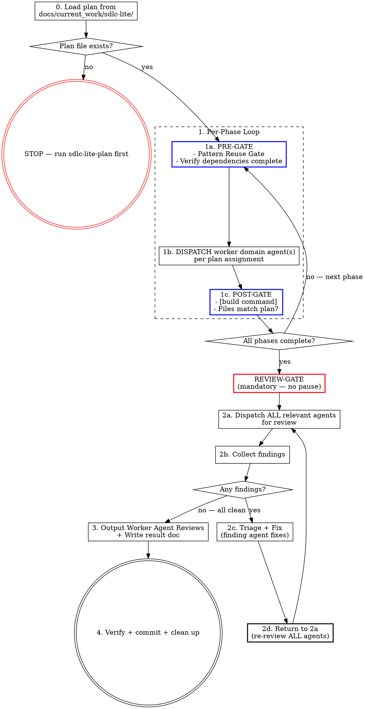

# SDLC-Lite Execution

This skill executes a plan produced by `sdlc-lite-plan`. Worker domain agents implement the phases, review the result, and fix findings. You are the manager — dispatch agents, track completion, and run the review loop until clean.

**Precondition:** A reviewed plan must exist at `docs/current_work/sdlc-lite/dNN_{slug}_plan.md`. If no plan file exists, stop and use `sdlc-lite-plan` first.

## The Process



## Collaboration Model

Read `[sdlc-root]/process/collaboration_model.md` for the CD/CC role definitions, communication patterns (AskUserQuestion rule), decision authority table, and anti-patterns. All questions to the user must use `AskUserQuestion`. All anti-patterns in that doc apply during execution.

## Deliverable Lifecycle

Follow the state machine in `[sdlc-root]/process/deliverable_lifecycle.md`. Update the `**Status:**` marker as the deliverable transitions: In Progress (at phase start), Complete (after final commit). Lite deliverables use the same canonical states — do not invent custom states.

## Step Details

### Manager Rule

Read and follow `[sdlc-root]/process/manager-rule.md` — the canonical definition of this rule. It applies unconditionally for the entire session.

**No pre-dispatch narration.** Status comes from the gates (PRE-GATE, POST-GATE, REVIEW-GATE) — not from sentences around them. Do not type filler describing what you are about to do: "Plan loaded.", "Let me check the catalog.", "Proceeding to Phase N.", "Now updating the catalog and committing.", "Staged set looks correct. Committing." The gates ARE the protocol; commentary around them is noise the user has to scroll past. The two acceptable exceptions are: (1) a one-line note conveying genuinely new information — a deviation observed, a phase-bleeding decision, a serialization choice forced by mid-stream discovery, a triage rationale; (2) the explicit announcements other rules require ("Review loop complete — all agents clean.", REVIEW-GATE block, etc.). When in doubt, prefer the gate over a sentence.

### Agent Dispatch Protocol

Consult `[sdlc-root]/knowledge/architecture/agent-orchestration-patterns.yaml` for dispatch discipline — especially AOP1 (decompose by file ownership for parallel work), AOP8 (wide-shallow dependency graphs), AOP9 (dispatch prompts must include acceptance criteria, owned files, and out-of-scope), and AOP10 (detect workload imbalance between agents). When dispatching 2+ agents in parallel, follow `[sdlc-root]/process/parallel-dispatch-monitoring.md` — read every agent's output before deciding next steps, check for file conflicts, and apply the 3-strike rule for stuck agents.

Dispatch prompts must pass through all relevant context from the plan — outcomes, constraints, acceptance criteria, and any implementation guidance the planning agent included. Never narrate readiness ("Ready to dispatch") and wait for user confirmation. The plan is already approved; execution means continuous forward motion.

### 0. Load the Plan

Read the SDLC-Lite plan file from `docs/current_work/sdlc-lite/`. If multiple plan files exist, check conversation context or ask the user which plan to execute.

**Read the plan file only.** Do not pre-read implementation files, existing components, or codebase patterns before dispatch. The plan file is sufficient context for the manager. Worker domain agents read the files relevant to their own phases when they execute. Pre-reading implementation files and accumulating context is not management — it is the first step toward self-implementation.

Extract from the plan:
1. **Phases and dependencies** — what runs in parallel vs. sequences
2. **Agent assignments** — which worker domain agent owns each phase
3. **Relevant agents** — the full list for post-execution review

If no plan file exists, stop:

> No SDLC-Lite plan found at `docs/current_work/sdlc-lite/`. Use `sdlc-lite-plan` first.

### 1. Execute Phases

Follow the plan's phase structure.

**Phase plan (emit once, before any dispatch):**

Reprint the plan's phase structure as a single table. This is the reference every subsequent PRE-GATE points back to — file-conflict and dependency information live here, not in each per-phase block.

```
**Phase plan**

| # | Agent       | Files                                 | Depends | Parallel with |
|---|-------------|---------------------------------------|---------|---------------|
| 1 | <agent>     | <path>, <path>                        | —       | <# or —>      |
| 2 | <agent>     | <path>, <path>                        | 1       | —             |
```

If any file appears in more than one phase's row, those phases MUST run sequentially regardless of the plan's `Parallel with` column — mark the conflict in the table and explain in one line below. The Phase plan emission IS the file-conflict check; don't repeat it per phase unless a conflict was missed.

For each phase:

**PRE-GATE** — you cannot dispatch the phase agent until this block appears in your response. Use the compact form by default; fall back to verbose when a trigger fires.

Compact form (happy path):

```
### Phase [N] — [phase name]  (agent: [agent-name])

Design decisions:
- [decision 1 — one per bullet, never semicolon-chained]
- [decision 2]

Expected: [counts from plan, or "none"]
```

Verbose form (use when any of these triggers fires):
- **Pattern found** — codebase search surfaced a precedent that's actively shaping the implementation (cite the path)
- **External data** — the phase reads from any source other than the codebase (URL, repo, API, document)
- **Dependency re-check** — the Phase plan table needs amending (mid-execution re-sequencing, late-discovered conflict)
- **Triage ≠ BUILD** — SKIP or REVISE_PLAN (stop and wait for user confirmation)
- **Re-dispatch** — partial completion or stub fix within this same phase

Verbose form — single phase. Emit as a table; the labeled-field block format is deprecated:

```
**PRE-GATE Phase [N] — [phase name]**

| Field          | Value |
|----------------|-------|
| Agent          | [agent-name] |
| Dependencies   | [phase N complete | none required] |
| File-conflict  | [parallel only: list overlap check | N/A — sequential] |
| Pattern search | [what you searched for] → [found / not found / following pattern at path/to/file.ts] |
| Data sources   | [ALL external sources — URLs, repos, APIs, documents | "codebase only"] |
| Expected       | [counts from plan | none] |

Design Decisions:
- [decision 1 — one per bullet, never semicolon-chained]
- [decision 2]
```

Verbose form — parallel dispatch (two or more phases in the same wave). Emit a single comparison table instead of repeating the per-phase block:

```
**PRE-GATE — parallel dispatch (Phases [N], [M])**

| Field          | Phase [N]: [name]      | Phase [M]: [name]      |
|----------------|------------------------|------------------------|
| Agent          | [agent-name]           | [agent-name]           |
| Dependencies   | [...]                  | [...]                  |
| File overlap   | none with Phase [M]    | none with Phase [N]    |
| Pattern search | [...]                  | [...]                  |
| Data sources   | [...]                  | [...]                  |
| Expected       | [...]                  | [...]                  |

Design Decisions — Phase [N]:
- ...

Design Decisions — Phase [M]:
- ...
```

- **Pattern Reuse Gate:** Search the codebase for existing implementations of what this phase builds. Use LSP `goToImplementation` for interface methods and `findReferences` for hooks/utilities. Use Grep for text patterns in configuration or documentation. If a pattern exists, follow it — consistency over preference.
- Verify all dependency phases are complete
- **File-Conflict Gate (parallel phases only):** Verify file overlap (same rule as the phase-plan table above, applied at dispatch time). If any file appears in more than one phase, sequence those phases. Do not rely on the plan's dependency table alone; verify overlap yourself.
- **Data Source Extraction (mandatory):** Read the plan's phase description and extract EVERY data source mentioned — external repos, APIs, URLs, documents, AND codebase files. List them all in the PRE-GATE block. If the plan says data comes from an external source, the dispatch prompt MUST tell the agent to fetch from that source. Omitting an external data source from the dispatch prompt causes agents to hallucinate values instead of reading from the defined source.
**DISPATCH:** List the agent and phase description before dispatching. Every listed agent must have a corresponding dispatch. If you find yourself editing files directly instead of dispatching an agent, stop — that violates the Manager Rule.

**EXECUTE:** Dispatch the assigned agent(s). The dispatch prompt must include:
1. **The phase's full context from the plan** — outcome, constraints, acceptance criteria, AND any implementation guidance the planning agent included (approach hints, key functions, file relationships, migration notes, data flow context). The plan is the agent's primary briefing document — pass through everything relevant to this phase. Do not summarize or omit plan details; the executing agent benefits from the planning agent's full reasoning.
2. **All data sources** from the PRE-GATE extraction — external sources get explicit fetch instructions. For data extraction tasks, tell the agent to read ALL relevant pages from the source, extract ALL entries exhaustively, and cross-check the final count.
3. **Expected counts** from the plan — the agent can self-check its output
4. **Binding Design Decisions** that constrain this phase's implementation
5. **Prior phase artifacts** — when this phase depends on a completed phase that produced data artifacts (seed scripts, config files, type definitions), the dispatch prompt must tell the agent to read those files as the canonical reference. Agents that produce coupled artifacts will fabricate their own values if not told where the canonical data lives.
6. **Library verification instructions** — when the phase involves external library/framework APIs, tell the agent to verify API usage via Context7 (`mcp__context7__resolve-library-id` → `mcp__context7__query-docs`) before writing integration code. Include the library names and versions from the project's dependency files. Agents must not rely on training data for API signatures, parameter names, or default behaviors.
For independent phases, dispatch in parallel using multiple Agent tool calls in a single message.

**Cross-domain knowledge injection:** When a phase requires an agent to work in a context outside its primary domain, consult `[sdlc-root]/knowledge/agent-context-map.yaml` for the other domain's agent and include those knowledge files in the dispatch prompt. Use judgment — only inject when the agent is genuinely crossing into unfamiliar territory. Do not inject for routine single-domain work.

**POST-GATE** — use the compact form by default; fall back to verbose when any trigger fires.

Compact form (happy path — all checks clean):

```
✓ Phase [N] — [X/Y tests pass] · [0 regressions] · [0 stubs] · build: pass
```

If something is not clean but doesn't warrant the full verbose form, indent caveats under the status line with `⚠`:

```
✓ Phase [N] — 6/6 new tests pass · 0 regressions · 0 stubs · build: pass
  ⚠ 36 pre-existing failures in test_session_start.py (baseline — will be fixed by Phase 2 patch-target rename)
```

Verbose form (use when any of these triggers fires):
- **Build fails** — any command from the project's CLAUDE.md returns non-zero
- **File deviation** — agent modified files not listed in the plan for this phase
- **Stubs found on final phase** — stub audit caught placeholder code that won't be filled by a later phase
- **Phase bleeding** — agent covered scope belonging to a subsequent phase
- **Re-dispatch needed** — partial completion requires a re-dispatch within this phase
- **Data audit mismatch** — phase produced data artifacts and the count doesn't match the plan

```
POST-GATE Phase [N] — [phase name]
Build: pass | fail (command: [build command] — see project CLAUDE.md)
Planned files: [list from plan]
Actual files: [list from git diff / agent report]
Deviations: [none | list of extra files with reason — logged, included in result doc]
Stubs: [none | list with file:line and disposition: deferred-to-phase-N | defect — re-dispatch pending]
```

The POST-GATE checks below still apply in both forms — only the output shape changes:

- Verify build passes: `[build command]` — see project CLAUDE.md
- **Stale diagnostic dismissal (anti-pattern):** Do not dismiss build warnings or diagnostics as "stale" or "LSP catching intermediate state." Every warning is potentially real. If a build tool reports an unused variable, type error, or import issue, dispatch the phase agent to verify and fix — do not reason the warning away yourself. Warnings dismissed as stale in one round reliably resurface as real findings in the next review round.
- **File deviation check (mandatory):**
  1. List every file the plan specifies for this phase (created or modified)
  2. List every file the agent actually created or modified (from the git diff or agent report)
  3. Compare the two lists. Any file in list 2 that is NOT in list 1 is a deviation — regardless of whether the agent describes it as "related", "fixing the same pattern", or "obviously necessary"
  4. If any deviation exists: log the deviation (file name and reason) and continue execution. Include all deviations in the result doc's Deviations section. Do not stop for approval — but do not silently absorb them either; they must be visible in the final report.

- **Phase bleeding check:** If an agent returns work that covers scope belonging to a subsequent phase (within plan-listed files): (1) output a one-line note to the user identifying which phase was anticipated, (2) in the subsequent phase's dispatch prompt, include a summary of what the earlier agent already implemented and instruct the agent to verify completeness and implement only what remains. If the bleeding substantially changes a subsequent phase (e.g., makes it a verify-only pass), flag to the user rather than silently absorbing.

- **Re-dispatch within the same phase (partial completion):** If an agent returns work that is incomplete (missed a component, left TODOs, partially implemented scope), re-dispatch that agent with a PRE-GATE block labeled `Phase [N] re-dispatch — [brief reason]`. The PRE-GATE documents what was missed and why the re-dispatch occurred. Omitting the PRE-GATE for re-dispatches creates untracked sub-phases that can cause drift between the plan and the implementation.

- **Stub audit (mandatory):** After each phase completes, grep the plan-specified files for stub indicators: `TODO`, `FIXME`, `NotImplementedError`, `not yet implemented`, `placeholder`, `raise NotImplementedError`, `pass` as a lone function body, hardcoded return values on functions the plan specified as real implementations (e.g., `return True`, `return []`, `return None` where the plan requires actual logic).
  - **Intermediate phases:** Log any stubs found as tracked items. Include them in the next phase's dispatch prompt so the implementing agent knows they exist and must be filled. This is expected — phased execution legitimately stubs things in early phases that get filled later.
  - **Final phase (or single-phase plans):** Stubs are defects. Re-dispatch the phase agent with a PRE-GATE block listing every stub found, requiring real implementation. Do not proceed to the review-fix loop with known stubs — they will pass code review because they are syntactically valid code. A stub that builds clean is the hardest defect to catch in review; catch it here instead.

- **Data audit (mandatory for phases that produce data artifacts):** If this phase created or modified a seed script, scraper, allowlist, or any file containing data values (not just code logic), verify the data against its authoritative source before marking the phase complete. For each data category: check the count matches the plan's expected count, confirm no fabricated entries exist, and confirm no entries are missing. If any value cannot be traced to a source, flag it via `AskUserQuestion`. Code review catches code quality — the data audit catches data accuracy. These are separate concerns.

A phase is NOT complete until POST-GATE passes.

### 2. Completion Review Loop

**MANDATORY — NO PAUSE.** When the last phase's POST-GATE clears, proceed directly to the review loop. A brief phase summary is fine, but do not stop and wait for user input — no "what's next?", no "ready to review?", no waiting for confirmation. The plan already defines the review agents — emit the REVIEW-GATE block and dispatch them in the same response. Phase completion is a waypoint, not a stopping point.

You must emit this block before dispatching review agents:

```
REVIEW-GATE — entering completion review
Phases completed: [list phase numbers]
Review agents (from plan): [list all agent names]
Dispatching: [count] agents
```

After ALL phases are done, run the **Review-Fix Loop** per `[sdlc-root]/process/review-fix-loop.md`. **Start with Step 0 (Verification Gate):** run tests, type checks, linting, and any configured SAST tooling BEFORE dispatching review agents. Fix any verification failures first. Agent source: the plan's agent assignment table. Classifications: use all five per `[sdlc-root]/process/finding-classification.md`.

**Triage output format (mandatory).** When you collect findings and classify them, emit the canonical Classification Table from `[sdlc-root]/process/finding-classification.md` — one row per finding with columns `# | Finding | Agent | Classification | Severity | Rationale`. Do NOT emit two free-form bullet lists ("Will fix:" / "Out of scope:") with agent names in brackets. The canonical table puts every finding on the same scannable axis; the bullet-list shape forces the reader to re-parse classification from prose ("logged in result doc", "pre-existing systemic", "accepted trade-off"). After the table, dispatch FIX rows in a single batch — no narration between table and dispatch.

**Plan contract briefing (mandatory):** When dispatching review agents in the loop, each agent's prompt must include the plan's specification for the phases they are reviewing — specifically: the expected behavior, acceptance criteria, and implementation approach from the plan. Reviewers check "does the implementation match what was specified?" in addition to "is the code well-written?" A well-structured stub passes code quality review but fails plan compliance review. Without the plan contract, reviewers can only assess code quality — they cannot detect whether the agent delivered what was actually asked for.

When the loop exits cleanly, output "Review loop complete — all agents clean. Proceeding to Worker Agent Reviews." then go to step 3.

### 3. Worker Agent Reviews + Result Doc

Every SDLC-Lite execution ends with a Worker Agent Reviews section and a result doc. This step is only reached when 2b shows ALL agents reporting no issues.

**3a. Worker Agent Reviews**

```markdown
## Worker Agent Reviews

Key feedback incorporated:

- [agent-name] specific, concrete feedback that was incorporated
- [agent-name] another specific feedback point with actionable detail
```

**Rules:**
- Bracket the agent's exact name: `[frontend-developer]`, `[software-architect]`, etc.
- Each bullet is specific and concrete — not "code looks good" but "input validation on SubmitForm correctly rejects empty values — prevents silent failures on form submission"
- Omit agents that found no issues
- This section is mandatory — the work is not done without it

**3b. Write Result Doc**

Save a result doc to: `docs/current_work/sdlc-lite/dNN_{slug}_result.md`

Reference the template at `[sdlc-root]/templates/sdlc_lite_result_template.md`. The result doc captures:
- What was built (summary + file lists)
- Deviations from the plan (from POST-GATE logs)
- Acceptance criteria verification (map each criterion from the plan to pass/partial/deferred)
- Worker Agent Reviews (append the section from 3a)
- Follow-up items

The result doc lives alongside the plan file in `docs/current_work/sdlc-lite/`. When the plan is moved to `completed/`, the result doc moves with it.

### 3c. Discipline Capture

Run the discipline capture protocol per `[sdlc-root]/process/discipline_capture.md`. Context format: `[DNN — phase N]`. This includes structured gap detection (using the review-fix triage table and agent dispatch data from this session) followed by the freeform insight scan.

Entry format:
```markdown
- **[Insight title].** [NEEDS VALIDATION] [Description]. (Source: [DNN — phase N])
```

No PROJECT-SECTION markers needed — discipline files are project-specific and not overwritten during framework migrations.

### 3d. CLAUDE.md Refresh

After discipline capture, scan the deliverable for changes that invalidate or extend the project's CLAUDE.md. The work just shipped — this is the moment to update project memory before context fades. Refresh updates ship in the step 4 final commit alongside the work that motivated them; do not commit CLAUDE.md separately.

**Trigger scan.** Compare the deliverable's diff against the existing CLAUDE.md files (project root and any module-/package-level CLAUDE.md the work touched). Update CLAUDE.md only when one of these triggers fired during execution:

| Trigger | What changes in CLAUDE.md |
|---------|---------------------------|
| New convention introduced (naming, error handling, state pattern, testing approach) | Add to conventions section |
| Build / test / lint / dev command added, removed, or renamed | Update commands section |
| Architecture shift (new layer, package boundary, contract surface, deployment model) | Update structure / architecture section |
| Files or directories moved, renamed, or deleted that CLAUDE.md references by path | Fix path references |
| New dependency with non-obvious usage (config, gotchas, version pin, opt-in flag) | Add to dependencies / gotchas section |
| Feature, path, or module that CLAUDE.md still describes was removed or deprecated | Remove or mark deprecated |

If no triggers fired, emit `CLAUDE.md refresh: no changes needed` and proceed. Do not pad CLAUDE.md with session-specific narration — only persistent project knowledge belongs there. Lite deliverables are smaller, so the no-op outcome is the common case; the explicit emission is still required so the gate is auditable.

**Update rules:**
1. Identify which CLAUDE.md file(s) need updates — root, package-level, or both.
2. Make surgical edits to the affected sections only. Do not rewrite untouched sections.
3. Do not paste deliverable summaries ("D-042 added session refresh"). CLAUDE.md describes *how the codebase works*, not deliverable history — that lives in the result doc.
4. Do not document conventions that the next deliverable will touch again. Wait until the convention stabilizes.
5. Do not log review-fix findings as CLAUDE.md content. Findings belong in disciplines.

### 4. Verify, Commit, and Clean Up

**Principle: documentation artifacts ship with their work.** Result docs, catalog updates, discipline entries, and archive moves are part of the deliverable — not afterthoughts. They go in the same commit as the work they describe. Never create separate doc-only or `sdlc`-type commits for artifacts that belong to a work commit.

1. Run `[build command]` — confirm zero errors (see project CLAUDE.md)
2. Review the git diff for unintended changes
3. Move the plan file and result doc to `docs/current_work/sdlc-lite/completed/` — preserves the "why this approach" and "what was built" context for reconciliation
4. Stage **all** modified files — not just application code. Check every category:
   - Application code and test files
   - Result doc (`docs/current_work/sdlc-lite/dNN_*_result.md`)
   - Discipline parking lot entries (`[sdlc-root]/disciplines/*.md`)
   - Knowledge store updates (`[sdlc-root]/knowledge/*.md`)
   - CLAUDE.md updates from step 3d (root and any module-level files)
   - Plan and result archive move (step 3 above)
   - Any other SDLC artifacts modified during execution
5. Commit using the cc-sdlc commit format:
   ```
   {type}[{deliverable_id}]({scope}): {description}

   {optional body — brief summary of what was changed and why}

   Co-Authored-By: Claude Opus 4.6 (1M context) <noreply@anthropic.com>
   ```
   **Types:** `feat` (new feature), `fix` (bug fix), `refactor` (restructure, no behavior change), `docs` (documentation only), `test` (adding/updating tests), `chore` (build, config, tooling, dependencies), `style` (formatting, no logic change), `perf` (performance improvement), `ci` (CI/CD changes), `sdlc` (SDLC process, skills, agents, or framework changes)
   **Example:** `feat[D-042](auth): add session refresh endpoint`
6. Present the full commit to the user:

```
Commit: {short-sha}

{full commit message — title, body, and footers as written}

Files changed:
- {file path}
- {file path}
```

7. Emit the **Completion Report** (step 5)

### 5. Completion Report

Every execution MUST end with a Completion Report presented to the user. This is the final output — the definitive summary of what happened. Emit this block after all commits are made:

```
# [deliverable ID] — Completion Report

[2-3 sentences: what was built, the core value delivered]

---

**Commits**
- `{short-sha}` {repo name} — {commit message title}

---

**What Changed**
- **{file or component}** — {what changed and why}
- **{file or component}** — {what changed and why}

---

**Infra / Deploy**
- {what needs to happen outside of the code — deployments, migrations, env vars, accounts, API keys, database changes, search index config, etc.}

---

**Smoke Tests**
- [ ] {user-facing action — what to do in the app and what to verify}
- [ ] {another user-facing action}

**Deeper Testing**
- {area} — {what to test and why it's worth deeper attention}

---

**Known Gaps**
- {what was deliberately skipped or left incomplete, and why}

**Next Steps**
- {planned forward motion — what comes next}
```

**Rules:**
- **Smoke tests are user-facing actions.** "Open the app and navigate to X", "Try creating a Y", "Check that Z appears on the dashboard." These are things you do in the running application — NOT CLI commands. Exception: if the deliverable's domain is CLI/terminal tooling (e.g., a CLI app, build scripts, developer tools, CME/LME), then commands are the appropriate smoke test format.
- **Omit sections when empty.** Infra / Deploy, Known Gaps, and Next Steps should be omitted entirely when not applicable. Don't include empty sections or "none" placeholders.
- **"What Changed" is exhaustive** — every meaningful change, not just the highlights. This is the audit trail.
- **"Known Gaps" is separate from "Next Steps."** Gaps = deliberately incomplete or skipped. Next steps = planned forward motion. They serve different purposes.
- **"Infra / Deploy" absorbs the deployment guide.** If the work requires manual deployment steps, environment variables, migrations, database changes, or account setup, it goes here. This replaces the standalone deployment guide step.

### Session Handoff

The Manager Rule remains in effect per `[sdlc-root]/process/manager-rule.md` — see the Session Scope section.

## What This Skill Does NOT Do

- **No spec.** Lite deliverables skip the spec. The deliverable is tracked in the catalog (tier: lite) and has a plan file and result doc, but no spec.

## Red Flags

| Thought | Reality |
|---------|---------|
| "There's no plan, I'll wing it" | Stop. Use `sdlc-lite-plan` first. |
| "I'll implement this myself" | If a domain agent exists for it, dispatch them. |
| "This phase is small and well-defined, I'll do it directly" | Size is not an exception. Dispatch the agent. |
| "I'll implement directly to avoid context gaps from dispatching" | Complexity increases the need for agents, not decreases it. Pass the context you have to the agent in the dispatch prompt. |
| "I pre-read 8 files so now I have complete context and can implement" | Pre-reading is the first step toward self-implementation. Read the plan file; let agents read the implementation files they need. |
| "Skip re-review, the fixes were small" | Small fixes cause new bugs. 2d says return to 2a. |
| "I'll skip the review loop, everything looks clean" | The review loop catches what confidence misses. Run it. |
| "I dispatched most of the agents" | ALL means ALL. Count the checklist. Count the dispatches. Match. |
| "One more iteration and I'll get it" | Three failed attempts = wrong hypothesis. Escalate to user. |
| "I'll just merge the conflict / fix the loose ends myself" | Parallel conflict or partial completion is still an agent failure. Re-dispatch the affected agent. |
| "This finding is about code I didn't modify in that file" | If the file is in the plan's Files list, the finding is in scope. File presence is the test, not function-level diff. |
| "The review loop finished cleanly" | Output the exit announcement before proceeding. Silent state transitions cause drift. |
| "Build passes, fixes are done — moving on" | Build-pass is step 4, not the review loop exit. After ANY fix round, return to 2a and dispatch ALL agents. Only exit when 2b shows all agents clean. Two audits caught this same skip. |
| "All phases complete — here's a summary" *(then waits for user input)* | Summaries are fine — stopping is not. Emit the summary, then REVIEW-GATE and dispatch review agents in the same response. The plan defines the review agents; no user input is needed to proceed. |
| "I noted the file deviation but didn't log it" | Deviations don't require approval, but they MUST be logged in the POST-GATE output and included in the result doc's Deviations section. Silent absorption defeats traceability. |
| "Ready to dispatch" / "Let me dispatch now" | Never narrate readiness — just dispatch. The plan is already approved. |
| "Phase 2's agent did Phase 3's work — I'll skip Phase 3" | Note the overlap to the user. Dispatch Phase 3 to verify completeness and implement what remains. |
| "Data sources: read from these codebase files" (plan also mentions external source) | If the plan says data comes from an external source AND codebase files, the dispatch prompt must include BOTH. Listing only codebase files causes agents to hallucinate values for the external-source categories. |
| "This phase produces a scraper/consumer that should align with the seed/config from Phase N" | Tell the agent to READ the Phase N output file for canonical values. Agents will fabricate their own allowlists if not pointed at the canonical source. |
| "The plan is committed, this is just a small follow-up" | Manager Rule applies for the full session. Dispatch the domain agent. |
| "The user asked about the server code — I'll just fix it while I'm here" | Domain crossing. Dispatch the relevant domain agent for that scope. Read domain boundaries in agent definitions. |
| "I'll commit the code now and the docs separately" | Documentation artifacts (result docs, catalog updates, discipline entries, archive moves) ship in the same commit as the work they describe. Separate doc commits fragment the history and break bisectability. |
| "Lite deliverables are too small to bother with CLAUDE.md refresh" | Step 3d is a scan, not a write. The common outcome for lite is `CLAUDE.md refresh: no changes needed`, but the explicit emission is what makes the gate auditable. Skip the scan and you skip the rare lite that does shift a path or convention. |
| "Pasting the deliverable summary into CLAUDE.md" | CLAUDE.md describes how the codebase works, not deliverable history. Result docs hold "what shipped"; CLAUDE.md holds "what future agents need to know to navigate the code." |
| "I know how this library works" | Verify external library APIs via Context7 before writing integration code. |
| "Plan loaded. Let me check the catalog. Proceeding to Phase 1." | Pre-dispatch narration is noise. Read the plan, then emit the PRE-GATE — no filler sentences between tool calls and gates. |
| Two phases dispatched in parallel, two long PRE-GATE blocks emitted | Use the parallel comparison table form. One table with phase columns is faster to read than two stacked blocks. |
| Triage emitted as "Will fix:" + "Out of scope:" bullet lists with `[agent-name]` brackets | Use the canonical Classification Table from finding-classification.md. Bullet lists force the reader to re-parse classification from prose. |

## Integration

- **Feeds into:** `sdlc-tests-run` (post-commit test verification), `sdlc-archive` (when deliverable is complete)
- **Uses:** worker domain agents (implementation + review), `sdlc-lite-plan` output (the plan file), `[sdlc-root]/process/manager-rule.md`, `[sdlc-root]/process/collaboration_model.md`
- **Complements:** `sdlc-execute` (handles full SDLC deliverables)
- **Does NOT replace:** `sdlc-lite-plan` (plan must exist before execution), `sdlc-tests-run` (separate test verification step)
