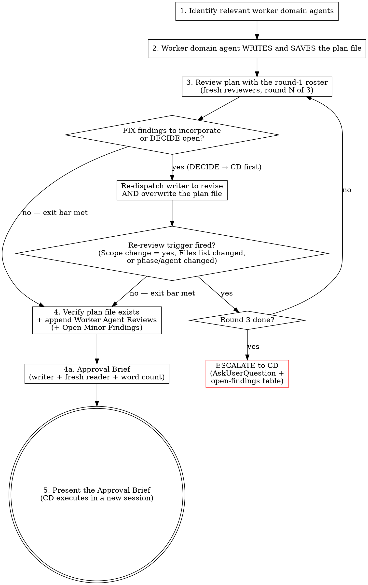

# SDLC-Lite Planning

Domain worker agents write the plan and review it. You are the manager and never do work yourself. This skill produces a plan saved to `docs/current_work/sdlc-lite/`, then presents the plan's Approval Brief, so CD approves from a short brief and starts execution in a new session. A headless run stops at `awaiting-approval` instead.

**This skill produces the plan. It does NOT execute it.** Execution happens via `sdlc-lite-execute`.

## Definition of Done

A lite plan is "done" when a fresh agent — given only the plan file and the current codebase — can execute it without coming back to the planner with questions.

Concretely, the saved plan file must let a reader answer:

1. **What is being built?** — scope, files touched, constraints (with concrete values, not placeholders)
2. **Why this approach?** — either a cited codebase precedent, or a brief comparison of 2 options with tradeoffs and the selected one justified
3. **How is it sequenced?** — ≤4 phases with dependencies and per-phase **outcomes** (what must be true when the phase is done), not just task lists
4. **How do we know it worked?** — per-phase acceptance criteria plus an overall post-execution review gate
5. **What decisions are still open?** — DECIDE items marked explicitly (`USER DECISION NEEDED: ...`), never left as prose ambiguity
6. **What did domain experts push back on?** — Worker Agent Reviews section with bracketed agent names and concrete feedback, appended after review converges
7. **Can CD approve it without reading all of it?** — an Approval Brief in plain language, about 450 words, naming every decision left to CD, checked by a fresh reader (step 4a)

If any of these seven are missing or vague, the plan is not done — regardless of which steps below were followed. The Steps section exists to make these outcomes reliable; when a step conflicts with an outcome (e.g. the plan demonstrably satisfies 1–7 but a step prescribes further work), surface the conflict rather than forcing the step.

## When This Applies

The trigger is **complexity**, not file count. Use SDLC-Lite when the work:
- Is complex enough that winging it risks mistakes (multi-step, cross-domain, non-obvious approach)
- Has clear, bounded scope (you know what "done" looks like)
- Benefits from domain agent review before execution
- Was explicitly confirmed as not needing full SDLC tracking by the user

A 2-file change that touches real-time + database warrants a lite plan. A 10-file rename refactor might not. Judge by the complexity of the decisions involved, not the number of files.

If the work introduces entirely new subsystems or architectural patterns — that's likely a full SDLC deliverable. Check with the user.

## Output

This skill produces:

1. **Plan file** at `docs/current_work/sdlc-lite/dNN_{slug}_plan.md` — persists across context clears, uses a deliverable ID from the catalog
2. **The Approval Brief message** (step 5): the plan's brief, its path, and the line that starts execution in a new session. Interactive runs only: a headless run ends with status `awaiting-approval` and the plan path.

**Approval by pull request.** When the plan goes to CD as a pull request (a factory plan stage, or CD asks for one), the PR description is the plan's Approval Brief (step 4a), in the plan variant of `[sdlc-root]/templates/pr_description_template.md`. In a headless run, fill the caller's PR-description schema fields from it. The rest of the plan stays the agent's contract.

The execution skill (`sdlc-lite-execute`) will additionally produce a **result doc** at `docs/current_work/sdlc-lite/dNN_{slug}_result.md` — capturing what was built, deviations, and acceptance criteria verification.

## The Process



## Agent Selection

Select from project-level worker agents (`.claude/agents/`). Cover every domain the task touches: if a worker agent's domain touches any aspect of the task — its files or its concerns — that domain's agent is included. Breadth is per domain, not headcount: "when in doubt" resolves toward covering a touched domain, never toward adding a second agent for a domain already covered. The review roster is `code-reviewer` and `software-architect` (always) plus one reviewer per touched domain. **Right-sizing is a rule here, not a suggestion (AOP5):** beyond five reviewers, each additional agent needs a one-sentence statement of what it uniquely adds, written next to it in the agent list. High-risk domains (MTS4) always get their specialist regardless of size. Lite plans get the same review loop as full plans — no lighter tier — and are lighter only because they touch fewer domains.

**Playbooks supplement — they don't determine.** A matching playbook provides a useful starting roster, but agent selection must independently assess domain relevance for the specific task. An agent whose domain is touched by the task's content belongs in the list whether or not any playbook mentions them. Playbooks capture *typical* coverage for a task *type*; the actual task may have domain-specific needs the playbook never anticipated.

The canonical agent-to-domain mapping is `[sdlc-root]/process/agent-selection.yaml` (Tier 1). The same worker agents are available here as in `sdlc-plan`.

## Collaboration Model

The full model is in `[sdlc-root]/process/collaboration_model.md` (role definitions, decision authority table, autonomy spectrum). The critical directives:

**AskUserQuestion mandate:** every question directed at the user MUST use the `AskUserQuestion` tool — do not type questions as conversational text. Status updates and completion reports that need no response use normal text. Planning is where this matters most — CC proposes approaches, CD approves. The one exception is plan approval: the Approval Brief message ends the turn, and CD's reply is the answer (step 5; `[sdlc-root]/process/writing-for-cd.md` § Approval Briefs).

<!-- MIRROR-START: headless-mode.md#headless-stop-rule -->
**Headless runs (no person present).** This run is headless if the caller's prompt or appended system prompt has a line starting `SDLC headless mode:`, or if no ask-the-user tool (`AskUserQuestion`, or the harness's equivalent such as OpenCode's `question`) can be used — none is available or loadable, or a call to it is denied without an answer. A dispatched subagent is never headless itself; in a headless run the orchestrator tells each subagent so, and the limits below bind it too. In a headless run, every point in this skill that asks CD something the next step depends on, waits for CD's approval, or escalates to CD **stops the run there**: save the work so far, return the questions, the document or action plan awaiting approval, or the open-findings table as the run's result (in the caller's output schema if it passed one), and end the turn normally — a stop is a result, not an error. A missing precondition the caller must fix ends the run with status `failed` and the reason. Never guess an answer, take a default for a decision CD owns, approve your own work, or skip the gate. List questions the next step does not depend on in the result instead of stopping. Take the no path on optional offers. Cause no side effect outside the working tree — no push, post, comment, label, publish, external send, or live-system change — unless the caller's prompt names it; list those actions in the result. Reads are fine. A question the prompt or thread already answers is not a gate. Full rule and result format: `[sdlc-root]/process/headless-mode.md`.
<!-- MIRROR-END: headless-mode.md#headless-stop-rule -->

**Anti-patterns to avoid:** (1) code assertion without verification — never answer "how does X work" from memory; grep/read the code first; (2) trajectory poisoning — if the agent is off track after 2-3 corrections, clear context and start fresh rather than continuing to correct in a poisoned trajectory.

## Deliverable Lifecycle

Follow the state machine in `[sdlc-root]/process/deliverable_lifecycle.md`. When registering a deliverable (step 0), use the canonical states — do not invent custom states like "In Progress (lite)". Lite deliverables follow the same state definitions as full deliverables.

## Manager Rule

**You are the manager — you orchestrate, you do not implement.** The canonical rule is in `[sdlc-root]/process/manager-rule.md`. The critical constraints:

- **Default: dispatch domain agents** for all code, plans, and domain content. You never write these yourself.
- **Delegation economics exception:** you may self-apply a change when delegation would cost more than the change itself (in tokens or main-context growth) AND the change is small and bounded, requires no design judgment, and needs no new context beyond what you already hold. Every self-applied change still goes through domain agent review — self-applied is never self-approved.
- **Failed dispatch:** if an agent returns without applying its work, re-dispatch with a revised prompt; only a remaining gap that passes the economics test may be closed directly (with review).
- **No semantic revert:** fixing a bug by removing the feature is not a fix — preserve the user's requested behavior.
- **Session scope:** this rule stays active for the entire session. There is no post-commit wind-down mode.

## Steps

These steps exist because LLMs reliably fail the Definition of Done without scaffolding — writers drift into HOW-only plans, skip cross-domain review, summarize when asked to present verbatim, and quietly absorb revision work the writing agent should own. Follow the steps. But the steps are guardrails, not the product: the product is a plan that satisfies outcomes 1–7 above.

### 0. Register Deliverable ID

1. **Read `docs/_index.md`** to find the next deliverable ID (listed in the header as "Next ID: **DNN**").
2. Claim the ID by incrementing the "Next ID" counter in the catalog.
3. Add the deliverable to the catalog table with status `In Progress`, tier `lite`, and `Depends on` (`—`, or the IDs the work already needs finished first).

This ID will be used in the plan filename (`dNN_{slug}_plan.md`).

**An ID that already exists** (a part of a split, such as D11a, or a deliverable CD names): don't claim a new one. Use the existing row, set its status to `In Progress`, and plan only the scope its catalog row and split record give it.

**Prerequisites.** Read the deliverable's `Depends on`. For each prerequisite that has no plan or isn't Complete, tell CD and offer to plan it next (headless: record it in `notes`). Planning may continue. The plan's Phase Dependencies table names the phases each prerequisite gates, and the Approval Brief's review focus repeats any prerequisite still unplanned (`[sdlc-root]/process/deliverable_lifecycle.md` § Dependencies).

**Headless restart.** When the prompt restarts an existing deliverable at a named stage, skip registration and every step before that stage: never claim a second ID or write a second plan file. Read the saved plan and the earlier result's `notes`. If the prompt carries CD's answers to DECIDE findings, a FACTS fail, or an escalated review, resume at that point (the FACTS gate in step 2, or step 3 at the recorded review round with the frozen round-1 roster). If it carries CD's changes to the plan, send them to the writing agent, re-run review when its re-review triggers fire (step 3 at the recorded round, frozen roster), then step 4a. Each headless stop's `notes` carry what a restart needs: the D-number, slug, plan path, writing agent, agent list, and during review the round number, frozen roster and open-findings table (`[sdlc-root]/process/headless-mode.md` § Resuming).

### Agent Dispatch Protocol

Dispatch prompts must pass through all relevant context — outcomes, constraints, and any implementation guidance that would help the agent succeed. Never narrate readiness ("Ready to dispatch") and wait for user confirmation. Dispatch immediately when context is ready.

Consult `[sdlc-root]/knowledge/architecture/agent-orchestration-patterns.yaml` for dispatch discipline — especially AOP5 (right-size the agent group), AOP6 (match specialization to domain), and AOP9 (dispatch prompts must include acceptance criteria, owned files, constraints, and out-of-scope). AOP5 is applied as a rule for the review roster (§ Agent Selection): beyond five reviewers, each extra agent states what it uniquely adds.

Read `[sdlc-root]/knowledge/architecture/model-tier-strategy.yaml` for model/effort tier matching — planning concentrates judgment work (MTS1, MTS6), so this session should run on the highest-tier model available, while recon dispatches go to cheap tiers and high-risk phases get risk-escalated reviewer tiers (MTS4).

**Cross-domain knowledge injection:** When dispatching a worker agent into a domain outside its primary expertise, consult `[sdlc-root]/knowledge/agent-context-map.yaml` for the relevant domain agent's mapped knowledge files and include them in the dispatch prompt.

**Library verification (MANDATORY when external libraries are involved):** You MUST verify API capabilities via Context7 BEFORE dispatching the plan-writing agent.

1. **Resolve library ID:** `mcp__context7__resolve-library-id` for each external library
2. **Query docs:** `mcp__context7__query-docs` — hooks, APIs, props, usage patterns
3. **Fallback if Context7 fails:** If the library ID doesn't resolve or docs are too sparse, fall back to WebSearch (find official docs) → WebFetch (read them). Context7 is the preferred path, not the only path — the requirement is *verified API details*, not *verified via a specific tool*.
4. **Check installed version:** Read `package.json` / lock files
5. **Extract concrete details:** Hook names, signatures, required props, patterns
6. **Pass to writing agent:** Include verified API details in dispatch prompt

**Infrastructure verification (MANDATORY when the plan involves deployment, hosting, or cost claims):** You MUST check the project's existing infrastructure BEFORE dispatching the plan-writing agent.

1. **Check existing services:** Read project config, deployment files, or ask the user what's already running and on which platform
2. **Determine cost basis:** Is this incremental (adding to an existing plan/platform) or greenfield (new account/platform)?
3. **Verify pricing claims:** Cross-check against the platform's current pricing — do not use training-data pricing
4. **Pass to writing agent:** Include verified infrastructure context in dispatch prompt

**VERIFICATION-GATE** — you cannot dispatch agents to write the plan until this block appears in your response. If there are no external libraries and no infrastructure/cost claims, emit the block with `none` entries — the block must still appear.

**One line when every check passes** (`[sdlc-root]/process/writing-for-cd.md` § Status Blocks):

```
VERIFICATION-GATE: PASS · libraries: [name X.Y.Z via Context7 <resolved-id> | WebFetch <docs URL>, installed X.Y.Z; … | none] · infrastructure: [incremental on <platform> | greenfield | none], checked via [project config | deployment files | user confirmation] · external APIs: [name via source; … | none]
```

**The full block when the gate fails,** or when a library's verified and installed versions differ:

```
VERIFICATION-GATE
External libraries:
- [library]: Context7 ID [resolved-id], verified version [X.Y.Z], installed version [X.Y.Z]
- [library]: WebSearch + WebFetch [official docs URL], verified version [X.Y.Z], installed version [X.Y.Z]
Infrastructure claims:
- Existing services checked: [list services found on current platform, or "N/A — no infra claims in this plan"]
- Cost basis: incremental (existing plan) | greenfield | N/A
- Verified via: [project config | deployment files | user confirmation | N/A]
External API contracts:
- [service/API]: verified via [Context7 | WebSearch | official docs | user confirmation]
Gate: PASS | FAIL (unverified: [list what's missing])
```

If the gate shows FAIL, resolve the unverified items before proceeding. Do not dispatch agents with unverified claims — the agent will write confidently from training data, producing plausible but wrong details that survive into the approved plan.

### 1. Identify Relevant Worker Domain Agents

**Independent domain assessment** — start from the task, not from a template. Read the task description and assess which agent domains it touches. Consider both technical domains (frontend, backend, data pipeline) and analytical/specialist domains (meta-analysis, design, accessibility, domain-specific expertise). An agent belongs in the list if their expertise would catch issues or improve quality that other agents would miss. Build this initial list before consulting any playbook.

**Playbook scan** — after your independent assessment, check for a matching playbook. Actually read the catalog before emitting a verdict — "no match" is earned by listing what you scanned, not asserted as a default.

1. Read `[sdlc-root]/playbooks/README.md` — scan the "Available playbooks" table. If the directory or README does not exist, the scan is genuinely empty; record that explicitly.
2. For each playbook in the table, judge task-type overlap. Read the file of any whose task type plausibly overlaps before ruling it out — a one-line table description is not enough to reject a candidate.
3. If a match is found, extract and incorporate:
   - **Recommended agents** → merge into your agent list (add any you missed)
   - **Knowledge context** → include these files when dispatching the relevant agents
   - **Typical phases** → use as the starting phase structure (adapt, don't copy blindly)
   - **Common gotchas** → surface as constraints in the plan
4. Report the scan as evidence in the Pre-Dispatch block (see below) — list every playbook in the catalog with a per-candidate verdict, not just the final match. The scan is mandatory even though "no match" is a fine result.

When exploring existing patterns, use LSP (`goToDefinition`, `findReferences`, `goToImplementation`) for type-system and call-graph questions. Use Grep for string literals and non-TypeScript content.

**Infrastructure domain trigger conditions** — read `[sdlc-root]/process/agent-selection.yaml` § `infrastructure_domains`. For each domain, ask its trigger questions about the task. If any trigger is true, add the specialist.

**CHRONICLE-CONTEXT scan** — scan `docs/chronicle/` for concepts related by name or domain. For each related concept read its `_index.md`; if it references deliverables with relevant decisions or patterns, read those result docs and include the context when dispatching agents. This prevents re-inventing patterns established by prior deliverables.

**Prior-contributor check** — when the chronicle scan surfaces related prior deliverables, check their result docs for which agents contributed (the Worker Agent Reviews section or Agents table). If a prior contributor's domain is relevant to the current task and they aren't already in your list, add them. An agent that shaped the ancestor deliverable likely has context and expertise that applies here — omitting them means losing that continuity.

**ADR-CONTEXT (skip-if-absent)** — after the chronicle scan, check whether `docs/architecture/decisions/_index.md` exists. If it does not, emit `**ADR context:** directory not present — skipped` and move on. If it does:

1. Read `docs/architecture/decisions/_index.md`
2. List active ADRs whose domain overlaps with the current task
3. Include active ADRs as technical constraints in agent dispatch prompts — agents must not re-litigate decided questions
4. Add active ADRs as rows in the Prior context table with `Source = ADR-NN`, `Ref = ADR-NN`, `Takeaway = [1-line decision]`

See `[sdlc-root]/process/adr-practice.md` for conventions, immutability rules, and the full three-function model (READ / PRODUCE / RESPECT).

#### Pre-Dispatch block (compact form — default)

Emit agent coverage and chronicle context as two tables. **Use this form on the happy path.**

```
**Playbook scan:** <N> in catalog — [slug-1: matched, <why> | no-match, <why>], [slug-2: ...]  (or: catalog absent — skipped)
**Playbook match:** [playbook-slug] — [1-line reason] | none

**Agent coverage**

| Domain                            | Specialist                       | Why |
|-----------------------------------|----------------------------------|-----|
| <domain>                          | <agent-name> ← writer            | <one-line rationale> |
| <domain>                          | <agent-name>                     | <one-line rationale> |
| implementation review             | code-reviewer                    | always in the review roster |
| structural review                 | software-architect               | always in the review roster |

**Prior context** — <N> entries

| Source           | Ref    | Takeaway |
|------------------|--------|----------|
| <concept-name>   | D<NN>  | <1-line decision/pattern relevant to this task> |
```

Mark the plan writer with `← writer` in the Specialist column. "Domain" covers both role (e.g. `implementation review`) and infrastructure domain (e.g. `plugin install / env bootstrap`). The Prior context table holds chronicle entries by default; downstream installations that also surface business decisions (DRs, product constraints) add them as rows with `Source = <DR name>`, `Ref = DR-<NN>`. If there are no entries, replace the table with a single line: `**Prior context:** none`.

#### Use verbose form instead of the compact tables if any trigger fires

**Emit either the compact tables above OR the verbose blocks below — never both.** Use the verbose AGENT-RECONFIRM + CHRONICLE-CONTEXT blocks whenever any of these is true — the extra reasoning trail matters when the routine picks need justification:

- **Coverage gap** — an infrastructure domain has no specialist, or `Agents to add` is non-empty
- **Chronicle conflict** — a prior deliverable establishes a pattern that contradicts the current approach, or loaded context is load-bearing for approach selection (not just informational)
- **Scope ambiguity** — unsure whether a trigger condition is met for some domain

Verbose form (use *instead of* the compact tables when any trigger above fires):

```
AGENT-RECONFIRM
Infrastructure touched: [scan each domain's trigger conditions — list every domain where at least one condition is true]
Agents from list above: [list]
Coverage check (infrastructure): [each infra domain → specialist agent if one exists, or "no specialist"]
Agents to add: [list or none]
Updated agent list: [final list]
```

```
CHRONICLE-CONTEXT
Related concepts found: [list concept names or "none"]
Key context loaded:
- [concept]: [1-line summary of relevant decision/pattern]
Context included in agent dispatch: yes | no (none relevant)
```

### 2. Worker Domain Agents Write and Save the Plan

The most relevant worker domain agent writes the plan **and saves it directly to the plan file path using the `Write` tool**. Other worker agents contribute to sections in their domain.

**The writing worker agent — not the manager — owns the file write.** The dispatch prompt must instruct the agent to save the plan to `docs/current_work/sdlc-lite/dNN_{slug}_plan.md` (pass the exact path computed from the deliverable ID in step 0 and a snake_case slug derived from the plan title). The agent returns a short confirmation — not the plan body. If the agent returns the plan body instead of saving the file, re-dispatch with explicit instructions to use the `Write` tool.

**Plan structure:** Use the template at `[sdlc-root]/templates/sdlc_lite_plan_template.md`. Read it before writing the plan. The writing agent leaves the `## Approval Brief` section as the template has it: it is written in step 4a, once review is done.

**Plan rules:**
- **Default to WHAT and WHY.** Phases should lead with outcomes and constraints — what must be true when the phase is done, and why it matters. This is the baseline because it lets the executing agent reason against the live codebase rather than following stale instructions.
- **Include implementation guidance when the planning agent deems it necessary.** If the planning agent has specific knowledge that would help the executing agent — a non-obvious approach, a specific function that needs modification, a migration pattern, a key file relationship — include it. The planning agent's judgment on what context is useful takes priority over a blanket prohibition on HOW details. The goal is to give the executing agent everything it needs to succeed, not to withhold information for purity's sake. Since lite plans are typically executed same-session, **code snippets are encouraged** — function signatures, before/after diffs, and structural patterns compress intent concretely and improve execution reliability.
- **Required regardless of detail level:** Outcome (what "done" looks like), constraints (what must not break), and acceptance criteria. Implementation details are additive — they supplement the outcome description, they don't replace it.
- **Constraint values must be concrete** — "maximum 4 items" not "a maximum count". If the value is a product decision the user hasn't made, mark it explicitly (e.g., `USER DECISION NEEDED: max table count — what should the limit be?`) so the reviewer routes it as DECIDE.

- **Maximum 4 phases.** If you need more, this probably warrants a deliverable — check with the user.
- **Assign each phase** to the worker domain agent with the most relevant expertise.
- **Approach comparison:** If the approach follows an existing codebase pattern, cite the precedent. Otherwise, briefly compare 2 approaches with tradeoffs and state which was selected.
- **The writing agent must produce the complete plan.** Every section shown in the template above — scope, files, agents, phase dependencies table, phases, and post-execution review — must be present in the saved file. After the agent confirms the save, Read the file to verify. If the saved plan is missing any template section, re-dispatch the writing agent to complete it and re-save. Do not fill in missing sections yourself.

**Post-write: offer an explainer or a walkthrough.** Ask CD whether they want an HTML explainer (`sdlc-explain`, **plan** storyboard) or a guided walkthrough (`sdlc-walkthru`) of the plan — never unprompted. Mechanics and the precedes-approval rule: `[sdlc-root]/process/html-rendering.md` § Post-Skill Offer.

**FACTS Gate** — after verifying completeness, score each phase using the FACTS rubric in `[sdlc-root]/process/input-quality-gates.md`. This is a soft gate: present the scores, then let the human decide whether to proceed to review or revise low-scoring phases first. When every phase passes, print one line and continue: `FACTS: PASS · mean [x.x] · lowest: phase [N] ([x.x])`. When any phase fails the bar, present the per-phase lines from `input-quality-gates.md` and wait for CD. Code snippets in lite plans count as Clarity evidence — phases with concrete signatures or diffs score higher on C than prose-only descriptions. **Headless run:** on a pass (every phase: mean ≥ 3.0, C ≥ 3, T ≥ 3), record the scores in the result's `notes` and proceed to review; on a fail, stop with status `needs-input` and the per-phase scores.

### 3. Worker Domain Agent Plan Review

Before executing, dispatch the review roster — `code-reviewer`, `software-architect`, and one worker agent per touched domain (§ Agent Selection) — to review the full plan. Each reviews through their domain lens.

Before dispatching, output the roster as one line:

```
Plan review round N of 3 — dispatching: agent-name-1, agent-name-2, agent-name-3, external-reviewer (if configured)
```

**Every name must have a corresponding agent dispatch. Count the names. Count the dispatches. They must match.** If the count doesn't match, stop and fix.

**External reviewer (first-class when configured):** If `[sdlc-root]/external-review.sh` exists and is executable, the external reviewer is part of the review roster — add it to the roster line and run it in the same review round as the worker agents. Build the plan-review payload (plan only — lite plans have no spec) per `[sdlc-root]/process/external-review-gate.md` § Planning Integration; mid-tier at `high` is the norm for lite plans; state data egress for hosted models. Its findings enter the classification table attributed `[external:<model>]`; the external model never revises the plan. On re-review it participates with the roster, capped at 2 rounds of its own inside the loop's three-round cap — after that, remaining new external findings classify as DECIDE. If the wrapper is absent, leave it off the roster line; if it errors, record "external plan review errored — skipped" and continue.

**Writing agent in review:** The worker agent that wrote the plan (step 2) may be included as a reviewer for self-verification, but cross-domain reviewers typically provide higher marginal value. Whether or not the writing agent reviews, the roster line must reflect only the agents actually dispatched — the count-must-match rule applies to the dispatched set, not the step-1 list.

Dispatch all review worker agents in parallel. Collect feedback.

<!-- MIRROR-START: review-fix-loop.md#plan-review-mechanics -->
**Plan review loop — critical mechanics.** Canonical protocol: `[sdlc-root]/process/review-fix-loop.md` § Plan Review. Shared definitions (severity, deduplication, scope-change marker, Open Minor Findings): `[sdlc-root]/process/finding-classification.md`. These steps are inlined so that skipping the read does not skip the behavior.

1. **Fresh reviewer subagents, every round.** Dispatch each reviewer as a new subagent in its own context window — never a resumed reviewer from an earlier round. Re-review prompts include the previous round's findings table and what the revision changed, require reading the current plan file rather than recalling it, ask for regressions beyond the prior findings, and state that a clean report is an expected, acceptable outcome.
2. **Deduplicate, calibrate, then classify.** Merge duplicates first, then calibrate every severity by impact × likelihood (the impact on the implementation if the plan is executed as written), then classify each finding in the Classification Table. Fill the `Scope change` column for every FIX finding: `yes` if the fix changes the approach, adds or removes files, or changes a phase or agent assignment. Never downgrade a severity to reach the exit bar.
3. **One revision dispatch per round.** All FIX findings go to the writing agent in a single revision dispatch. DECIDE findings go to CD via `AskUserQuestion`. PRE-EXISTING findings appear in the table and need no action.
4. **Re-review trigger is mechanical.** Before the revision dispatch, record the plan's Files list and phase/agent assignments from your last Read of the plan file; after the writer returns, Read it again and compare. Re-review is mandatory if ANY of these is true: (1) any FIX finding has `Scope change` = yes, (2) the revised plan's Files list differs from the pre-revision Files list, or (3) a phase was added, removed, or its assigned agent changed. Otherwise there is no re-review. Read the `Scope change` column and compare the before/after Files list; do not reason about whether the revision "changed the approach."
5. **Re-review dispatches the full roster.** The roster is the round-1 roster line (plus the external reviewer, inside its own 2-round cap). When re-review fires, dispatch every reviewer on it — not a subset chosen by what the revision changed. Plans have no narrow re-review.
6. **Exit bar.** Review ends when no `critical` or `major` FIX finding remains unaddressed and no DECIDE finding is unresolved. Minor FIX findings the revision did not incorporate go in an **Open Minor Findings** table in the plan file. They are never silently closed; only CD closes them.
7. **Three-round cap.** At most 3 review rounds: the first round plus up to 2 re-reviews, and every round counts. If any `critical` or `major` finding is open at the cap, or round 3's revision fires a re-review trigger: stop, escalate to CD via `AskUserQuestion` with the open-findings table, and never claim the review is clean. At the cap with only minors open: exit with the Open Minor Findings table.
<!-- MIRROR-END: review-fix-loop.md#plan-review-mechanics -->

If agents have findings, deduplicate and calibrate them, then classify per `[sdlc-root]/process/finding-classification.md`. Planning context uses FIX, DECIDE, and PRE-EXISTING only, and the Classification Table carries the `Scope change` column. Output the classification table, then:

- Only FIX findings go to the writing worker agent for revision
- DECIDE findings go to the user via `AskUserQuestion`
- PRE-EXISTING findings require no action but must appear in the table

If there are FIX findings, re-dispatch the worker domain agent who wrote the plan (from step 2) with only the FIX findings. **That worker agent produces the revision AND overwrites the plan file** using the `Write` tool at the same path. You do not write the revision, and you do not save it. The re-dispatch prompt must pass the plan file path and explicitly instruct the agent to overwrite it — not return the body. Output one line before re-dispatching:

```
Plan revision — dispatching: [writing-agent-name] to incorporate N findings (K critical, M major, P minor; S scope-change) and overwrite the plan file
```

The names-must-match-dispatches rule from Step 3 applies here too. If you find yourself editing the plan directly — or saving the agent's returned body yourself — stop. Both violate the Manager Rule.

**Re-review:** the trigger and the roster are mechanical (steps 4–5 of the block above). The roster is the round-1 roster line — copy it, re-emitting it each round with N updated (`Plan review round N of 3 — dispatching:`) and dropping `external-reviewer` once its 2-round cap is spent; do not reason about which worker agents are "relevant to this revision."

**Stopping condition:** the exit bar (step 6 of the block above) — no critical or major FIX finding unaddressed, no DECIDE unresolved. Minor FIX findings the revision did not incorporate are listed in an **Open Minor Findings** table (`[sdlc-root]/process/finding-classification.md` § Open Minor Findings), appended after the Worker Agent Reviews section in step 4 — not dropped.

Once the stopping condition is met, collect the feedback that will become the Worker Agent Reviews section. You append this section to the plan file in step 4 — not here. The format specification and rules for that section are below.

```markdown
## Worker Agent Reviews

Key feedback incorporated:

- [agent-name] specific, concrete feedback that was incorporated
- [agent-name] another specific feedback point with actionable detail
```

**Rules:**
- Bracket the worker agent's exact name: `[frontend-developer]`, `[software-architect]`, etc. External reviewer feedback uses `[external:<model>]`
- Each bullet is specific and concrete — not generic praise
- Omit worker agents that found no issues

**This section is mandatory — the plan is not complete without it, even when no worker agents found issues.**

### 3a. Discipline Capture

Run the discipline capture protocol from `[sdlc-root]/process/discipline_capture.md`. Context format: `[DNN — planning]`. The procedure:

1. **Structured gap detection** — 3 comparisons using session data:
   - Knowledge loaded vs. needed: could a knowledge file have prevented any FIX finding?
   - Cross-domain friction: did agents struggle outside their primary domain?
   - Iteration cost: did the review loop run >2 rounds with recurring findings?
2. **Freeform insight scan** — look for insights that are reusable, non-obvious, and cross-discipline
3. **Write to parking lots** — append to `[sdlc-root]/disciplines/*.md` under `## Parking Lot`, one bullet per insight, marked `[NEEDS VALIDATION]`

Skip if nothing surfaced — do not fabricate entries. Budget: <3 minutes total. The manager writes these directly (process documentation, not domain content).

### 4. Verify Plan File and Append Worker Agent Reviews

The plan file was saved by the writing worker agent in step 2 (and overwritten by the same agent during any revision in step 3). Your job here is to verify the file on disk, then append the Worker Agent Reviews section.

1. **Verify the file exists** at `docs/current_work/sdlc-lite/dNN_{slug}_plan.md`. If it does not exist, the writing agent failed to save — re-dispatch per step 2. Do not create the file yourself.
2. **Append the Worker Agent Reviews section** using the `Edit` tool, following the format and rules in step 3 — followed by the **Open Minor Findings** table when any minors remain open. This section is mechanical metadata (summary of review outcomes) and falls under the manager's allowed direct edits per `[sdlc-root]/process/manager-rule.md`. Do not modify any other part of the file — only append the new section at the end.
3. **Format check:** After appending, verify that every bullet begins with `[agent-name]` in square brackets. If any bullet is missing the bracket prefix, correct only the bracket prefix — do not rephrase the finding.

Where `NN` is the deliverable ID from step 0 and `{slug}` is a short snake_case name derived from the plan title (e.g., `d8_card_overlay_controls_plan.md`). The `docs/current_work/sdlc-lite/` directory is created by the writing agent on first save, not by the manager.

### 4a. Approval Brief

CD approves the plan from its `## Approval Brief` section (`[sdlc-root]/process/writing-for-cd.md` § Approval Briefs), written now, from the final plan, Worker Agent Reviews included.

<!-- MIRROR-START: writing-for-cd.md#approval-brief -->
**Approval Brief procedure.** The document's writing agent writes the brief once the document is final (after review, for a plan). The manager never writes it, except a WORDING fix CD asked for during spec approval.

1. **Dispatch the writing agent** to fill the document's `## Approval Brief` section with `Edit`, changing nothing else in the file. It fills the template's `###` headings, keeping them at level 3 and adding no agent-record `<details>`, as the plan variant of `[sdlc-root]/templates/pr_description_template.md` describes each section: plain language, about 450 words, from the document as it now stands. Every decision the document leaves to CD goes under What you're approving: a table CD approves, a `USER DECISION NEEDED`, or scope beyond what was asked for or approved. For a plan, pass it the review round count and the number of open minor findings for the brief's Review line.
2. **Dispatch a fresh reader** in the foreground: a new subagent given only the document's path, told to read the brief first and then the rest. It reports whether someone who didn't watch the work could explain the problem, the change, the choices, the risks and the evidence from the brief alone; any statement the document doesn't support; and any decision left to CD that the brief leaves out. Send its findings to the writing agent to fix. One pass, not a loop.
3. **Count the words:** `awk '/^## Approval Brief/{f=1;next} /^## /{f=0} f' <document path> | wc -w`. If the brief runs well past 450 words (over about 600), send it back to the writing agent once to cut.
<!-- MIRROR-END: writing-for-cd.md#approval-brief -->

### 5. Present the Approval Brief

**Explainer precedes approval:** if CD opted into an HTML explainer of the plan, regenerate it now so it reflects the final revised plan **before** the brief is presented — CD approves what they last saw explained. Never generate it after the approval or in the same message as the brief.

**Headless run:** skip 5a–5b; the reviewed plan is saved, so stop with status `awaiting-approval` and the plan path (`[sdlc-root]/process/headless-mode.md`).

**Interactive run:** follow these sub-steps in order.

**5a.** Use the `Read` tool to read the plan file at `docs/current_work/sdlc-lite/dNN_{slug}_plan.md` (saved by the writing worker agent in step 2, augmented with Worker Agent Reviews in step 4, and given its Approval Brief in step 4a). You need the tool output — do not work from memory.

**5b.** End your turn with one message: the plan's `## Approval Brief` section exactly as the `Read` output shows it, from its heading to the next `## ` heading, followed by:

```
Full plan: `docs/current_work/sdlc-lite/dNN_{slug}_plan.md`

To approve and execute, start a new session and say: **Execute the plan at docs/current_work/sdlc-lite/dNN_{slug}_plan.md**
To change it, tell me what to change.
```

Nothing else, and no `AskUserQuestion` in the same turn. Do not transform, shorten, summarize, or rephrase the brief in any way. Copy-paste it.

**Why this procedure exists:** The LLM's default behavior when asked to "present" content is to summarize it. This has caused compliance failures where the manager wrote a condensed version of the plan instead of the verbatim file. CD approves from a short brief, but the manager still never writes it: the plan's author wrote the brief and a fresh reader checked it against the plan (step 4a). The Read-then-paste procedure makes that section the message itself, with no intermediate "understand and re-express" step.

**Approval** is CD starting execution in a new session; `sdlc-lite-execute` loads the plan from the saved file. **A change request** goes back to the writing agent. Re-run review when its re-review triggers fire, then step 4a, then present the brief again.

### Session Handoff

The Manager Rule remains in effect per `[sdlc-root]/process/manager-rule.md` — see the Session Scope section.

## Red Flags

| Thought | Reality |
|---------|---------|
| "I'll write the plan myself" | Worker agents write. You manage. See Manager Rule. |
| "I'll just incorporate this feedback myself" | Re-dispatch the writing worker agent with the findings. Manager Rule applies to revisions too. |
| "I'll just save the agent's output myself with Write" | The writing worker agent saves. The manager only reads the file (step 5a) and appends the Worker Agent Reviews section (step 4). Saving the returned body yourself risks transcription drift and breaks the Manager Rule. If the agent returned the body instead of saving, re-dispatch it with explicit instructions to use the `Write` tool. |
| "I'll just add the structural elements myself — the worker agent wrote the content" | There is no structural/content distinction. Missing sections (phase dependencies, file list, agents, worker agent reviews) go back to the writing worker agent. Re-dispatch. |
| "Skip plan review, it's simple" | Simple plans still have cross-domain blind spots. |
| "This finding is critical now, so re-review must fire" / "It's only major, so no re-review" | Plan re-review reads the `Scope change` column and the before/after Files and phase/agent lists — never the Severity column. |
| "The plan needed a third revision — one more round and it'll converge" | Plan review is capped at three rounds. At the cap with critical or major findings open, escalate to CD via `AskUserQuestion` with the open-findings table. |
| "I'll resume last round's reviewers — they already know the plan" | Every round uses fresh subagents. Pass the prior findings table and what the revision changed; require reading the current plan file. |
| "Only the reviewers who found issues need to re-check the revision" | Plans have no narrow re-review. A fired trigger re-dispatches the full round-1 roster; no trigger means no re-review. |
| "Add one more reviewer, just in case" | Breadth is per touched domain, not headcount. Beyond five reviewers, each extra agent needs a one-sentence statement of what it uniquely adds. |
| "This needs 5+ phases" | That's a full SDLC deliverable. Check with the user. |
| "I'll include exact code so execution is easier" | Lite plans are typically executed same-session, so code snippets (function signatures, before/after diffs, structural patterns) are acceptable and improve execution reliability. Frame them as intent indicators — the executing agent should verify against actual code before implementing. Avoid exact line numbers, which shift even within a session. |
| "The constraint is specified but the value isn't known yet" | That's a DECIDE finding. Mark it `USER DECISION NEEDED` so the reviewer routes it. |
| "Only one domain is involved" | Most tasks touch 2+ domains. Check again. |
| "Headless run, plan saved — I'll present the brief so CD can approve" | Nobody is there to read it. A headless run skips 5a–5b and stops with `awaiting-approval`; the caller shows CD the brief. |
| "I'll write the brief message from memory" | Interactive run: follow step 5 exactly: Read the file with the Read tool, then paste the Approval Brief section from the Read output, with the path and the execute line. Working from memory produces summaries. |
| "I'll paste the whole plan so CD sees everything" | CD approves from the brief. A plan pasted in full is where CD stops reading. The plan is one path away. |
| "The brief just needs a small fix; I'll make it" | The plan's writing agent writes and fixes the brief (step 4a). The manager only counts its words. |
| "The author's brief reads fine; skip the fresh reader" | The fresh reader catches agent-speak and a missing decision. Run it, then count the words. |
| "The plan has a table CD approves, but it won't fit in the brief" | Every decision left to CD goes under What you're approving, or the fresh reader fails the brief. Cut elsewhere. |
| "Plan's approved — now I'll offer the explainer" | Explainer precedes approval, never follows it. The offer resolves (declined, or accepted and delivered) before the approval gate; a post-approval explainer can't inform the decision it exists to support. |
| "The plan is done, let me just quickly fix this other thing" | Manager Rule applies for the full session. Dispatch the domain agent. |
| "I know how this library works" | Verify external library APIs via Context7. Never assume. VERIFICATION-GATE must show the resolved ID and version. |
| "The pricing is $X/month for this service" | Check existing infrastructure first. If the project already runs on that platform, incremental cost differs dramatically from greenfield pricing. VERIFICATION-GATE must show what you checked. |
| "I'll verify after the plan is written" | Verification happens BEFORE dispatch. Post-hoc verification means the plan was written from unverified claims and the agent's confident tone makes errors invisible. |
| "The external reviewer is for code review, not lite plans" | When `external-review.sh` is configured, the external reviewer joins every plan review round — lite included. Plans are cheap to review; structural mistakes are the expensive kind. |

## Integration

- **Feeds into:** `sdlc-lite-execute` (executes the reviewed plan from the saved file)
- **Uses:** worker domain agents (plan writing + review), `[sdlc-root]/process/manager-rule.md`, `[sdlc-root]/process/collaboration_model.md`, `[sdlc-root]/process/deliverable_lifecycle.md`, `[sdlc-root]/process/external-review-gate.md` § Planning Integration (external reviewer in plan review when configured), `[sdlc-root]/templates/pr_description_template.md` (plan variant, when the plan is approved through a pull request), `[sdlc-root]/process/writing-for-cd.md` (the Approval Brief written in step 4a and presented in step 5, one-line status blocks)
- **Complements:** `sdlc-plan` (handles full SDLC deliverables that need specs)
- **Does NOT replace:** `sdlc-plan` (use that for new features, integrations, or architectural changes)
