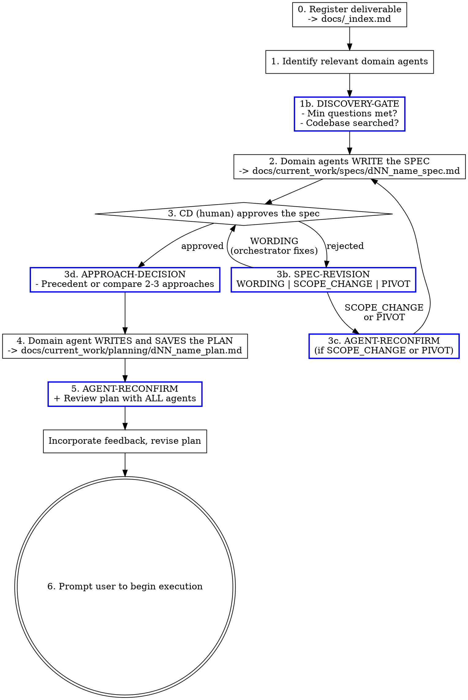

# SDLC Planning

## Overview

Domain agents own the planning lifecycle: they write the spec, they write the plan, they review the plan. You are the orchestrator — you identify which agents are relevant, dispatch them, and ensure the plan is reviewed and approved before declaring it ready for execution.

**This skill produces the plan. It does NOT execute it.** Execution happens via `sdlc-execute`.

**Core principle:** The agent with domain expertise writes and reviews. Never do domain work yourself when an agent exists for it.

## Collaboration Model

Read `[sdlc-root]/process/collaboration_model.md` for the CD/CC role definitions, communication patterns (proposal-first, AskUserQuestion rule), decision authority table, and anti-patterns. Planning is where proposal-first and decision authority matter most — CC proposes approaches, CD approves.

## Deliverable Lifecycle

Follow the state machine in `[sdlc-root]/process/deliverable_lifecycle.md`. When registering a deliverable (step 0), it enters Draft state. After spec approval (step 3), it transitions to Ready. Use the defined `**Status:**` markers in the spec file.

## Manager Rule

Read and follow `[sdlc-root]/process/manager-rule.md` — the canonical definition of this rule. It applies unconditionally for the entire session.

## Mode Selection

| User Intent | Mode | Entry Point |
|-------------|------|-------------|
| "Build X", "add Y", "new feature", "start deliverable", problem statement | **APPLIER** | Full planning workflow (Step 0) |
| "Review this plan", "audit the spec", "check coverage" | **CHECKER** | Audit Workflow below |
| Unclear | Ask: "Are you starting new work, or reviewing existing?" | — |

### CHECKER Mode: Audit Existing Artifacts

When auditing an existing spec or plan (not creating new work):

1. Load the referenced artifact (spec or plan file)
2. Identify which domain agents should review it
3. Dispatch each agent to audit through their domain lens
4. Collect findings — each rated: `critical` / `major` / `minor`
5. Present structured audit to CD:

| Finding | Agent | Severity | Recommendation |
|---------|-------|----------|----------------|
| ... | ... | ... | ... |

6. If CD approves revisions: dispatch agents to fix, then re-audit

**CHECKER mode ends after step 6. APPLIER mode below governs all new planning work.**

## Output

This skill produces three artifacts:

| Artifact | Path | Step |
|----------|------|------|
| Catalog entry | `docs/_index.md` (new row in Active Work table) | 0 |
| Spec | `docs/current_work/specs/dNN_name_spec.md` | 2 |
| Plan | `docs/current_work/planning/dNN_name_plan.md` | 5 |

When complete, prompt the user to begin execution:

> Planning complete. The approved plan is at `docs/current_work/planning/dNN_name_plan.md`.
>
> Ready to execute? Say: **"Execute the plan at docs/current_work/planning/dNN_name_plan.md"**
>
> (Recommend clearing context first — execution benefits from a fresh context budget.)

## Prototype Gate

For tasks with genuine technical uncertainty ("can we parse this data format?", "will [service] support this query?"), run a prototype BEFORE writing the spec:

1. Define the single question to answer
2. Write ≤50 lines of throwaway code on a branch
3. Document the finding in `docs/current_work/prototypes/dNN_name_prototype.md`
4. Use the finding to inform the spec — proceed if feasible, flag to CD if not

**Skip decision must be explicit:** If skipping, state the precedent: "Skipping prototype — this follows the same pattern as [prior implementation]." Do not skip silently.

## Worktree Rule

Assess task scope before starting. Create the worktree **before** step 1 if needed — all domain agent work happens inside it. The execution skill will use the same worktree.

| Scope | Branch Strategy |
|-------|----------------|
| New feature, new integration, new module/adapter | **Git worktree** |
| Breaking changes, multi-step iterative changes | **Git worktree** |
| Modification touching 10+ files | **Git worktree** |
| Bug fix, config change, small modification | Main branch |
| Refactoring (even multi-file) | Main branch |
| Unsure of scope | **Ask the user** |

## The Process



## Agent Selection

### Agent Source

Use `[sdlc-root]/process/agent-selection.yaml` as the canonical agent-to-domain mapping. The Tier 1 section lists every project-level agent and its dispatch triggers. For planning, read the trigger descriptions as domain coverage — if a phase touches files that would trigger an agent in review, that agent should be assigned to that phase.

**Project agents:** `.claude/agents/` (project root) — listed in `agent-selection.yaml` tier1
**Personal agents:** `~/.claude/agents/` — fallback for tasks extending beyond project-scoped expertise (prompt-engineer, refactoring-specialist, research-analyst, competitive-analyst, market-researcher, trend-analyst, etc.)

### Selection Rule

If an agent's domain touches **any aspect** of the task, include them. When in doubt, include. A 2-minute review that finds nothing costs less than a missed issue that ships.

## Phase Details

### Agent Dispatch Protocol

Consult `[sdlc-root]/knowledge/architecture/agent-orchestration-patterns.yaml` for dispatch discipline — especially AOP5 (right-size the agent group), AOP6 (match specialization to domain), and AOP9 (dispatch prompts must include acceptance criteria, owned files, constraints, and out-of-scope).

Dispatch prompts must pass through all relevant context — outcomes, constraints, and any implementation guidance that would help the agent succeed. Never narrate readiness ("Ready to dispatch") and wait for user confirmation. The plan is already approved; execution means continuous forward motion. Use the full dispatch template from the orchestration patterns: objective, owned files (or "Read-only"), constraints, acceptance criteria, and out-of-scope. For spec-writing dispatches, acceptance criteria = "spec covers all required fields from the template"; out-of-scope = "do not propose implementation approach — that is the plan phase."

### 0. Register Deliverable

**This step is mandatory for APPLIER mode.** Every new deliverable gets an ID before any planning begins.

1. **Read `docs/_index.md`** to find the next deliverable ID (listed in the header as "Next ID: **DNN**").
   - If `docs/_index.md` is missing or the Next ID field is absent, stop and alert the user.
2. **Ask the user for a deliverable name** using AskUserQuestion:
   > Starting deliverable **DNN**. What's the name? (e.g., "User Authentication", "Payment Integration")
3. **Create the catalog entry.** Edit `docs/_index.md` to:
   - Add a new row to the Active Work table with the ID, name, and status "Draft"
   - Increment the "Next ID" counter in the header
4. **Confirm and continue:**
   > Deliverable **DNN — Name** registered. Proceeding to agent selection.

**If a deliverable ID already exists** (user says "plan D7" or references an existing catalog entry), skip registration — read the catalog to confirm the ID exists and proceed to step 1.

### 1. Identify Relevant Domain Agents

List which agents are relevant and why:

```
Relevant domain agents for this task:
- frontend-developer: touches UI components and state management
- ui-ux-designer: new UI component needs design review
- software-architect: new pattern being introduced
- code-reviewer: included by default for implementation tasks
```

**Playbook scan** — before finalizing agent selection, check for a matching playbook:

1. Read `[sdlc-root]/playbooks/README.md` — scan the "Available playbooks" table
2. For each playbook whose task type overlaps with the current task, read the playbook file
3. If a match is found, extract and incorporate:
   - **Recommended agents** → merge into your agent list (add any you missed)
   - **Knowledge context** → include these files when dispatching the relevant agents
   - **Typical phases** → use as the starting phase structure (adapt, don't copy blindly)
   - **Common gotchas** → surface as constraints in the spec and plan
   - **Key decisions** → add to discovery questions
4. Report the match in the Pre-Dispatch block:

```
Playbook match: [playbook-slug] — [1-line reason for match] | none
```

If no playbooks exist yet or none match, emit `Playbook match: none` and move on. This is a lookup, not a gate — no match is fine.

**DISCOVERY-GATE** — you cannot dispatch agents to write the spec until this block appears in your response:

```
DISCOVERY-GATE
Complexity: SIMPLE (≤2 files) | MEDIUM (3-9 files) | COMPLEX (10+ files)
Min questions required: [2 | 4 | 6]
Questions asked so far: [N]
Codebase searches: [list what you searched for and what you found]
Gate: PASS | FAIL (need [N] more questions)
```

Ask clarifying questions **one at a time** — batched questions get vague answers. Search the codebase BEFORE asking — don't ask what you can look up. Use LSP (`goToDefinition`, `findReferences`, `hover`) to verify function signatures, trace dependencies, and understand interface contracts — do not read files and infer types. Fall back to Grep for string literals and non-TypeScript content. If the gate shows FAIL, ask more questions before proceeding.

**FAR Gate (MEDIUM/COMPLEX only)** — after DISCOVERY-GATE passes, score each discovery finding using the FAR rubric in `[sdlc-root]/process/input-quality-gates.md`. This is a soft gate: present the scores and let the human decide whether to proceed, re-research, or discard low-scoring findings. Skip for SIMPLE complexity.

**Deep interview technique:** Don't ask obvious questions — dig into the hard parts the user hasn't considered:
- **Edge cases** — "What happens when [unusual but plausible scenario]?"
- **Failure modes** — "If this breaks, what's the blast radius? How would you know?"
- **Hidden dependencies** — "This assumes [X] will always be true. What if it isn't?"
- **Scale implications** — "Does this need to work for 10 items or 10,000?"
- **Second-order effects** — "If we build this, what else changes downstream?"
- **Tradeoffs** — "If you had to choose between [A] and [B], which matters more?"

The goal is to surface unknowns that would become expensive surprises during implementation. Questions that confirm what the user already knows are wasted questions.

**Spec as durable artifact:** The spec is more durable than the code it produces. Code can be regenerated; the spec preserves intent, constraints, and decision context that generated code loses. Document *why* alongside *what* — a spec that only lists requirements without rationale becomes opaque the moment someone asks "why was it built this way?"

**CHRONICLE-CONTEXT** — after the DISCOVERY-GATE passes, scan `docs/chronicle/` for concepts related to this task:

1. List concept directories in `docs/chronicle/`
2. For each concept that could be related (by name or domain), read its `_index.md`
3. If the `_index.md` references deliverables with relevant decisions, patterns, or trade-offs, read those result docs
4. Include the relevant context when dispatching agents for spec and plan writing

This prevents re-discovering decisions already made. If a prior deliverable established a pattern (e.g., "REST in, WebSocket out" for demo state, array-based health configs), the spec and plan agents should know about it.

Emit the result as a **Prior context** table on the happy path:

```
**Prior context** — <N> entries

| Source           | Ref    | Takeaway |
|------------------|--------|----------|
| <concept-name>   | D<NN>  | <1-line decision/pattern from result doc> |
```

If there are no entries, replace the table with a single line: `**Prior context:** none`. The Prior context table holds chronicle entries by default; downstream installations that also surface business decisions (DRs, product constraints) add them as rows with `Source = <DR name>`, `Ref = DR-<NN>`.

**Emit either the compact table above OR the verbose form below — never both.** Use the verbose form when any of these is true:
- Chronicle conflict — a prior deliverable establishes a pattern that contradicts the current approach
- Loaded context is load-bearing for spec/approach selection (not just informational)
- Takeaway for a concept does not fit a single line

Verbose form (use *instead of* the compact table when any trigger above fires):

```
CHRONICLE-CONTEXT
Related concepts found: [list concept names or "none"]
Key context loaded:
- [concept]: [1-line summary of relevant decision/pattern from result doc]
- [concept]: [1-line summary]
Context included in agent dispatch: yes | no (none relevant)
```

**Interactive exploration artifacts:** During discovery — especially for MEDIUM/COMPLEX tasks — create self-contained HTML files when they help CD evaluate options before committing to a spec. These are exploration tools, not deliverables:

- **Side-by-side approach comparisons** — When 2+ architectural approaches exist, render them visually in a single HTML file: data flow diagrams, component trees, tradeoff matrices. CD compares at a glance instead of parsing paragraphs.
- **UI/interaction prototypes** — When the feature involves user-facing behavior, create clickable HTML prototypes with real interactions — hover states, transitions, form flows. Motion and interaction can't be described, only felt.
- **Parameter exploration** — Sliders, knobs, and controls for tuning values that affect the design (rate limits, thresholds, layout density, animation timing). Include a "copy settings" button so CD can paste chosen values back into the conversation.
- **Architecture diagrams** — Interactive SVG with clickable nodes showing module boundaries, data flows, and dependency paths.

Write exploration artifacts to `docs/current_work/ideas/` or `/tmp/` with descriptive names. Read the design system from `[sdlc-root]/templates/html-design-system.html` for visual tokens but use whatever JavaScript and interactivity the exploration requires — the "tabs and collapsibles only" constraint applies to deliverable renders, not exploration artifacts. Offer to open them in the browser.

These artifacts are optional and demand-driven — create them when the discovery reveals that a text description would be insufficient for CD to make a confident decision. Don't create interactive artifacts for simple decisions.

### 2. Domain Agents Write the Spec

The spec is the contract between CD (human) and CC (agent system). It defines **what** will be built and **why**, not how.

The primary domain agent writes the core spec. Other relevant agents contribute domain-specific constraints (e.g., `data-architect` adds schema requirements, `security-engineer` adds security constraints).

**Research integration:** If the spec requires research into external services, APIs, competitors, or technologies — use WebSearch for web research grounded in project context (CLAUDE.md). Incorporate findings into the spec's Design section.

**Library verification (MANDATORY when external libraries are involved):** You MUST verify API capabilities via Context7 BEFORE dispatching the spec-writing agent.

1. **Resolve library ID:** `mcp__context7__resolve-library-id` for each external library
2. **Query docs:** `mcp__context7__query-docs` — hooks, APIs, props, usage patterns
3. **Check installed version:** Read `package.json` / lock files
4. **Extract concrete details:** Hook names, signatures, required props, patterns
5. **Pass to writing agent:** Include verified API details in dispatch prompt

**Spec-time knowledge filtering (opt-in):** When dispatching agents for spec writing, filter their knowledge context to spec-relevant files only — if the project has configured spec-relevance tagging. For each agent being dispatched:
1. Consult `[sdlc-root]/knowledge/agent-context-map.yaml` for the agent's mapped files
2. Check whether **any** knowledge file in the project has `spec_relevant: true`. If none do, load ALL mapped files (the project hasn't configured spec-relevance yet — preserve current behavior).
3. If at least one file is tagged `true`: read each mapped YAML file's top-level `spec_relevant` field. Include only files where `spec_relevant: true` — skip files where `spec_relevant: false` or the field is absent.
4. Read `[sdlc-root]/knowledge/testing/testing-paradigm.yaml` and include it at spec time regardless of its `spec_relevant` tag — the Testing Strategy section below depends on it.

This filtering reduces context load during spec writing by excluding implementation-detail knowledge (code patterns, debugging guides, deployment patterns) that does not inform **what** to build. At plan time (Step 4), ALL mapped files load for each dispatched agent — no `spec_relevant` filtering.

Reference the template at `[sdlc-root]/templates/spec_template.md`. Required fields:
- Problem statement
- Requirements (functional + non-functional)
- Components/packages affected
- Domain scope (all users, specific feature area, infrastructure-only)
- Data model changes
- Interface/adapter changes required
- Depends on (other deliverable IDs)
- Testing strategy — informed by `[sdlc-root]/knowledge/testing/testing-paradigm.yaml` (loaded at spec time per rule 4 above): unit tests for pure logic, integration tests for I/O boundaries, E2E for critical user flows. Identify which code layers the feature introduces and match test types accordingly.
- Success criteria
- Constraints
- Open questions / unknowns — explicitly state what the spec does NOT know yet. Each unknown is a risk; the plan must address or accept each one.

Save to: `docs/current_work/specs/dNN_name_spec.md`

**Post-write: HTML render.** Render the spec to a self-contained HTML file for human reading. Read the design system from `[sdlc-root]/templates/html-design-system.html`, apply **spec** document-type defaults from `[sdlc-root]/process/html-rendering.md`, and write a `.html` file alongside the markdown (same directory, same base name, `.html` extension). This is the version CD reviews for approval.

### 3. CD Approves the Spec

**Hard gate.** Present the spec to the human and wait for explicit approval. Do NOT proceed to planning without approval. Implicit approval is fine ("looks good", "proceed", "yes").

If CD requests changes, classify before acting using the **SPEC-REVISION** block:

```
SPEC-REVISION
CD feedback: [one-line summary]
Classification: WORDING | SCOPE_CHANGE | PIVOT
Action:
  WORDING → orchestrator edits text directly, re-present
  SCOPE_CHANGE → dispatch domain agent(s) to revise affected sections
  PIVOT → AGENT-RECONFIRM + dispatch agents to rewrite spec
```

- **WORDING**: Phrasing, typos, clarifications that don't change what's being built. Orchestrator fixes directly.
- **SCOPE_CHANGE**: Requirements added/removed, packages affected change, new constraints. Dispatch the relevant domain agent to revise. Run AGENT-RECONFIRM (see below) before re-presenting.
- **PIVOT**: Fundamental direction change. Run AGENT-RECONFIRM, then dispatch agents to rewrite the spec from the revised agent list.

**AGENT-RECONFIRM** — emit whenever scope changes (SCOPE_CHANGE, PIVOT, or before step 5). Two coverage dimensions are required: package coverage ensures every affected package has an agent; infrastructure coverage ensures every specialized infrastructure domain has its specialist (not just a generalist who happens to work in the same package).

**Compact form (default, happy path):**

```
**Agent coverage**

| Domain                            | Specialist              | Why |
|-----------------------------------|-------------------------|-----|
| <package or infrastructure domain>| <agent-name>            | <one-line rationale> |
| <package or infrastructure domain>| <agent-name>            | <one-line rationale> |

- **Delta from step 1:** +<added> / −<removed> | unchanged
```

"Domain" covers both package ownership (e.g. `packages/ui`) and infrastructure domain (e.g. `realtime fan-out`). The Specialist column is the agent list in table form — no separate flat list needed.

**Emit either the compact table above OR the verbose form below — never both.** Use the verbose form when any trigger fires:
- Coverage gap — a package or infrastructure domain has no specialist (`no specialist` in the table)
- Agents added or removed vs step 1 (delta is non-empty)
- Infrastructure check catches a domain not obvious from the package list (generalist-masking or absence-masking; see below)
- Scope ambiguity — unsure whether a trigger condition is met for some domain

Verbose form (use *instead of* the compact table when any trigger above fires):

```
AGENT-RECONFIRM
Packages in spec: [list]
Infrastructure touched: [scan the trigger conditions below — list every domain where at least one condition is true]
Agents from step 1: [list]
Coverage check (packages): [each package → agent with domain expertise]
Coverage check (infrastructure): [each infra domain listed above → specialist agent if one exists in the agent table, or "no specialist" if none exists]
Agents to add: [list or none]
Agents to remove: [list or none — only if a domain is no longer touched]
Updated agent list: [final list]
```

**Infrastructure domain trigger conditions** — read `[sdlc-root]/process/agent-selection.yaml` § `infrastructure_domains`. For each domain, ask its trigger questions about the task (not files). If any trigger is true, add the specialist.

The infrastructure check prevents two common failures:
1. **Generalist masking:** A generalist (e.g., `backend-developer`) covers a package that contains specialist infrastructure (e.g., WebSocket fan-out owned by `realtime-systems-engineer`). Both live in the same package, but the generalist lacks domain depth.
2. **Absence masking:** *Removing* infrastructure (e.g., stripping an auth guard to create a public endpoint) doesn't touch specialist code, so file-based scanning misses it. The trigger conditions catch this because they ask about what the change *introduces*, not just what files it modifies.

### 3d. Approach Decision

After spec approval, before writing the plan — determine the implementation approach:

**APPROACH-DECISION** — you cannot proceed to plan writing until this block appears in your response:

```
APPROACH-DECISION
Precedent: [existing pattern at path/to/file.ts | none found]
If precedent: "Following existing pattern. Skipping comparison."
If no precedent:
  Approach A: [2-sentence description] — tradeoff: [key tradeoff]
  Approach B: [2-sentence description] — tradeoff: [key tradeoff]
  [Approach C: optional]
  Selected: [A/B/C] — reason: [why]
```

If the approach follows an existing codebase pattern with no structural ambiguity, cite the precedent and skip comparison. Otherwise, compare 2-3 structurally different approaches before selecting one.

### 4. Domain Agents Write the Plan

After spec approval, the most relevant domain agent(s) **author** the implementation plan. The agent with the deepest expertise in the primary domain writes the plan. Other relevant agents contribute to sections in their domain.

Reference the template at `[sdlc-root]/templates/planning_template.md`.

Example: For a new frontend feature, `frontend-developer` writes the plan, with `ui-ux-designer` contributing the design spec section and `software-architect` contributing the architecture section.

The plan MUST include:
- **Phases with explicit dependencies** — which phases can run in parallel, which must sequence
- **Agent assignments** — which domain agent owns each phase/task
- **Outcomes, constraints, and acceptance criteria for every phase** — what must be true when the phase is done, what must not break, and how to verify success. These are always required regardless of how much implementation detail is included.
- **Implementation guidance at the planning agent's discretion** — The default posture is WHAT and WHY: let the executing agent reason against the live codebase. But when the planning agent has specific knowledge that would help execution succeed — a non-obvious approach, a key function or file relationship, a migration pattern, a data flow that isn't apparent from reading the code — include it. The planning agent's judgment on what context is useful takes priority over withholding details. The goal is to give the executing agent everything it needs, not to enforce abstraction for its own sake.

  **Required (the WHAT):**
  - Outcome: "Egress and spectator identities must be unique across reconnects"
  - Constraint: "Must not break stable identities for player/caster/judge roles"
  - Acceptance criteria: "Two concurrent tabs requesting session tokens produce distinct identities"
  - File scope: which files are affected and why

  **Include when the planning agent judges it useful (the HOW):**
  - Approach guidance: "Use a random suffix on the identity string" / "Follow the pattern in `authAdapter.ts`"
  - Key functions or files: "The `generateToken()` function in `session.ts` is the integration point"
  - Data flow notes: "The field is persisted in Firestore, so renaming requires a migration"
  - Architecture context: "This crosses the API boundary — both client and server adapters need changes"

  **Avoid even when including HOW:**
  - Verbatim code blocks to copy-paste (full deliverable plans may sit days before execution — code shifts underneath them. sdlc-lite-plan relaxes this for same-session work where snippets are still fresh.)
  - Exact line numbers (they shift with any edit)
  - Exhaustive step-by-step sequences that turn the executing agent into a typist

  Constraint values must be concrete — "maximum 4 copies per card" not "a maximum copy count". If the value is a product decision the user hasn't made, mark it explicitly (e.g., `USER DECISION NEEDED: max table count — what should the limit be?`) so the reviewer routes it as a product decision for CD.
- **A "Post-Execution Review" note at the end** — stating that all completed work must be reviewed by all relevant domain agents, and all findings must be fixed before the task is considered done

**Tests-first consideration:** When the spec defines precise expected behavior with clear acceptance criteria, consider writing tests as an early implementation phase (Phase 1 or 2) so subsequent phases implement code to pass them. This front-loads verification and catches spec ambiguity early. The planning template includes a Test Phase Ordering checkbox — select the appropriate strategy. Tests-first is especially valuable for bug fixes (write a failing test that reproduces the bug, then fix it) and for features with well-defined input/output contracts.

**Phase limit:** Plans are capped at 7 phases. If a plan reaches phase 8, **stop writing and split into sub-deliverables** (D1a, D1b) before continuing. Over-phased plans signal insufficient decomposition.

**The writing agent must produce the complete plan AND save it to disk.** The dispatch prompt must instruct the agent to use the `Write` tool to save the plan to `docs/current_work/planning/dNN_name_plan.md` (pass the exact path computed from the deliverable ID). The agent returns a short confirmation — not the plan body. If the agent returns the plan body instead of saving the file, re-dispatch with explicit instructions to use the `Write` tool. **The manager does not save the plan** — saving the agent's returned body yourself risks transcription drift and violates the Manager Rule.

Every section required by the template — package impact, phase dependencies table, phases with agent assignments, and post-execution review — must be present in the saved file. If the saved plan is missing any template section, re-dispatch the writing agent to complete it. Do not fill in missing sections yourself.

**After the writing agent confirms the save, Read the file to verify completeness before proceeding to review.** Check that every phase has: (1) a clear outcome statement, (2) acceptance criteria, and (3) file scope. Implementation guidance beyond these is at the planning agent's discretion and should not be stripped. If a phase is missing outcome or acceptance criteria, re-dispatch the writing agent to add them and re-save.

**FACTS Gate** — after verifying completeness, score each phase using the FACTS rubric in `[sdlc-root]/process/input-quality-gates.md`. This is a soft gate: present the per-phase scores and overall mean, then let the human decide whether to proceed to review or revise low-scoring phases first. Phases with Clarity < 3 or Testability < 3 are worth flagging — reviewers will struggle to evaluate ambiguous or unverifiable phases.

Writer saves to: `docs/current_work/planning/dNN_name_plan.md`

**Post-write: HTML render.** Render the plan to a self-contained HTML file for human reading. Read the design system from `[sdlc-root]/templates/html-design-system.html`, apply **plan** document-type defaults from `[sdlc-root]/process/html-rendering.md`, and write a `.html` file alongside the markdown.

### 5. Domain Agent Plan Review

**AGENT-RECONFIRM** — emit before dispatching review agents. Use the compact / verbose form convention from §3c: emit either the compact table OR the verbose form, never both. Default to the compact table; use the verbose form when a coverage gap, delta from step 1, generalist-masking risk, or scope ambiguity is detected.

Compact form (default):

```
**Agent coverage (review)**

| Domain                            | Specialist              | Why |
|-----------------------------------|-------------------------|-----|
| <package or infrastructure domain>| <agent-name>            | <one-line rationale> |

- **Delta from step 1:** +<added> | unchanged
```

Verbose form (when a fall-back trigger fires):

```
AGENT-RECONFIRM
Packages in plan: [list]
Infrastructure touched: [scan each domain's trigger conditions (§3c infrastructure table) — list every domain where at least one condition is true]
Agents from step 1: [list]
Coverage check (packages): [each package → agent with domain expertise]
Coverage check (infrastructure): [each infra domain listed above → specialist agent if one exists in the agent table, or "no specialist" if none exists]
Agents to add: [list or none]
Updated agent list: [final list]
```

Then output the dispatch checklist:

```
Plan review — dispatching:
- [ ] agent-name-1
- [ ] agent-name-2
- [ ] agent-name-3
```

**Every checkbox must have a corresponding agent dispatch. Count the checkboxes. Count the dispatches. They must match.** If the count doesn't match, stop and fix.

Dispatch all review agents in parallel. Collect feedback.

If agents have findings, classify per `[sdlc-root]/process/finding-classification.md`. Planning context uses FIX, DECIDE, and PRE-EXISTING only. Output the classification table, then:

- Only FIX findings go to the writing agent for revision
- DECIDE findings go to the user via `AskUserQuestion`
- PRE-EXISTING findings require no action but must appear in the table

**Incorporating findings:** If there are FIX findings, re-dispatch the domain agent who wrote the plan (from step 4) with only the FIX findings. **That agent produces the revision AND overwrites the plan file** using the `Write` tool at the same path. You do not write the revision, and you do not save it. The re-dispatch prompt must pass the plan file path and explicitly instruct the agent to overwrite the file — not return the body. Output a dispatch checklist before re-dispatching:

```
Plan revision — dispatching:
- [ ] [writing-agent-name]: incorporate N findings (K critical, M major), overwrite plan file
```

The checkbox-must-match-dispatch rule from Step 5 applies here too. If you find yourself editing the plan directly — or saving the agent's returned body yourself — stop. Both violate the Manager Rule.

**Re-review criteria:** Re-review is mandatory if ANY of the following is true: (1) any FIX finding has Severity = `critical`, (2) the revised plan's file list differs from the pre-revision file list, or (3) a phase was added, removed, or its assigned agent changed. Otherwise — no FIX findings met these criteria — skip re-review. This check is mechanical: scan the Severity column and compare the before/after Files list. Do not reason about whether the revision "changed the approach."

**Re-review dispatch procedure:** When re-review is required, dispatch ALL agents from the step-1 list — not a subset selected based on what changed in the revision. The step-1 agent list determines who reviews. Do not reason about which agents are "relevant to this revision." ALL means the step-1 list.

**Stopping condition:** All agents report no critical or major findings. Minor findings may be acknowledged without a fix — document the decision.

Once the stopping condition is met, append a **Domain Agent Reviews** section to the plan file using the `Edit` tool. This section is mechanical metadata (summary of review outcomes) and falls under the manager's allowed direct edits per `[sdlc-root]/process/manager-rule.md`. Do not modify any other part of the file — only append the new section at the end. **This section is mandatory — the plan is not complete without it, even when no agents found issues.**

```markdown
## Domain Agent Reviews

Key feedback incorporated:

- [agent-name] specific, concrete feedback that was incorporated
- [agent-name] another specific feedback point with actionable detail
```

**Rules:**
- Bracket the agent's exact name: `[frontend-developer]`, `[software-architect]`, etc.
- Each bullet is specific and concrete — not generic praise
- Omit agents that found no issues (don't write "[agent] no issues found")

**Format check:** After appending the Domain Agent Reviews section, verify that every bullet begins with `[agent-name]` in square brackets. If any bullet is missing the bracket prefix, correct only the bracket prefix — do not rephrase the finding.

### 5a. Discipline Capture

Run the discipline capture protocol per `[sdlc-root]/process/discipline_capture.md`. Context format: `[DNN — planning]`. This includes structured gap detection (using the finding classification table and agent dispatch data from this session) followed by the freeform insight scan.

### 6. Prompt for Execution

The plan is reviewed and approved. Enter plan mode so the user gets the standard execution prompt with the option to clear context.

Follow these sub-steps in exact order. Do not combine or skip any.

**6a.** Use the `Read` tool to read the plan file at `docs/current_work/planning/dNN_name_plan.md` (saved by the writing agent in step 4 and augmented with Domain Agent Reviews in step 5). You need the tool output — do not work from memory.

**6b.** Use `EnterPlanMode`. The content you pass to `EnterPlanMode` must be the complete file contents returned by the `Read` tool in step 6a — pasted in full, start to finish. Do not transform, shorten, summarize, or rephrase the read output in any way. Copy-paste it.

**6c.** Use `ExitPlanMode` immediately after.

**Why this procedure exists:** The LLM's default behavior when asked to "present" content is to summarize it. The Read-then-paste procedure eliminates the summarization pathway by making the file contents the direct input to the tool call, with no intermediate "understand and re-express" step.

The execution prompt appears as:

```
Claude has written up a plan and is ready to execute. Would you like to proceed?

 ❯ 1. Yes, clear context and bypass permissions
   2. Yes, and bypass permissions
   3. Yes, manually approve edits
   4. Type here to tell Claude what to change
```

When execution begins (whether in this session or a fresh one), `sdlc-execute` loads the plan from the saved file.

## SDLC Integration

This skill produces the first two SDLC artifacts (spec + plan). The execution skill produces the third (result).

Not every invocation needs a deliverable ID. For ad hoc work (bug fixes, small tweaks), skip the SDLC artifacts. The compliance audit will surface any substantial undocumented work.

## Red Flags

| Thought | Reality |
|---------|---------|
| "I'll write the plan myself" | Domain agents write. You orchestrate. See Manager Rule. |
| "Skip the spec, it's straightforward" | The spec is the contract between CD and CC. No spec, no plan. |
| "I don't need plan review" | Domain agents catch non-obvious issues in obvious plans. |
| "Only one domain is involved" | Most tasks touch 2+ domains. Check again. |
| "Skip straight to coding, the plan is obvious" | Planning catches issues that cost 10x more to fix during execution. |
| "Ready to dispatch" / "Let me dispatch now" | Never narrate readiness — just dispatch. The plan is already approved. |
| "I'll use opus for everything to be safe" | Model tiers are pre-assigned in agent frontmatter. Trust the assignment. |
| "The agent will figure out what skills to load" | Iron Law 2: subagents don't inherit skill awareness. Load skills in the prompt. |
| "I'll ask all my questions at once to save time" | Batched questions get shallow answers. One question at a time surfaces real constraints. |
| "The approach is obvious, no prototype needed" | Have we built this integration before? If no, define the question a prototype would answer. If yes, cite the precedent. |
| "I don't have unknowns for this task" | All tasks have unknowns. If none surface, the spec hasn't been examined deeply enough. State at minimum: integration risks, performance unknowns, and third-party compatibility unknowns. |
| "This plan needs 8+ phases" | Stop. Split into sub-deliverables before continuing. Over-phased plans mean insufficient decomposition. |
| "I'll paste a full code block so the executor can copy it" | Verbatim code goes stale across context clears. Include approach guidance, key functions, and file relationships — but not copy-paste code blocks. |
| "I'll revise the spec myself, it's just a wording change" | Classify first (SPEC-REVISION). SCOPE_CHANGE and PIVOT need agent dispatch. Only WORDING is orchestrator-editable. |
| "The agent list from step 1 still applies" | Run AGENT-RECONFIRM. Scope changes during spec revision or plan writing can introduce domains not in the original list. |
| "Package coverage is enough, no infrastructure specialists needed" | Generalists mask specialists. Run the infrastructure trigger table — it takes 30 seconds and catches what package-level checks miss. |
| "I'll incorporate the review findings myself, it's faster" | Re-dispatch the writing agent with the findings. Manager Rule applies to revisions too. |
| "I'll just save the agent's output myself with Write" | The writing agent saves. The manager only reads the file (step 6a) and appends the Domain Agent Reviews section (step 5). Saving the returned body yourself risks transcription drift and breaks the Manager Rule. If the agent returned the body instead of saving, re-dispatch it with explicit instructions to use the `Write` tool. |
| "I'll just add the structural elements myself — the agent wrote the content" | There is no structural/content distinction. Missing sections (phase dependencies, file list, agents, domain agent reviews) go back to the writing agent. Re-dispatch. |
| "The plan is done, let me just quickly fix this other thing" | Manager Rule applies for the full session. Dispatch the domain agent. |
| "While we're here, I'll also update the server code" | Domain crossing. Dispatch the relevant domain agent for that scope. |
| "I know how this library works" | Verify external library APIs via Context7. Never assume. |

### Session Handoff

The Manager Rule remains in effect per `[sdlc-root]/process/manager-rule.md` — see the Session Scope section.

## Integration

- **sdlc-execute** — The next skill in the pipeline; executes the approved plan
