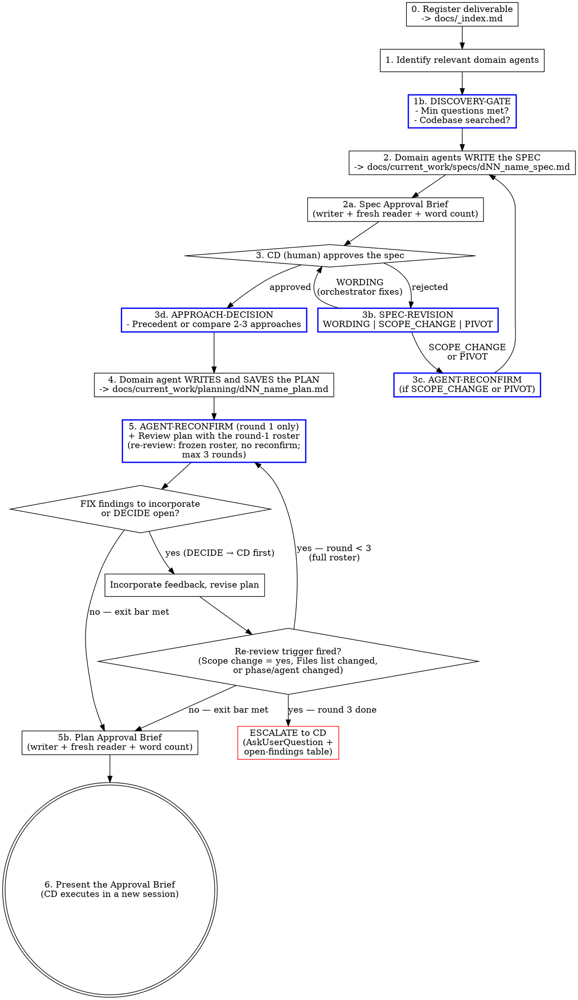

# SDLC Planning

## Overview

Domain agents own the planning lifecycle: they write the spec, they write the plan, they review the plan. You are the orchestrator — you identify which agents are relevant, dispatch them, and ensure the plan is reviewed and approved before declaring it ready for execution.

**This skill produces the plan. It does NOT execute it.** Execution happens via `sdlc-execute`.

**Core principle:** The agent with domain expertise writes and reviews. Never do domain work yourself when an agent exists for it.

## Collaboration Model

The full model is in `[sdlc-root]/process/collaboration_model.md` (role definitions, decision authority table, autonomy spectrum). The critical directives:

**AskUserQuestion mandate:** every question directed at the user MUST use the `AskUserQuestion` tool — do not type questions as conversational text. Status updates and completion reports that need no response use normal text. Planning is where this matters most — CC proposes approaches, CD approves. The one exception is spec and plan approval: the Approval Brief message ends the turn, and CD's reply is the answer (steps 3 and 6; `[sdlc-root]/process/writing-for-cd.md` § Approval Briefs).

<!-- MIRROR-START: headless-mode.md#headless-stop-rule -->
**Headless runs (no person present).** This run is headless if the caller's prompt or appended system prompt has a line starting `SDLC headless mode:`, or if no ask-the-user tool (`AskUserQuestion`, or the harness's equivalent such as OpenCode's `question`) can be used — none is available or loadable, or a call to it is denied without an answer. A dispatched subagent is never headless itself; in a headless run the orchestrator tells each subagent so, and the limits below bind it too. In a headless run, every point in this skill that asks CD something the next step depends on, waits for CD's approval, or escalates to CD **stops the run there**: save the work so far, return the questions, the document or action plan awaiting approval, or the open-findings table as the run's result (in the caller's output schema if it passed one), and end the turn normally — a stop is a result, not an error. A missing precondition the caller must fix ends the run with status `failed` and the reason. Never guess an answer, take a default for a decision CD owns, approve your own work, or skip the gate. List questions the next step does not depend on in the result instead of stopping. Take the no path on optional offers. Cause no side effect outside the working tree — no push, post, comment, label, publish, external send, or live-system change — unless the caller's prompt names it; list those actions in the result. Reads are fine. A question the prompt or thread already answers is not a gate. Full rule and result format: `[sdlc-root]/process/headless-mode.md`.
<!-- MIRROR-END: headless-mode.md#headless-stop-rule -->

**Anti-patterns to avoid:** (1) code assertion without verification — never answer "how does X work" from memory; grep/read the code first; (2) trajectory poisoning — if the agent is off track after 2-3 corrections, clear context and start fresh rather than continuing to correct in a poisoned trajectory.

## Deliverable Lifecycle

Follow the state machine in `[sdlc-root]/process/deliverable_lifecycle.md`. When registering a deliverable (step 0), it enters Draft state. After spec approval (step 3), it transitions to Ready. Use the defined `**Status:**` markers in the spec file.

## Manager Rule

**You are the manager — you orchestrate, you do not implement.** The canonical rule is in `[sdlc-root]/process/manager-rule.md`. The critical constraints:

- **Default: dispatch domain agents** for all code, specs, plans, and domain content. You never write these yourself.
- **Delegation economics exception:** you may self-apply a change when delegation would cost more than the change itself (in tokens or main-context growth) AND the change is small and bounded, requires no design judgment, and needs no new context beyond what you already hold. Every self-applied change still goes through domain agent review — self-applied is never self-approved.
- **Failed dispatch:** if an agent returns without applying its work, re-dispatch with a revised prompt; only a remaining gap that passes the economics test may be closed directly (with review).
- **No semantic revert:** fixing a bug by removing the feature is not a fix — preserve the user's requested behavior.
- **Session scope:** this rule stays active for the entire session. There is no post-commit wind-down mode.

## Mode Selection

| User Intent | Mode | Entry Point |
|-------------|------|-------------|
| "Build X", "add Y", "new feature", "start deliverable", problem statement | **APPLIER** | Full planning workflow (Step 0) |
| "Review this plan", "audit the spec", "check coverage" | **CHECKER** | Audit Workflow below |
| Unclear | Ask: "Are you starting new work, or reviewing existing?" | — |

### CHECKER Mode: Audit Existing Artifacts

When auditing an existing spec or plan (not creating new work):

1. Load the referenced artifact (spec or plan file)
2. Identify which domain agents should review it
3. Dispatch each agent to audit through their domain lens
4. Collect findings — each rated: `critical` / `major` / `minor`
5. Present structured audit to CD:

| Finding | Agent | Severity | Recommendation |
|---------|-------|----------|----------------|
| ... | ... | ... | ... |

6. If CD approves revisions: dispatch agents to fix, then re-audit under `[sdlc-root]/process/review-fix-loop.md` § Plan Review. For a **plan** audit, first deduplicate, calibrate, then classify each finding in the planning Classification Table (`[sdlc-root]/process/finding-classification.md`, with the `Scope change` column) — the step 5 severities are calibrated before CD sees them — and record the Files list and phase/agent assignments; re-audit only if a plan re-review trigger fires. For a **spec** audit, re-audit only if the fix changed the spec's scope. Re-audits dispatch the full round-1 roster as fresh subagents. The initial audit is round 1, with at most 3 rounds: at the cap with a critical or major finding open, or with a trigger fired, escalate to CD via `AskUserQuestion` with the open-findings table.

**CHECKER mode ends after step 6. APPLIER mode below governs all new planning work.**

## Output

This skill produces three artifacts:

| Artifact | Path | Step |
|----------|------|------|
| Catalog entry | `docs/_index.md` (new row in Active Work table) | 0 |
| Spec | `docs/current_work/specs/dNN_name_spec.md` | 2 |
| Plan | `docs/current_work/planning/dNN_name_plan.md` | 5 |

When complete in an interactive run, step 6 presents the plan's Approval Brief, its path, and the line that starts execution in a new session (a headless run ends with status `awaiting-approval` and the plan path instead).

**Approval by pull request.** When the spec or plan goes to CD as a pull request (a factory plan stage, or CD asks for one), the PR description is the document's Approval Brief (step 2a for the spec, 5b for the plan), in the plan variant of `[sdlc-root]/templates/pr_description_template.md`. In a headless run, fill the caller's PR-description schema fields from it. The rest of each document stays the agent's contract.

## Feasibility Gate

For tasks with genuine technical uncertainty, **resolve the uncertainty BEFORE writing the spec** — not during execution. Pick the resolution method by where the uncertainty lives:

| Uncertainty lives in | Method | Example questions |
|---------------------|--------|-------------------|
| **External** systems you don't own | **Throwaway prototype** — ≤50 lines on a branch | "Can we parse this data format?" "Will [service] support this query?" |
| **Internal** code you own | **Feasibility audit** — dispatch the owning domain agent to READ the actual subsystems and render a per-candidate verdict | "Do these engine primitives already exist?" "Is this composable from existing helpers, or new engine work — and how big?" |

For your own codebase you do **not** need throwaway prototype code. The faster, more accurate move is a feasibility audit: the engine/subsystem owner reads the real code and returns a verdict per candidate — **exists / composable from existing helpers / needs new work + size estimate**. This makes the plan accurate instead of speculative.

Either way:

1. Define the question(s) to answer
2. Run the prototype (external) or feasibility audit (internal)
3. Document the finding in `docs/current_work/prototypes/dNN_name_prototype.md`
4. Use the finding to inform the spec and the phasing — proceed if feasible, flag to CD if not

**The deferral anti-pattern (the core rule):** If a feasibility question's answer would change the plan's *structure* — one deliverable vs. split, phase count, scope, sequencing, or a one-vs-many decision — it MUST be resolved here, at planning time. Scheduling a "prove the primitives" spike as the *first execution phase* (P0), then phasing the rest of the plan on the speculative answer with a mid-execution GO/NO-GO checkpoint, is the smell. The spike's whole purpose is to answer a planning-time question; run it now and let the *real* engine cost shape the plan, rather than committing to a structure you may have to unwind. Verifying against the actual code now resolves most open questions before phasing — cheaper than discovering them mid-execution.

**Skip decision must be explicit:** If skipping, state the precedent: "Skipping feasibility check — this follows the same pattern as [prior implementation]." Do not skip silently.

## Worktree Rule

Assess task scope before starting. Create the worktree **before** step 1 if needed — all domain agent work happens inside it. The execution skill will use the same worktree.

| Scope | Branch Strategy |
|-------|----------------|
| New feature, new integration, new module/adapter | **Git worktree** |
| Breaking changes, multi-step iterative changes | **Git worktree** |
| Modification touching 10+ files | **Git worktree** |
| Bug fix, config change, small modification | Main branch |
| Refactoring (even multi-file) | Main branch |
| Unsure of scope | **Ask the user** |

## The Process


```dot
digraph planning {
    rankdir=TB;

    "0. Register deliverable\n-> docs/_index.md" [shape=box];
    "1. Identify relevant domain agents" [shape=box];
    "1b. DISCOVERY-GATE\n- Min questions met?\n- Codebase searched?" [shape=box, style=bold, color=blue];
    "2. Domain agents WRITE the SPEC\n-> docs/current_work/specs/dNN_name_spec.md" [shape=box];
    "3. CD (human) approves the spec" [shape=diamond];
    "3b. SPEC-REVISION\nWORDING | SCOPE_CHANGE | PIVOT" [shape=box, style=bold, color=blue];
    "3c. AGENT-RECONFIRM\n(if SCOPE_CHANGE or PIVOT)" [shape=box, style=bold, color=blue];
    "3d. APPROACH-DECISION\n- Precedent or compare 2-3 approaches" [shape=box, style=bold, color=blue];
    "4. Domain agent WRITES and SAVES the PLAN\n-> docs/current_work/planning/dNN_name_plan.md" [shape=box];
    "5. AGENT-RECONFIRM (round 1 only)\n+ Review plan with the round-1 roster\n(re-review: frozen roster, no reconfirm;\nmax 3 rounds)" [shape=box, style=bold, color=blue];
    "FIX findings to incorporate\nor DECIDE open?" [shape=diamond];
    "Incorporate feedback, revise plan" [shape=box];
    "Re-review trigger fired?\n(Scope change = yes, Files list changed,\nor phase/agent changed)" [shape=diamond];
    "ESCALATE to CD\n(AskUserQuestion +\nopen-findings table)" [shape=box, color=red];
    "2a. Spec Approval Brief\n(writer + fresh reader + word count)" [shape=box];
    "5b. Plan Approval Brief\n(writer + fresh reader + word count)" [shape=box];
    "5b. Plan Approval Brief\n(writer + fresh reader + word count)" -> "6. Present the Approval Brief\n(CD executes in a new session)";
    "6. Present the Approval Brief\n(CD executes in a new session)" [shape=doublecircle];

    "0. Register deliverable\n-> docs/_index.md" -> "1. Identify relevant domain agents";
    "1. Identify relevant domain agents" -> "1b. DISCOVERY-GATE\n- Min questions met?\n- Codebase searched?";
    "1b. DISCOVERY-GATE\n- Min questions met?\n- Codebase searched?" -> "2. Domain agents WRITE the SPEC\n-> docs/current_work/specs/dNN_name_spec.md";
    "2. Domain agents WRITE the SPEC\n-> docs/current_work/specs/dNN_name_spec.md" -> "2a. Spec Approval Brief\n(writer + fresh reader + word count)";
    "2a. Spec Approval Brief\n(writer + fresh reader + word count)" -> "3. CD (human) approves the spec";
    "3. CD (human) approves the spec" -> "3b. SPEC-REVISION\nWORDING | SCOPE_CHANGE | PIVOT" [label="rejected"];
    "3b. SPEC-REVISION\nWORDING | SCOPE_CHANGE | PIVOT" -> "3c. AGENT-RECONFIRM\n(if SCOPE_CHANGE or PIVOT)" [label="SCOPE_CHANGE\nor PIVOT"];
    "3b. SPEC-REVISION\nWORDING | SCOPE_CHANGE | PIVOT" -> "3. CD (human) approves the spec" [label="WORDING\n(orchestrator fixes)"];
    "3c. AGENT-RECONFIRM\n(if SCOPE_CHANGE or PIVOT)" -> "2. Domain agents WRITE the SPEC\n-> docs/current_work/specs/dNN_name_spec.md";
    "3. CD (human) approves the spec" -> "3d. APPROACH-DECISION\n- Precedent or compare 2-3 approaches" [label="approved"];
    "3d. APPROACH-DECISION\n- Precedent or compare 2-3 approaches" -> "4. Domain agent WRITES and SAVES the PLAN\n-> docs/current_work/planning/dNN_name_plan.md";
    "4. Domain agent WRITES and SAVES the PLAN\n-> docs/current_work/planning/dNN_name_plan.md" -> "5. AGENT-RECONFIRM (round 1 only)\n+ Review plan with the round-1 roster\n(re-review: frozen roster, no reconfirm;\nmax 3 rounds)";
    "5. AGENT-RECONFIRM (round 1 only)\n+ Review plan with the round-1 roster\n(re-review: frozen roster, no reconfirm;\nmax 3 rounds)" -> "FIX findings to incorporate\nor DECIDE open?";
    "FIX findings to incorporate\nor DECIDE open?" -> "Incorporate feedback, revise plan" [label="yes (DECIDE → CD first)"];
    "FIX findings to incorporate\nor DECIDE open?" -> "5b. Plan Approval Brief\n(writer + fresh reader + word count)" [label="no — exit bar met"];
    "Incorporate feedback, revise plan" -> "Re-review trigger fired?\n(Scope change = yes, Files list changed,\nor phase/agent changed)";
    "Re-review trigger fired?\n(Scope change = yes, Files list changed,\nor phase/agent changed)" -> "5b. Plan Approval Brief\n(writer + fresh reader + word count)" [label="no — exit bar met"];
    "Re-review trigger fired?\n(Scope change = yes, Files list changed,\nor phase/agent changed)" -> "5. AGENT-RECONFIRM (round 1 only)\n+ Review plan with the round-1 roster\n(re-review: frozen roster, no reconfirm;\nmax 3 rounds)" [label="yes — round < 3\n(full roster)"];
    "Re-review trigger fired?\n(Scope change = yes, Files list changed,\nor phase/agent changed)" -> "ESCALATE to CD\n(AskUserQuestion +\nopen-findings table)" [label="yes — round 3 done"];
}
```

## Agent Selection

### Agent Source

Use `[sdlc-root]/process/agent-selection.yaml` as the canonical agent-to-domain mapping. The Tier 1 section lists every project-level agent and its dispatch triggers. For planning, read the trigger descriptions as domain coverage — if a phase touches files that would trigger an agent in review, that agent should be assigned to that phase.

**Project agents:** `.claude/agents/` (project root) — listed in `agent-selection.yaml` tier1
**Personal agents:** `~/.claude/agents/` — fallback for tasks extending beyond project-scoped expertise (prompt-engineer, refactoring-specialist, research-analyst, competitive-analyst, market-researcher, trend-analyst, etc.)

### Selection Rule

Cover every domain the task touches: if an agent's domain touches **any aspect** of the task — its files or its concerns — that domain's agent is included. Breadth is per domain, not headcount: "when in doubt" resolves toward covering a touched domain, never toward adding a second agent for a domain already covered. The review roster is `code-reviewer` and `software-architect` (always) plus one reviewer per touched domain. **Right-sizing is a rule here, not a suggestion (AOP5):** beyond five reviewers, each additional agent needs a one-sentence statement of what it uniquely adds, written next to it in the agent list. High-risk domains (MTS4) always get their specialist regardless of size.

**Playbooks supplement — they don't determine.** A matching playbook provides a useful starting roster, but agent selection must independently assess domain relevance for the specific task. An agent whose domain is touched by the task's content belongs in the list whether or not any playbook mentions them. Playbooks capture *typical* coverage for a task *type*; the actual task may have domain-specific needs the playbook never anticipated.

## Phase Details

### Agent Dispatch Protocol

Consult `[sdlc-root]/knowledge/architecture/agent-orchestration-patterns.yaml` for dispatch discipline — especially AOP5 (right-size the agent group), AOP6 (match specialization to domain), and AOP9 (dispatch prompts must include acceptance criteria, owned files, constraints, and out-of-scope). AOP5 is applied as a rule for the review roster (§ Selection Rule): beyond five reviewers, each extra agent states what it uniquely adds.

Read `[sdlc-root]/knowledge/architecture/model-tier-strategy.yaml` for model/effort tier matching — planning concentrates judgment work (MTS1, MTS6), so this session should run on the highest-tier model available, while recon dispatches go to cheap tiers and the plan must assign risk-escalated reviewer tiers to high-risk phases (MTS4).

Dispatch prompts must pass through all relevant context — outcomes, constraints, and any implementation guidance that would help the agent succeed. Never narrate readiness ("Ready to dispatch") and wait for user confirmation. The plan is already approved; execution means continuous forward motion. Use the full dispatch template from the orchestration patterns: objective, owned files (or "Read-only"), constraints, acceptance criteria, and out-of-scope. For spec-writing dispatches, acceptance criteria = "spec covers all required fields from the template"; out-of-scope = "do not propose implementation approach — that is the plan phase."

### 0. Register Deliverable

**This step is mandatory for APPLIER mode.** Every new deliverable gets an ID before any planning begins.

1. **Read `docs/_index.md`** to find the next deliverable ID (listed in the header as "Next ID: **DNN**").
   - If `docs/_index.md` is missing or the Next ID field is absent, stop and alert the user.
2. **Ask the user for a deliverable name** using AskUserQuestion:
   > Starting deliverable **DNN**. What's the name? (e.g., "User Authentication", "Payment Integration")
3. **Create the catalog entry.** Edit `docs/_index.md` to:
   - Add a new row to the Active Work table with the ID, name, and status "Draft"
   - Increment the "Next ID" counter in the header
4. **Confirm and continue:**
   > Deliverable **DNN — Name** registered. Proceeding to agent selection.

**If a deliverable ID already exists** (user says "plan D7" or references an existing catalog entry), skip registration — read the catalog to confirm the ID exists and proceed to step 1.

**Headless restart.** When the prompt restarts an existing deliverable at a named stage, skip registration and every step before that stage, and never mint a second D-number. Read the saved spec or plan and the earlier result's `notes` instead. Then:
- **CD approved the spec:** if the saved spec still matches the version that was awaiting approval, set its `**Status:**` to Ready and start at step 3d. If it has changed since, stop again with `awaiting-approval`.
- **CD gave feedback on the spec:** start at the SPEC-REVISION block in step 3.
- **CD answered a discovery question or a FAR fail:** continue at the DISCOVERY-GATE in step 1, then the FAR gate. Findings CD accepted or discarded in the thread do not stop the run again.
- **CD answered a FACTS fail:** resume at the FACTS gate in step 4. Step 5's round 1 then runs AGENT-RECONFIRM as usual.
- **CD answered DECIDE findings or an escalated review:** resume step 5 at the recorded review round with the frozen round-1 roster. Do not re-run AGENT-RECONFIRM.
- **CD asked for changes to the plan:** send them to the plan's writing agent, re-run review when its re-review triggers fire (step 5 at the recorded round, frozen roster), then step 5b.

Never re-run finished discovery or rewrite an approved spec. Each headless stop's `notes` carry what a restart needs: the D-number, complexity, the worktree path or branch, the step-1 agent list, the plan's writing agent, the content hash (`git hash-object`) of a spec awaiting approval, the Prior context table and ADR constraints, the playbook match, and, during plan review, the round number, the frozen round-1 roster and the open-findings table (`[sdlc-root]/process/headless-mode.md` § Resuming).

### 1. Identify Relevant Domain Agents

**Independent domain assessment** — start from the task, not from a template. Read the task description and assess which agent domains it touches. Consider both technical domains (frontend, backend, data pipeline) and analytical/specialist domains (meta-analysis, design, accessibility, domain-specific expertise). An agent belongs in the list if their expertise would catch issues or improve quality that other agents would miss. Build this initial list before consulting any playbook.

List which agents are relevant and why:

```
Relevant domain agents for this task:
- frontend-developer: touches UI components and state management
- ui-ux-designer: new UI component needs design review
- software-architect: new pattern being introduced
- code-reviewer and software-architect: always included in the review roster
```

**Playbook scan** — after your independent assessment, check for a matching playbook. You must actually read the catalog before emitting a verdict — "no match" is a conclusion you earn by listing what you scanned, not a default you assert.

1. Read `[sdlc-root]/playbooks/README.md` — scan the "Available playbooks" table. If the directory or README does not exist, the scan is genuinely empty; record that explicitly.
2. For each playbook in the table, judge task-type overlap. Read the file of any whose task type plausibly overlaps before ruling it out — a one-line table description is not enough to reject a candidate.
3. If a match is found, extract and incorporate:
   - **Recommended agents** → merge into your agent list (add any you missed)
   - **Knowledge context** → include these files when dispatching the relevant agents
   - **Typical phases** → use as the starting phase structure (adapt, don't copy blindly)
   - **Common gotchas** → surface as constraints in the spec and plan
   - **Key decisions** → add to discovery questions
4. Report the scan as **evidence, not a verdict** in the Pre-Dispatch block. List every playbook in the catalog with a per-candidate match/no-match reason, then the chosen match:

```
Playbook scan: <N> in catalog — [slug-1: matched, <why> | no-match, <why>], [slug-2: ...]   (or: catalog absent — skipped)
Playbook match: [playbook-slug] — [1-line reason for match] | none
```

You cannot write the scan line without having read `README.md` (you have to name the actual slugs), and you cannot list a slug without judging its overlap — that is what closes the fabrication gap. Reaching `Playbook match: none` while a real, overlapping playbook sits in the catalog is a process miss, not an acceptable default. This is still a soft gate on the *result* (no match is a fine outcome), but the *scan itself is mandatory* — emit the evidence line every time.

**DISCOVERY-GATE** — you cannot dispatch agents to write the spec until this block appears in your response. **One line when it passes** (`[sdlc-root]/process/writing-for-cd.md` § Status Blocks):

```
DISCOVERY-GATE: PASS · [SIMPLE | MEDIUM | COMPLEX] ([N] files) · questions [asked] of [min] · searched: [what you searched for → what you found; …]
```

**The full block while it fails:**

```
DISCOVERY-GATE
Complexity: SIMPLE (≤2 files) | MEDIUM (3-9 files) | COMPLEX (10+ files)
Min questions required: [2 | 4 | 6]
Questions asked so far: [N]
Codebase searches: [list what you searched for and what you found]
Gate: PASS | FAIL (need [N] more questions)
```

Ask clarifying questions **one at a time** — batched questions get vague answers. Search the codebase BEFORE asking — don't ask what you can look up. Use LSP (`goToDefinition`, `findReferences`, `hover`) to verify function signatures, trace dependencies, and understand interface contracts — do not read files and infer types. Fall back to Grep for string literals and non-TypeScript content. If the gate shows FAIL, ask more questions before proceeding.

**Headless run:** questions the prompt, the thread or CD's earlier answers already settle count toward the minimum; cite where each was answered. If the gate still shows FAIL, stop with status `needs-input` carrying the single most blocking question. Never mark PASS without the count, lower the minimum, or batch several questions into one stop.

**FAR Gate (MEDIUM/COMPLEX only)** — after DISCOVERY-GATE passes, score each discovery finding using the FAR rubric in `[sdlc-root]/process/input-quality-gates.md`. This is a soft gate: present the scores and let the human decide whether to proceed, re-research, or discard low-scoring findings. When every finding passes, print one line and continue: `FAR: PASS · [N] findings · lowest: [finding] (F:x A:x R:x)`. When any fails, present the per-finding scores and wait for CD. Skip for SIMPLE complexity. **Headless run:** if every finding passes, record the scores in the result's `notes` and proceed; otherwise stop with status `needs-input` and the scores.

**Deep interview technique:** Don't ask obvious questions — dig into the hard parts the user hasn't considered:
- **Edge cases** — "What happens when [unusual but plausible scenario]?"
- **Failure modes** — "If this breaks, what's the blast radius? How would you know?"
- **Hidden dependencies** — "This assumes [X] will always be true. What if it isn't?"
- **Scale implications** — "Does this need to work for 10 items or 10,000?"
- **Second-order effects** — "If we build this, what else changes downstream?"
- **Tradeoffs** — "If you had to choose between [A] and [B], which matters more?"

The goal is to surface unknowns that would become expensive surprises during implementation. Questions that confirm what the user already knows are wasted questions.

**Spec as durable artifact:** The spec is more durable than the code it produces. Code can be regenerated; the spec preserves intent, constraints, and decision context that generated code loses. Document *why* alongside *what* — a spec that only lists requirements without rationale becomes opaque the moment someone asks "why was it built this way?"

**CHRONICLE-CONTEXT** — after the DISCOVERY-GATE passes, scan `docs/chronicle/` for concepts related to this task:

1. List concept directories in `docs/chronicle/`
2. For each concept that could be related (by name or domain), read its `_index.md`
3. If the `_index.md` references deliverables with relevant decisions, patterns, or trade-offs, read those result docs
4. Include the relevant context when dispatching agents for spec and plan writing

This prevents re-discovering decisions already made. If a prior deliverable established a pattern (e.g., "REST in, WebSocket out" for demo state, array-based health configs), the spec and plan agents should know about it.

**Prior-contributor check** — when the chronicle scan surfaces related prior deliverables, check their result docs for which agents contributed (the Worker Agent Reviews section or Agents table). If a prior contributor's domain is relevant to the current task and they aren't already in your list, add them. An agent that shaped the ancestor deliverable likely has context and expertise that applies here — omitting them means losing that continuity.

Emit the result as a **Prior context** table on the happy path:

```
**Prior context** — <N> entries

| Source           | Ref    | Takeaway |
|------------------|--------|----------|
| <concept-name>   | D<NN>  | <1-line decision/pattern from result doc> |
```

If there are no entries, replace the table with a single line: `**Prior context:** none`. The Prior context table holds chronicle entries by default; downstream installations that also surface business decisions (DRs, product constraints) add them as rows with `Source = <DR name>`, `Ref = DR-<NN>`.

**Emit either the compact table above OR the verbose form below — never both.** Use the verbose form when any of these is true:
- Chronicle conflict — a prior deliverable establishes a pattern that contradicts the current approach
- Loaded context is load-bearing for spec/approach selection (not just informational)
- Takeaway for a concept does not fit a single line

Verbose form (use *instead of* the compact table when any trigger above fires):

```
CHRONICLE-CONTEXT
Related concepts found: [list concept names or "none"]
Key context loaded:
- [concept]: [1-line summary of relevant decision/pattern from result doc]
- [concept]: [1-line summary]
Context included in agent dispatch: yes | no (none relevant)
```

**ADR-CONTEXT (skip-if-absent)** — after the CHRONICLE-CONTEXT, check whether `docs/architecture/decisions/_index.md` exists. If it does not, emit `**ADR context:** directory not present — skipped` and move on. If it does:

1. Read `docs/architecture/decisions/_index.md`
2. List active ADRs whose domain overlaps with the current task
3. Include active ADRs as technical constraints in agent dispatch prompts — agents must not re-litigate decided questions
4. Add active ADRs as rows in the Prior context table with `Source = ADR-NN`, `Ref = ADR-NN`, `Takeaway = [1-line decision]`

See `[sdlc-root]/process/adr-practice.md` for conventions, immutability rules, and the full three-function model (READ / PRODUCE / RESPECT).

**Interactive exploration artifacts:** During discovery — especially for MEDIUM/COMPLEX tasks — create self-contained HTML files when they help CD evaluate options before committing to a spec. These are exploration tools, not deliverables:

- **Side-by-side approach comparisons** — When 2+ architectural approaches exist, render them visually in a single HTML file: data flow diagrams, component trees, tradeoff matrices. CD compares at a glance instead of parsing paragraphs.
- **UI/interaction prototypes** — When the feature involves user-facing behavior, create clickable HTML prototypes with real interactions — hover states, transitions, form flows. Motion and interaction can't be described, only felt.
- **Parameter exploration** — Sliders, knobs, and controls for tuning values that affect the design (rate limits, thresholds, layout density, animation timing). Include a "copy settings" button so CD can paste chosen values back into the conversation.
- **Architecture diagrams** — Interactive SVG with clickable nodes showing module boundaries, data flows, and dependency paths.

Write exploration artifacts to `docs/current_work/ideas/` or `/tmp/` with descriptive names. Read the design system from `[sdlc-root]/templates/html-design-system.html` for visual tokens but use whatever JavaScript and interactivity the exploration requires — the static, stepper-only rule applies to explainers, not exploration artifacts. Offer to open them in the browser.

These artifacts are optional and demand-driven — create them when the discovery reveals that a text description would be insufficient for CD to make a confident decision. Don't create interactive artifacts for simple decisions.

### 2. Domain Agents Write the Spec

The spec is the contract between CD (human) and CC (agent system). It defines **what** will be built and **why**, not how.

The primary domain agent writes the core spec. Other relevant agents contribute domain-specific constraints (e.g., `data-architect` adds schema requirements, `security-engineer` adds security constraints).

**Research integration:** If the spec requires research into external services, APIs, competitors, or technologies — use WebSearch for web research grounded in project context (CLAUDE.md). Incorporate findings into the spec's Design section.

**Library verification (MANDATORY when external libraries are involved):** You MUST verify API capabilities via Context7 BEFORE dispatching the spec-writing agent.

1. **Resolve library ID:** `mcp__context7__resolve-library-id` for each external library
2. **Query docs:** `mcp__context7__query-docs` — hooks, APIs, props, usage patterns
3. **Fallback if Context7 fails:** If the library ID doesn't resolve or docs are too sparse, fall back to WebSearch (find official docs) → WebFetch (read them). Context7 is the preferred path, not the only path — the requirement is *verified API details*, not *verified via a specific tool*.
4. **Check installed version:** Read `package.json` / lock files
5. **Extract concrete details:** Hook names, signatures, required props, patterns
6. **Pass to writing agent:** Include verified API details in dispatch prompt

**Infrastructure verification (MANDATORY when the spec involves deployment, hosting, or cost claims):** You MUST check the project's existing infrastructure BEFORE dispatching the spec-writing agent.

1. **Check existing services:** Read project config, deployment files, or ask the user what's already running and on which platform
2. **Determine cost basis:** Is this incremental (adding to an existing plan/platform) or greenfield (new account/platform)?
3. **Verify pricing claims:** Cross-check against the platform's current pricing — do not use training-data pricing
4. **Pass to writing agent:** Include verified infrastructure context in dispatch prompt

**VERIFICATION-GATE** — you cannot dispatch agents to write the spec until this block appears in your response. If there are no external libraries and no infrastructure/cost claims, emit the block with `none` entries — the block must still appear.

**One line when every check passes** (`[sdlc-root]/process/writing-for-cd.md` § Status Blocks):

```
VERIFICATION-GATE: PASS · libraries: [name X.Y.Z via Context7 <resolved-id> | WebFetch <docs URL>, installed X.Y.Z; … | none] · infrastructure: [incremental on <platform> | greenfield | none], checked via [project config | deployment files | user confirmation] · external APIs: [name via source; … | none]
```

**The full block when the gate fails,** or when a library's verified and installed versions differ:

```
VERIFICATION-GATE
External libraries:
- [library]: Context7 ID [resolved-id], verified version [X.Y.Z], installed version [X.Y.Z]
- [library]: WebSearch + WebFetch [official docs URL], verified version [X.Y.Z], installed version [X.Y.Z]
Infrastructure claims:
- Existing services checked: [list services found on current platform, or "N/A — no infra claims in this spec"]
- Cost basis: incremental (existing plan) | greenfield | N/A
- Verified via: [project config | deployment files | user confirmation | N/A]
External API contracts:
- [service/API]: verified via [Context7 | WebSearch | official docs | user confirmation]
Gate: PASS | FAIL (unverified: [list what's missing])
```

If the gate shows FAIL, resolve the unverified items before proceeding. Do not dispatch agents with unverified claims — the agent will write confidently from training data, producing plausible but wrong details that survive into the approved spec.

**Spec-time knowledge filtering (opt-in):** When dispatching agents for spec writing, filter their knowledge context to spec-relevant files only — if the project has configured spec-relevance tagging. For each agent being dispatched:
1. Consult `[sdlc-root]/knowledge/agent-context-map.yaml` for the agent's mapped files
2. Check whether **any** knowledge file in the project has `spec_relevant: true`. If none do, load ALL mapped files (the project hasn't configured spec-relevance yet — preserve current behavior).
3. If at least one file is tagged `true`: read each mapped YAML file's top-level `spec_relevant` field. Include only files where `spec_relevant: true` — skip files where `spec_relevant: false` or the field is absent.
4. Read `[sdlc-root]/knowledge/testing/testing-paradigm.yaml` and include it at spec time regardless of its `spec_relevant` tag — the Testing Strategy section below depends on it.

This filtering reduces context load during spec writing by excluding implementation-detail knowledge (code patterns, debugging guides, deployment patterns) that does not inform **what** to build. At plan time (Step 4), ALL mapped files load for each dispatched agent — no `spec_relevant` filtering.

Reference the template at `[sdlc-root]/templates/spec_template.md`. The writing agent leaves its `## Approval Brief` section for step 2a. Required fields:
- Problem statement
- Requirements (functional + non-functional)
- Components/packages affected
- Domain scope (all users, specific feature area, infrastructure-only)
- Data model changes
- Interface/adapter changes required
- Depends on (other deliverable IDs)
- Testing strategy — informed by `[sdlc-root]/knowledge/testing/testing-paradigm.yaml` (loaded at spec time per rule 4 above): unit tests for pure logic, integration tests for I/O boundaries, E2E for critical user flows. Identify which code layers the feature introduces and match test types accordingly.
- Success criteria
- Constraints
- Open questions / unknowns — explicitly state what the spec does NOT know yet. Each unknown is a risk; the plan must address or accept each one.

Save to: `docs/current_work/specs/dNN_name_spec.md`

**Post-write: offer an explainer or a walkthrough.** Ask CD whether they want an HTML explainer (`sdlc-explain`, **spec** storyboard) or a guided walkthrough (`sdlc-walkthru`) of the spec — never unprompted. Mechanics and the precedes-approval rule: `[sdlc-root]/process/html-rendering.md` § Post-Skill Offer.

### 2a. Spec Approval Brief

CD approves the spec from its `## Approval Brief` section (`[sdlc-root]/process/writing-for-cd.md` § Approval Briefs), written now that the rest of the spec is done. How it works covers only the approach the spec settles, and the open questions the spec states go under Review focus. A spec has no Review line.

<!-- MIRROR-START: writing-for-cd.md#approval-brief -->
**Approval Brief procedure.** The document's writing agent writes the brief once the document is final (after review, for a plan). The manager never writes it, except a WORDING fix CD asked for during spec approval.

1. **Dispatch the writing agent** to fill the document's `## Approval Brief` section with `Edit`, changing nothing else in the file. It fills the template's `###` headings, keeping them at level 3 and adding no agent-record `<details>`, as the plan variant of `[sdlc-root]/templates/pr_description_template.md` describes each section: plain language, about 450 words, from the document as it now stands. Every decision the document leaves to CD goes under What you're approving: a table CD approves, a `USER DECISION NEEDED`, or scope beyond what was asked for or approved. For a plan, pass it the review round count and the number of open minor findings for the brief's Review line.
2. **Dispatch a fresh reader** in the foreground: a new subagent given only the document's path, told to read the brief first and then the rest. It reports whether someone who didn't watch the work could explain the problem, the change, the choices, the risks and the evidence from the brief alone; any statement the document doesn't support; and any decision left to CD that the brief leaves out. Send its findings to the writing agent to fix. One pass, not a loop.
3. **Count the words:** `awk '/^## Approval Brief/{f=1;next} /^## /{f=0} f' <document path> | wc -w`. If the brief runs well past 450 words (over about 600), send it back to the writing agent once to cut.
<!-- MIRROR-END: writing-for-cd.md#approval-brief -->

### 3. CD Approves the Spec

**Hard gate.** Present the spec's Approval Brief and wait for explicit approval. Do NOT proceed to planning without approval. Implicit approval is fine ("looks good", "proceed", "yes"). Use the `Read` tool on the spec file, then end your turn with one message: the `## Approval Brief` section exactly as the Read output shows it, from its heading to the next `## ` heading, followed by:

```
Spec: `docs/current_work/specs/dNN_name_spec.md`

To approve, reply "approved". To change it, tell me what to change.
```

Nothing else. CD's reply is the approval or the change request. Never put the brief in the same turn as an `AskUserQuestion` call: text shown alongside a pending question can be lost. **Headless run:** save the spec, record its content hash (`git hash-object`) in the result's `notes`, and stop with status `awaiting-approval`; planning starts in a new run once CD has approved it (`[sdlc-root]/process/headless-mode.md`).

If CD requests changes, classify before acting using the **SPEC-REVISION** block:

```
SPEC-REVISION
CD feedback: [one-line summary]
Classification: WORDING | SCOPE_CHANGE | PIVOT
Action:
  WORDING → orchestrator edits text directly (in the brief too, if the wording appears there), re-present
  SCOPE_CHANGE → dispatch domain agent(s) to revise affected sections, then step 2a
  PIVOT → AGENT-RECONFIRM + dispatch agents to rewrite spec, then step 2a
```

- **WORDING**: Phrasing, typos, clarifications that don't change what's being built. Orchestrator fixes directly.
- **SCOPE_CHANGE**: Requirements added/removed, packages affected change, new constraints. Dispatch the relevant domain agent to revise. Run AGENT-RECONFIRM (see below) and step 2a before re-presenting.
- **PIVOT**: Fundamental direction change. Run AGENT-RECONFIRM, then dispatch agents to rewrite the spec from the revised agent list, then step 2a.

**AGENT-RECONFIRM** — emit whenever scope changes (SCOPE_CHANGE, PIVOT, or before step 5). Two coverage dimensions are required: package coverage ensures every affected package has an agent; infrastructure coverage ensures every specialized infrastructure domain has its specialist (not just a generalist who happens to work in the same package).

**Compact form (default, happy path):**

```
**Agent coverage**

| Domain                            | Specialist              | Why |
|-----------------------------------|-------------------------|-----|
| <package or infrastructure domain>| <agent-name>            | <one-line rationale> |
| <package or infrastructure domain>| <agent-name>            | <one-line rationale> |

- **Delta from step 1:** +<added> / −<removed> | unchanged
```

"Domain" covers both package ownership (e.g. `packages/ui`) and infrastructure domain (e.g. `realtime fan-out`). The Specialist column is the agent list in table form — no separate flat list needed.

**Emit either the compact table above OR the verbose form below — never both.** Use the verbose form when any trigger fires:
- Coverage gap — a package or infrastructure domain has no specialist (`no specialist` in the table)
- Agents added or removed vs step 1 (delta is non-empty)
- Infrastructure check catches a domain not obvious from the package list (generalist-masking or absence-masking; see below)
- Scope ambiguity — unsure whether a trigger condition is met for some domain

Verbose form (use *instead of* the compact table when any trigger above fires):

```
AGENT-RECONFIRM
Packages in spec: [list]
Infrastructure touched: [scan the trigger conditions below — list every domain where at least one condition is true]
Agents from step 1: [list]
Coverage check (packages): [each package → agent with domain expertise]
Coverage check (infrastructure): [each infra domain listed above → specialist agent if one exists in the agent table, or "no specialist" if none exists]
Agents to add: [list or none]
Agents to remove: [list or none — only if a domain is no longer touched]
Updated agent list: [final list]
```

**Infrastructure domain trigger conditions** — read `[sdlc-root]/process/agent-selection.yaml` § `infrastructure_domains`. For each domain, ask its trigger questions about the task (not files). If any trigger is true, add the specialist.

The infrastructure check prevents two common failures:
1. **Generalist masking:** A generalist (e.g., `backend-developer`) covers a package that contains specialist infrastructure (e.g., WebSocket fan-out owned by `realtime-systems-engineer`). Both live in the same package, but the generalist lacks domain depth.
2. **Absence masking:** *Removing* infrastructure (e.g., stripping an auth guard to create a public endpoint) doesn't touch specialist code, so file-based scanning misses it. The trigger conditions catch this because they ask about what the change *introduces*, not just what files it modifies.

### 3d. Approach Decision

After spec approval, before writing the plan — determine the implementation approach:

**APPROACH-DECISION** — you cannot proceed to plan writing until this block appears in your response:

```
APPROACH-DECISION
Precedent: [existing pattern at path/to/file.ts | none found]
If precedent: "Following existing pattern. Skipping comparison."
If no precedent:
  Approach A: [2-sentence description] — tradeoff: [key tradeoff]
  Approach B: [2-sentence description] — tradeoff: [key tradeoff]
  [Approach C: optional]
  External consult: [RECOMMEND line + 1-line reason | wrapper absent — skipped | errored — skipped]
  Selected: [A/B/C] — reason: [why]
```

If the approach follows an existing codebase pattern with no structural ambiguity, cite the precedent and skip comparison. Otherwise, compare 2-3 structurally different approaches before selecting one.

**External deliberation consult:** When comparing approaches (no precedent) and `[sdlc-root]/external-review.sh` exists and is executable, send the task summary, constraints, and approach comparison to the external reviewer **before selecting** — a model from a different family disagrees for different reasons, which is exactly the signal wanted at a structural decision point. Build the consult payload per `[sdlc-root]/process/external-review-gate.md` § Planning Integration (frontier tier at `xhigh`; state data egress for hosted models). The consult is advisory: record its RECOMMEND line in the block. If it recommends against the internally preferred approach, present both positions to CD via `AskUserQuestion` — do not silently override either side. If the wrapper is absent or errors, record that in the `External consult:` line and proceed; never block planning on external availability.

### 4. Domain Agents Write the Plan

After spec approval, the most relevant domain agent(s) **author** the implementation plan. The agent with the deepest expertise in the primary domain writes the plan. Other relevant agents contribute to sections in their domain.

Reference the template at `[sdlc-root]/templates/planning_template.md`. The writing agent leaves its `## Approval Brief` section for step 5b.

Example: For a new frontend feature, `frontend-developer` writes the plan, with `ui-ux-designer` contributing the design spec section and `software-architect` contributing the architecture section.

The plan MUST include:
- **Phases with explicit dependencies** — which phases can run in parallel, which must sequence
- **Agent assignments** — which domain agent owns each phase/task
- **Outcomes, constraints, and acceptance criteria for every phase** — what must be true when the phase is done, what must not break, and how to verify success. These are always required regardless of how much implementation detail is included.
- **Implementation guidance at the planning agent's discretion** — The default posture is WHAT and WHY: let the executing agent reason against the live codebase. But when the planning agent has specific knowledge that would help execution succeed — a non-obvious approach, a key function or file relationship, a migration pattern, a data flow that isn't apparent from reading the code — include it. The planning agent's judgment on what context is useful takes priority over withholding details. The goal is to give the executing agent everything it needs, not to enforce abstraction for its own sake.

  **Required (the WHAT):**
  - Outcome: "Egress and spectator identities must be unique across reconnects"
  - Constraint: "Must not break stable identities for player/caster/judge roles"
  - Acceptance criteria: "Two concurrent tabs requesting session tokens produce distinct identities"
  - File scope: which files are affected and why

  **Include when the planning agent judges it useful (the HOW):**
  - Approach guidance: "Use a random suffix on the identity string" / "Follow the pattern in `authAdapter.ts`"
  - Key functions or files: "The `generateToken()` function in `session.ts` is the integration point"
  - Data flow notes: "The field is persisted in Firestore, so renaming requires a migration"
  - Architecture context: "This crosses the API boundary — both client and server adapters need changes"

  **Avoid even when including HOW:**
  - Verbatim code blocks to copy-paste (full deliverable plans may sit days before execution — code shifts underneath them. sdlc-lite-plan relaxes this for same-session work where snippets are still fresh.)
  - Exact line numbers (they shift with any edit)
  - Exhaustive step-by-step sequences that turn the executing agent into a typist

  Constraint values must be concrete — "maximum 4 copies per card" not "a maximum copy count". If the value is a product decision the user hasn't made, mark it explicitly (e.g., `USER DECISION NEEDED: max table count — what should the limit be?`) so the reviewer routes it as a product decision for CD.
- **A "Post-Execution Review" note at the end** — stating that all completed work must be reviewed by all relevant domain agents, and all findings must be fixed before the task is considered done

**Tests-first consideration:** When the spec defines precise expected behavior with clear acceptance criteria, consider writing tests as an early implementation phase (Phase 1 or 2) so subsequent phases implement code to pass them. This front-loads verification and catches spec ambiguity early. The planning template includes a Test Phase Ordering checkbox — select the appropriate strategy. Tests-first is especially valuable for bug fixes (write a failing test that reproduces the bug, then fix it) and for features with well-defined input/output contracts.

**UI verification checkpoints:** When any phase in the plan modifies user-facing code (components, pages, styles, templates, layouts, interactions), its acceptance criteria must include what to verify visually — not just what code to produce. This applies to every UI-touching phase regardless of deliverable size: a single button change needs "navigate to X, verify the button renders with label Y" just as much as a 6-phase visual editor needs per-phase canvas verification. The execution skill auto-detects UI phases and runs inline smoke checks (screenshot + console error check via Playwright MCP if available), but the plan must tell the executor WHAT to look for. Include per-phase visual checkpoints:

  - **What to navigate to:** The specific page or route to load after the phase completes
  - **What to verify renders:** The key visual elements that prove the phase's outcome (e.g., "canvas renders with nodes", "sidebar shows grouped catalog items", "button appears with correct label and state")
  - **What interactions to test (if applicable):** The primary interaction the phase enables (e.g., "drag a page from catalog to canvas — node appears at drop position", "click the button — modal opens")

  These checkpoints feed directly into the POST-GATE UI smoke check during execution and the experiential verification in the review loop. Without them, the executor can only check "does the page render" — not "does the phase's specific outcome appear."

**Phase limit:** Plans are capped at 7 phases. If a plan reaches phase 8, **stop writing and split into sub-deliverables** (D1a, D1b) before continuing. Over-phased plans signal insufficient decomposition.

**The writing agent must produce the complete plan AND save it to disk.** The dispatch prompt must instruct the agent to use the `Write` tool to save the plan to `docs/current_work/planning/dNN_name_plan.md` (pass the exact path computed from the deliverable ID). The agent returns a short confirmation — not the plan body. If the agent returns the plan body instead of saving the file, re-dispatch with explicit instructions to use the `Write` tool. **The manager does not save the plan** — saving the agent's returned body yourself risks transcription drift and violates the Manager Rule.

Every section required by the template — package impact, phase dependencies table, phases with agent assignments, and post-execution review — must be present in the saved file. If the saved plan is missing any template section, re-dispatch the writing agent to complete it. Do not fill in missing sections yourself.

**After the writing agent confirms the save, Read the file to verify completeness before proceeding to review.** Check that every phase has: (1) a clear outcome statement, (2) acceptance criteria, and (3) file scope. Implementation guidance beyond these is at the planning agent's discretion and should not be stripped. If a phase is missing outcome or acceptance criteria, re-dispatch the writing agent to add them and re-save.

**FACTS Gate** — after verifying completeness, score each phase using the FACTS rubric in `[sdlc-root]/process/input-quality-gates.md`. This is a soft gate: present the scores, then let the human decide whether to proceed to review or revise low-scoring phases first. When every phase passes, print one line and continue: `FACTS: PASS · mean [x.x] · lowest: phase [N] ([x.x])`. When any phase fails the bar, present the per-phase lines from `input-quality-gates.md` and wait for CD. Phases with Clarity < 3 or Testability < 3 are worth flagging — reviewers will struggle to evaluate ambiguous or unverifiable phases. **Headless run:** on a pass (every phase: mean ≥ 3.0, C ≥ 3, T ≥ 3), record the scores in the result's `notes` and proceed to review; on a fail, stop with status `needs-input` and the per-phase scores.

Writer saves to: `docs/current_work/planning/dNN_name_plan.md`

**Post-write: offer an explainer or a walkthrough.** Ask CD whether they want an HTML explainer (`sdlc-explain`, **plan** storyboard) or a guided walkthrough (`sdlc-walkthru`) of the plan — never unprompted. Mechanics and the precedes-approval rule: `[sdlc-root]/process/html-rendering.md` § Post-Skill Offer.

### 5. Domain Agent Plan Review

**AGENT-RECONFIRM** — emit before dispatching the round-1 review agents. It runs in round 1 only: re-review rounds re-dispatch the frozen round-1 roster and do not re-run AGENT-RECONFIRM. Use the compact / verbose form convention from §3c: emit either the compact table OR the verbose form, never both. Default to the compact table; use the verbose form when a coverage gap, delta from step 1, generalist-masking risk, or scope ambiguity is detected.

Compact form (default):

```
**Agent coverage (review)**

| Domain                            | Specialist              | Why |
|-----------------------------------|-------------------------|-----|
| <package or infrastructure domain>| <agent-name>            | <one-line rationale> |

- **Delta from step 1:** +<added> | unchanged
```

Verbose form (when a fall-back trigger fires):

```
AGENT-RECONFIRM
Packages in plan: [list]
Infrastructure touched: [scan each domain's trigger conditions (§3c infrastructure table) — list every domain where at least one condition is true]
Agents from step 1: [list]
Coverage check (packages): [each package → agent with domain expertise]
Coverage check (infrastructure): [each infra domain listed above → specialist agent if one exists in the agent table, or "no specialist" if none exists]
Agents to add: [list or none]
Updated agent list: [final list]
```

Then output the roster as one line:

```
Plan review round N of 3 — dispatching: agent-name-1, agent-name-2, agent-name-3, external-reviewer (if configured)
```

**Every name must have a corresponding agent dispatch. Count the names. Count the dispatches. They must match.** If the count doesn't match, stop and fix.

**External reviewer (first-class when configured):** If `[sdlc-root]/external-review.sh` exists and is executable, the external reviewer is part of the review roster — add it to the roster line and run it in the same review round as the domain agents, not as an afterthought pass. Build the plan-review payload (spec + plan) per `[sdlc-root]/process/external-review-gate.md` § Planning Integration; mid-tier at `high` by default, frontier at `xhigh` for high-risk deliverables; state data egress for hosted models. If the wrapper is absent, leave it off the roster line; if it errors, record "external plan review errored — skipped" and continue with the internal roster.

Dispatch all review agents in parallel. Collect feedback.

<!-- MIRROR-START: review-fix-loop.md#plan-review-mechanics -->
**Plan review loop — critical mechanics.** Canonical protocol: `[sdlc-root]/process/review-fix-loop.md` § Plan Review. Shared definitions (severity, deduplication, scope-change marker, Open Minor Findings): `[sdlc-root]/process/finding-classification.md`. These steps are inlined so that skipping the read does not skip the behavior.

1. **Fresh reviewer subagents, every round.** Dispatch each reviewer as a new subagent in its own context window — never a resumed reviewer from an earlier round. Re-review prompts include the previous round's findings table and what the revision changed, require reading the current plan file rather than recalling it, ask for regressions beyond the prior findings, and state that a clean report is an expected, acceptable outcome.
2. **Deduplicate, calibrate, then classify.** Merge duplicates first, then calibrate every severity by impact × likelihood (the impact on the implementation if the plan is executed as written), then classify each finding in the Classification Table. Fill the `Scope change` column for every FIX finding: `yes` if the fix changes the approach, adds or removes files, or changes a phase or agent assignment. Never downgrade a severity to reach the exit bar.
3. **One revision dispatch per round.** All FIX findings go to the writing agent in a single revision dispatch. DECIDE findings go to CD via `AskUserQuestion`. PRE-EXISTING findings appear in the table and need no action.
4. **Re-review trigger is mechanical.** Before the revision dispatch, record the plan's Files list and phase/agent assignments from your last Read of the plan file; after the writer returns, Read it again and compare. Re-review is mandatory if ANY of these is true: (1) any FIX finding has `Scope change` = yes, (2) the revised plan's Files list differs from the pre-revision Files list, or (3) a phase was added, removed, or its assigned agent changed. Otherwise there is no re-review. Read the `Scope change` column and compare the before/after Files list; do not reason about whether the revision "changed the approach."
5. **Re-review dispatches the full roster.** The roster is the round-1 roster line (plus the external reviewer, inside its own 2-round cap). When re-review fires, dispatch every reviewer on it — not a subset chosen by what the revision changed. Plans have no narrow re-review.
6. **Exit bar.** Review ends when no `critical` or `major` FIX finding remains unaddressed and no DECIDE finding is unresolved. Minor FIX findings the revision did not incorporate go in an **Open Minor Findings** table in the plan file. They are never silently closed; only CD closes them.
7. **Three-round cap.** At most 3 review rounds: the first round plus up to 2 re-reviews, and every round counts. If any `critical` or `major` finding is open at the cap, or round 3's revision fires a re-review trigger: stop, escalate to CD via `AskUserQuestion` with the open-findings table, and never claim the review is clean. At the cap with only minors open: exit with the Open Minor Findings table.
<!-- MIRROR-END: review-fix-loop.md#plan-review-mechanics -->

If agents have findings, deduplicate and calibrate them, then classify per `[sdlc-root]/process/finding-classification.md`. Planning context uses FIX, DECIDE, and PRE-EXISTING only, and the Classification Table carries the `Scope change` column. External findings enter the same table, attributed `[external:<model>]` — the external model never revises the plan, and uncorroborated architectural objections that contradict a recorded chronicle/ADR decision lean DECIDE, not FIX (it lacks that context by design). Output the classification table, then:

- Only FIX findings go to the writing agent for revision
- DECIDE findings go to the user via `AskUserQuestion`
- PRE-EXISTING findings require no action but must appear in the table

**Incorporating findings:** If there are FIX findings, re-dispatch the domain agent who wrote the plan (from step 4) with only the FIX findings. **That agent produces the revision AND overwrites the plan file** using the `Write` tool at the same path. You do not write the revision, and you do not save it. The re-dispatch prompt must pass the plan file path and explicitly instruct the agent to overwrite the file — not return the body. Output one line before re-dispatching:

```
Plan revision — dispatching: [writing-agent-name] to incorporate N findings (K critical, M major, P minor; S scope-change) and overwrite the plan file
```

The names-must-match-dispatches rule from Step 5 applies here too. If you find yourself editing the plan directly — or saving the agent's returned body yourself — stop. Both violate the Manager Rule.

**Re-review:** the trigger and the roster are mechanical (steps 4–5 of the block above). The roster is the round-1 roster line (the step-1 list as reconfirmed by AGENT-RECONFIRM) — re-emit that same line each round with N updated (`Plan review round N of 3 — dispatching:`), dropping `external-reviewer` once its 2-round cap is spent, and do not reason about which agents are "relevant to this revision." If the external reviewer is configured, it re-reviews with the roster, capped at **2 rounds** of its own inside the loop's three-round cap; after that, classify any remaining new external findings as DECIDE and surface to CD rather than looping.

**Stopping condition:** the exit bar (step 6 of the block above) — no critical or major FIX finding unaddressed, no DECIDE unresolved. Minor FIX findings the revision did not incorporate are listed, not dropped.

Once the stopping condition is met, append a **Domain Agent Reviews** section to the plan file using the `Edit` tool — followed by an **Open Minor Findings** table (`[sdlc-root]/process/finding-classification.md` § Open Minor Findings) when any minors remain open. Both are mechanical metadata (summary of review outcomes) and fall under the manager's allowed direct edits per `[sdlc-root]/process/manager-rule.md`. Do not modify any other part of the file — only append the new sections at the end. **The Domain Agent Reviews section is mandatory — the plan is not complete without it, even when no agents found issues.**

```markdown
## Domain Agent Reviews

Key feedback incorporated:

- [agent-name] specific, concrete feedback that was incorporated
- [agent-name] another specific feedback point with actionable detail
```

**Rules:**
- Bracket the agent's exact name: `[frontend-developer]`, `[software-architect]`, etc. External reviewer feedback uses `[external:<model>]`
- Each bullet is specific and concrete — not generic praise
- Omit agents that found no issues (don't write "[agent] no issues found")

**Format check:** After appending the Domain Agent Reviews section, verify that every bullet begins with `[agent-name]` in square brackets. If any bullet is missing the bracket prefix, correct only the bracket prefix — do not rephrase the finding.

### 5a. Discipline Capture

Run the discipline capture protocol from `[sdlc-root]/process/discipline_capture.md`. Context format: `[DNN — planning]`. The procedure:

1. **Structured gap detection** — 3 comparisons using session data:
   - Knowledge loaded vs. needed: could a knowledge file have prevented any FIX finding?
   - Cross-domain friction: did agents struggle outside their primary domain?
   - Iteration cost: did the review loop run >2 rounds with recurring findings?
2. **Freeform insight scan** — look for insights that are reusable, non-obvious, and cross-discipline
3. **Write to parking lots** — append to `[sdlc-root]/disciplines/*.md` under `## Parking Lot`, one bullet per insight, marked `[NEEDS VALIDATION]`

Skip if nothing surfaced — do not fabricate entries. Budget: <3 minutes total. The manager writes these directly (process documentation, not domain content).

### 5b. Plan Approval Brief

CD approves the plan from its `## Approval Brief` section (`[sdlc-root]/process/writing-for-cd.md` § Approval Briefs), written now, from the final plan. Scope beyond the approved spec counts as a decision CD approves.

<!-- MIRROR-START: writing-for-cd.md#approval-brief -->
**Approval Brief procedure.** The document's writing agent writes the brief once the document is final (after review, for a plan). The manager never writes it, except a WORDING fix CD asked for during spec approval.

1. **Dispatch the writing agent** to fill the document's `## Approval Brief` section with `Edit`, changing nothing else in the file. It fills the template's `###` headings, keeping them at level 3 and adding no agent-record `<details>`, as the plan variant of `[sdlc-root]/templates/pr_description_template.md` describes each section: plain language, about 450 words, from the document as it now stands. Every decision the document leaves to CD goes under What you're approving: a table CD approves, a `USER DECISION NEEDED`, or scope beyond what was asked for or approved. For a plan, pass it the review round count and the number of open minor findings for the brief's Review line.
2. **Dispatch a fresh reader** in the foreground: a new subagent given only the document's path, told to read the brief first and then the rest. It reports whether someone who didn't watch the work could explain the problem, the change, the choices, the risks and the evidence from the brief alone; any statement the document doesn't support; and any decision left to CD that the brief leaves out. Send its findings to the writing agent to fix. One pass, not a loop.
3. **Count the words:** `awk '/^## Approval Brief/{f=1;next} /^## /{f=0} f' <document path> | wc -w`. If the brief runs well past 450 words (over about 600), send it back to the writing agent once to cut.
<!-- MIRROR-END: writing-for-cd.md#approval-brief -->

### 6. Present the Approval Brief

**Explainer precedes approval:** if CD opted into an HTML explainer of the plan, regenerate it now so it reflects the final revised plan **before** the brief is presented — CD approves what they last saw explained. Never generate it after the approval or in the same message as the brief.

**Headless run:** skip 6a–6b; the reviewed plan is saved, so stop with status `awaiting-approval` and the plan path (`[sdlc-root]/process/headless-mode.md`).

**Interactive run:** follow these sub-steps in order.

**6a.** Use the `Read` tool to read the plan file at `docs/current_work/planning/dNN_name_plan.md` (saved by the writing agent in step 4, augmented with Domain Agent Reviews in step 5, and given its Approval Brief in step 5b). You need the tool output — do not work from memory.

**6b.** End your turn with one message: the plan's `## Approval Brief` section exactly as the `Read` output shows it, from its heading to the next `## ` heading, followed by:

```
Full plan: `docs/current_work/planning/dNN_name_plan.md`

To approve and execute, start a new session and say: **Execute the plan at docs/current_work/planning/dNN_name_plan.md**
To change it, tell me what to change.
```

Nothing else, and no `AskUserQuestion` in the same turn. Do not transform, shorten, summarize, or rephrase the brief in any way. Copy-paste it.

**Why this procedure exists:** The LLM's default behavior when asked to "present" content is to summarize it. This has caused compliance failures where the manager wrote a condensed version of the plan instead of the verbatim file. CD approves from a short brief, but the manager still never writes it: the plan's author wrote the brief and a fresh reader checked it against the plan (step 5b). The Read-then-paste procedure makes that section the message itself, with no intermediate "understand and re-express" step.

**Approval** is CD starting execution in a new session; `sdlc-execute` loads the plan from the saved file. **A change request** goes back to the writing agent. Re-run review when its re-review triggers fire, then step 5b, then present the brief again.

## SDLC Integration

This skill produces the first two SDLC artifacts (spec + plan). The execution skill produces the third (result).

Not every invocation needs a deliverable ID. For ad hoc work (bug fixes, small tweaks), skip the SDLC artifacts. The compliance audit will surface any substantial undocumented work.

## Red Flags

| Thought | Reality |
|---------|---------|
| "I'll write the plan myself" | Domain agents write. You orchestrate. See Manager Rule. |
| "Skip the spec, it's straightforward" | The spec is the contract between CD and CC. No spec, no plan. |
| "I don't need plan review" | Domain agents catch non-obvious issues in obvious plans. |
| "This finding is critical now, so re-review must fire" / "It's only major, so no re-review" | Plan re-review reads the `Scope change` column and the before/after Files and phase/agent lists — never the Severity column. |
| "The plan needed a third revision — one more round and it'll converge" | Plan review is capped at three rounds. At the cap with critical or major findings open, escalate to CD via `AskUserQuestion` with the open-findings table. |
| "I'll resume last round's reviewers — they already know the plan" | Every round uses fresh subagents. Pass the prior findings table and what the revision changed; require reading the current plan file. |
| "Only the reviewers who found issues need to re-check the revision" | Plans have no narrow re-review. A fired trigger re-dispatches the full round-1 roster; no trigger means no re-review. |
| "Add one more reviewer, just in case" | Breadth is per touched domain, not headcount. Beyond five reviewers, each extra agent needs a one-sentence statement of what it uniquely adds. |
| "Only one domain is involved" | Most tasks touch 2+ domains. Check again. |
| "Skip straight to coding, the plan is obvious" | Planning catches issues that cost 10x more to fix during execution. |
| "Ready to dispatch" / "Let me dispatch now" | Never narrate readiness — just dispatch. The plan is already approved. |
| "Headless run, spec or plan saved — I'll treat it as approved and keep going" | Approval happens outside a headless run. Stop with `awaiting-approval`, and never start the next stage in the same run. |
| "I'll paste the whole spec or plan so CD sees everything" | CD approves from the Approval Brief. A document pasted in full is where CD stops reading. The document is one path away. |
| "The brief just needs a small fix; I'll make it" | The document's author writes and fixes the brief (steps 2a and 5b). The manager only counts its words, and fixes WORDING the spec revision already changed. |
| "I'll write the brief message from memory" | Read the file with the Read tool, then paste the Approval Brief section from the Read output, with the path and the closing lines. Working from memory produces summaries. |
| "The plan has a table CD approves, but it won't fit in the brief" | Every decision left to CD goes under What you're approving, or the fresh reader fails the brief. Cut elsewhere. |
| "The author's brief reads fine; skip the fresh reader" | The fresh reader catches agent-speak and a missing decision. Run it, then count the words. |
| "Headless run, plan saved — I'll present the brief so CD can approve" | Nobody is there to read it. A headless run stops with `awaiting-approval`; the caller shows CD the brief. |
| "I'll show the spec brief and ask for approval in the same turn" | Text shown alongside a pending question can be lost. Show the brief, end the turn, and take CD's reply as the answer. |
| "Spec/plan's approved — now I'll offer the explainer" | Explainer precedes approval, never follows it. The offer resolves (declined, or accepted and delivered) before the approval gate; a post-approval explainer can't inform the decision it exists to support. |
| "I'll ask for approval and offer the explainer in one question" | Never bundle them. The offer is its own interaction; if CD accepts, deliver the HTML, then ask for approval. |
| "I'll use opus for everything to be safe" | Model tiers are pre-assigned in agent frontmatter. Trust the assignment. |
| "The agent will figure out what skills to load" | Iron Law 2: subagents don't inherit skill awareness. Load skills in the prompt. |
| "Playbook match: none" (without having read the catalog) | A bare "none" is fabrication unless you can list the slugs you scanned. Read `[sdlc-root]/playbooks/README.md`, name every candidate, and give a per-candidate verdict. Deriving the roster from a precedent instead of scanning is how a real, overlapping playbook gets missed. |
| "I'll ask all my questions at once to save time" | Batched questions get shallow answers. One question at a time surfaces real constraints. |
| "The approach is obvious, no prototype needed" | Have we built this integration before? If no, define the question a prototype or feasibility audit would answer. If yes, cite the precedent. |
| "P0 will prove the primitives, then we'll phase the rest" | If the answer changes the plan's structure (one deliverable vs. split, phase count, scope), it's a planning-time question — run the Feasibility Gate now, don't defer it to an execution spike and phase on a guess. |
| "It's our own engine, I'll just write a quick prototype" | For code you own, a feasibility audit (owning agent reads the real subsystems, returns exists/composable/new-work-with-size per candidate) is faster and more accurate than throwaway prototype code. |
| "I don't have unknowns for this task" | All tasks have unknowns. If none surface, the spec hasn't been examined deeply enough. State at minimum: integration risks, performance unknowns, and third-party compatibility unknowns. |
| "This plan needs 8+ phases" | Stop. Split into sub-deliverables before continuing. Over-phased plans mean insufficient decomposition. |
| "I'll paste a full code block so the executor can copy it" | Verbatim code goes stale across context clears. Include approach guidance, key functions, and file relationships — but not copy-paste code blocks. |
| "I'll revise the spec myself, it's just a wording change" | Classify first (SPEC-REVISION). SCOPE_CHANGE and PIVOT need agent dispatch. Only WORDING is orchestrator-editable. |
| "The agent list from step 1 still applies" | Run AGENT-RECONFIRM. Scope changes during spec revision or plan writing can introduce domains not in the original list. |
| "Package coverage is enough, no infrastructure specialists needed" | Generalists mask specialists. Run the infrastructure trigger table — it takes 30 seconds and catches what package-level checks miss. |
| "I'll incorporate the review findings myself, it's faster" | Re-dispatch the writing agent with the findings. Manager Rule applies to revisions too. |
| "I'll just save the agent's output myself with Write" | The writing agent saves. The manager only reads the file (step 6a) and appends the Domain Agent Reviews section (step 5). Saving the returned body yourself risks transcription drift and breaks the Manager Rule. If the agent returned the body instead of saving, re-dispatch it with explicit instructions to use the `Write` tool. |
| "I'll just add the structural elements myself — the agent wrote the content" | There is no structural/content distinction. Missing sections (phase dependencies, file list, agents, domain agent reviews) go back to the writing agent. Re-dispatch. |
| "The plan is done, let me just quickly fix this other thing" | Manager Rule applies for the full session. Dispatch the domain agent. |
| "While we're here, I'll also update the server code" | Domain crossing. Dispatch the relevant domain agent for that scope. |
| "I know how this library works" | Verify external library APIs via Context7. Never assume. VERIFICATION-GATE must show the resolved ID and version. |
| "The pricing is $X/month for this service" | Check existing infrastructure first. If the project already runs on that platform, incremental cost differs dramatically from greenfield pricing. VERIFICATION-GATE must show what you checked. |
| "I'll verify after the spec is written" | Verification happens BEFORE dispatch. Post-hoc verification means the spec was written from unverified claims and the agent's confident tone makes errors invisible. |
| "The external reviewer is for code review, not planning" | When `external-review.sh` is configured, the external reviewer is a first-class planning participant: approach consult at 3d, review roster member at step 5. Cross-family deliberation is strongest at structural decisions — skipping it at planning time wastes it where it matters most. |
| "The external model disagrees — I'll defer to it" / "…I'll ignore it" | Neither. Cross-vendor disagreement is signal, not authority. On approach disagreement, present both positions to CD. On plan findings, classify on evidence like any finding — uncorroborated objections that contradict recorded decisions lean DECIDE. |

### Session Handoff

The Manager Rule remains in effect per `[sdlc-root]/process/manager-rule.md` — see the Session Scope section.

## Integration

- **sdlc-execute** — The next skill in the pipeline; executes the approved plan
- **Writing for CD** — `[sdlc-root]/process/writing-for-cd.md`: the Approval Briefs (steps 2a and 5b) CD approves from (steps 3 and 6), and the one-line status blocks
- **PR description** — `[sdlc-root]/templates/pr_description_template.md` (plan variant) when the spec or plan is approved through a pull request (Output section)
- **External Review Gate** — `[sdlc-root]/process/external-review-gate.md` § Planning Integration: when `[sdlc-root]/external-review.sh` is configured, the external reviewer joins the approach decision (step 3d) and the plan review roster (step 5)
